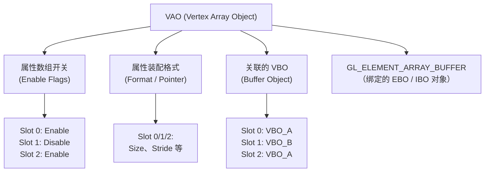

# OpenGL VAO（Vertex Array Object）的主要作用与状态管理

在现代 OpenGL（尤其是 Core Profile）中，**VAO（Vertex Array Object，顶点数组对象）** 是渲染流程中不可或缺的核心概念。很多初学者在刚接触 VAO、VBO 和 EBO 时，常常被它们之间的绑定和解绑顺序搞晕。

本文将深入解析 VAO 的底层原理、其存储的具体状态树结构、VBO 与 EBO 的行为差异，以及常见的使用陷阱。

---

## 一、 为什么引入 VAO？

在没有 VAO 的早期 OpenGL 中，每次绘制一个物体前，开发者都需要为该物体重复设置一遍顶点属性配置：

```c
// 每次绘制都需要做如下繁琐设置
glBindBuffer(GL_ARRAY_BUFFER, VBO);
glVertexAttribPointer(0, 3, GL_FLOAT, GL_FALSE, 3 * sizeof(float), (void*)0);
glEnableVertexAttribArray(0);
glUseProgram(shaderProgram);
glDrawArrays(GL_TRIANGLES, 0, 3);
```

如果要绘制成百上千个具有不同顶点格式的 3D 模型，这种在 CPU 和 GPU 之间频繁交接、重复配置状态的操作会带来巨大的 CPU 开销，并且代码极其臃肿。

**VAO 的诞生解决了这一痛点。** VAO 充当了一个**状态录制器**。你只需要在初始化时“录制”一次顶点格式的配置，之后在渲染循环中，只需切换绑定不同的 VAO，即可瞬间恢复之前录制的所有顶点装配状态，然后直接调用绘制函数。

---

## 二、 VAO 内部究竟记录了什么？（状态树结构）

VAO 是一个在 GPU 显存中的对象，它内部维护了一个状态树。为了彻底理清其机制，我们需要分清哪些状态被记录在 VAO 中，哪些状态由全局上下文持有。



具体而言，VAO 内部记录的**状态清单**如下：

### 1. 顶点属性开启/关闭状态（Attrib Array Enable States）
由 `glEnableVertexAttribArray(index)` 和 `glDisableVertexAttribArray(index)` 控制。它指示 OpenGL 某个属性槽（如位置、颜色或 UV）是否启用。

### 2. 顶点属性装配格式（Attribute Formats）
由 `glVertexAttribPointer` 设置的顶点解析参数，包括数据维度（size）、数据类型（type）、是否归一化（normalized）以及跨度字节数（stride）。

### 3. 关联的 VBO（Vertex Buffer Objects）
**特别注意**：VAO 不会记录 `glBindBuffer(GL_ARRAY_BUFFER, VBO)` 这一句绑定命令本身。
但当你接着调用 `glVertexAttribPointer(index, ...)` 时，OpenGL 会把**当前正绑定在全局 `GL_ARRAY_BUFFER` 上的 VBO** 的指针，关联并存储到当前 VAO 的该 `index` 属性槽中。

### 4. 索引缓冲区绑定（Element Array Buffer Binding）
当前绑定到 `GL_ELEMENT_ARRAY_BUFFER` 的 **EBO（Element Buffer Object，或称 IBO）** 的 ID。

---

## 三、 VAO “记录”与“不记录”的对比表

要编写正确的渲染管线，必须划清 VAO 的职责边界：

| 状态类型       | 具体状态项                                  | VAO 是否记录？ | 说明                                     |
| :--------- | :------------------------------------- | :-------: | :------------------------------------- |
| **顶点装配相关** | 顶点属性开关（`glEnableVertexAttribArray`）    |   **是**   | 针对每个 Slot 独立记录                         |
|            | 顶点属性数据格式与偏移（`glVertexAttribPointer`）   |   **是**   | 针对每个 Slot 独立记录                         |
|            | 每个属性槽关联的 VBO                           |   **是**   | 在调用 `glVertexAttribPointer` 瞬间被隐式记录    |
|            | 索引缓冲区（`GL_ELEMENT_ARRAY_BUFFER` / EBO） |   **是**   | **直接记录绑定的 Buffer ID**                  |
| **全局缓冲绑定** | `GL_ARRAY_BUFFER` 全局绑定状态码              |   **否**   | 属全局上下文状态。解绑 VAO 后，绑定的 VBO 依然保留在全局上下文上。 |
| **全局渲染状态** | 深度测试（`GL_DEPTH_TEST`）状态及比较函数           |   **否**   | 属于全局管线状态，由 Context 统一管理。               |
|            | 模板测试、混合状态、面剔除、视口大小等                    |   **否**   | 属于全局管线状态，由 Context 统一管理。               |
| **着色器与纹理** | 当前激活的 Shader 程序（`glUseProgram`）        |   **否**   | 属于全局 Context 状态。                       |
|            | 纹理通道绑定（`glBindTexture`）                |   **否**   | 属于全局纹理单元（Texture Unit）状态。              |

---

## 四、 黄金避坑指南：VBO 与 EBO 的绑定差异

在 VAO 的状态管理中，VBO 和 EBO 的记录方式完全不同，这也导致了两个经典的初学者 Bug：

### 陷阱 1：无视 glVertexAttribPointer，直接解绑 VBO
```c
glBindVertexArray(VAO);
glBindBuffer(GL_ARRAY_BUFFER, VBO);
glBindBuffer(GL_ARRAY_BUFFER, 0); // ❌ 错误：在调用 glVertexAttribPointer 前就解绑了 VBO
glVertexAttribPointer(0, 3, GL_FLOAT, GL_FALSE, 0, (void*)0);
```
*   **后果**：由于提前解绑了 VBO，在执行 `glVertexAttribPointer` 瞬间，OpenGL 抓取到的当前绑定 VBO 是 0（无缓冲），因此 VAO 中未成功关联任何数据，绘制时会闪退或无画面。
*   **正确做法**：必须先执行 `glVertexAttribPointer`，关联完成后，才可以解绑 VBO（此时解绑 VBO 不会破坏 VAO 内部已经保存好的关联指针）。

### 陷阱 2：先解绑 EBO，再解绑 VAO（最致命的经典 Bug）
```c
glBindVertexArray(VAO);
glBindBuffer(GL_ELEMENT_ARRAY_BUFFER, EBO);

// ... 设置顶点属性等 ...

glBindBuffer(GL_ELEMENT_ARRAY_BUFFER, 0); // ❌ 致命错误：在解绑 VAO 之前，就解绑了 EBO
glBindVertexArray(0);
```
*   **原因分析**：因为 `GL_ELEMENT_ARRAY_BUFFER`（EBO）的绑定状态是**直接存储在 VAO 内部的**。如果你在 `glBindVertexArray(0)` 之前调用了 `glBindBuffer(GL_ELEMENT_ARRAY_BUFFER, 0)`，相当于手动将当前 VAO 内部记录的 EBO 重置为了 0！
*   **后果**：当你在渲染循环中绑定该 VAO 并尝试调用 `glDrawElements` 绘制时，GPU 找不到索引缓冲区，程序会因为内存越界直接闪退。
*   **正确做法**：**永远不要在解绑 VAO 之前解绑 EBO**。正确的关闭顺序是先解绑 VAO（`glBindVertexArray(0)`），它会自动安全地隔离 EBO 的绑定状态。

---

## 五、 实战代码模板

下面是现代 OpenGL 中规范的 VAO 初始化与绘制流程：

### 1. 初始化阶段（仅执行一次）
```cpp
GLuint VAO, VBO, EBO;

// 1. 生成对象
glGenVertexArrays(1, &VAO);
glGenBuffers(1, &VBO);
glGenBuffers(1, &EBO);

// 2. 绑定 VAO 开始录制状态
glBindVertexArray(VAO);

// 3. 绑定并填充 VBO
glBindBuffer(GL_ARRAY_BUFFER, VBO);
glBufferData(GL_ARRAY_BUFFER, sizeof(vertices), vertices, GL_STATIC_DRAW);

// 4. 绑定并填充 EBO
glBindBuffer(GL_ELEMENT_ARRAY_BUFFER, EBO);
glBufferData(GL_ELEMENT_ARRAY_BUFFER, sizeof(indices), indices, GL_STATIC_DRAW);

// 5. 设置顶点属性指针（此时会将上文绑定的 VBO 关联到 Slot 0）
glVertexAttribPointer(0, 3, GL_FLOAT, GL_FALSE, 8 * sizeof(float), (void*)0);
glEnableVertexAttribArray(0);

// 设置 Slot 1 (如纹理坐标)
glVertexAttribPointer(1, 2, GL_FLOAT, GL_FALSE, 8 * sizeof(float), (void*)(6 * sizeof(float)));
glEnableVertexAttribArray(1);

// 6. 安全解绑
glBindVertexArray(0); // 先解绑 VAO ！！！此时 VAO 会锁死并保留 EBO 绑定
glBindBuffer(GL_ARRAY_BUFFER, 0); // 此时可以安全解绑 VBO
// 注意：千万不要在这里 glBindBuffer(GL_ELEMENT_ARRAY_BUFFER, 0)
```

### 2. 渲染循环阶段（每帧执行）
```cpp
// 渲染阶段代码极其精简、高效
glUseProgram(shaderProgram);

// 绑定当前物体的 VAO，瞬间恢复所有的 VBO/EBO 绑定和数据解析格式
glBindVertexArray(VAO);

// 直接调用绘制（因为 EBO 已经记录在 VAO 中，绘制函数直接从 VAO 读取索引）
glDrawElements(GL_TRIANGLES, 6, GL_UNSIGNED_INT, 0);

// 绘制完毕后解绑 VAO
glBindVertexArray(0);
```

---

## 六、 总结

VAO 并非只是一个可有可无的辅助缓存，它是 OpenGL **从立即渲染模式（Immediate Mode）转向现代状态驱动渲染（Core Profile）的基石**。合理利用 VAO 能够极大地减少渲染阶段的 OpenGL API 调用次数，有效提升程序的执行效率。