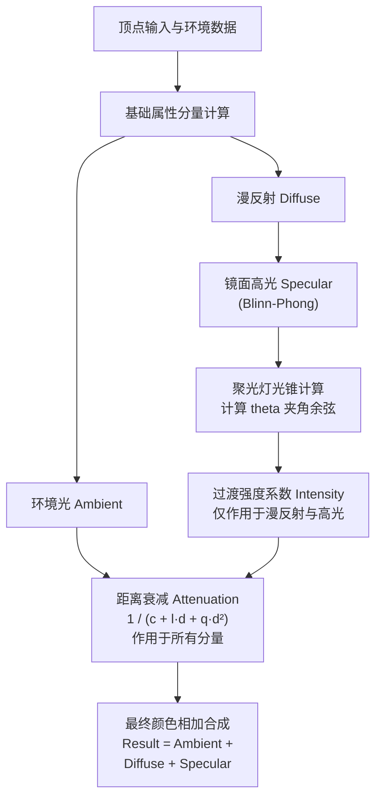

# OpenGL 中 Spotlight 的聚光、衰减与柔和边缘效果实现

在 3D 场景中，聚光灯（Spotlight）是一种非常常见且具有强烈视觉效果的光源类型，常用于手电筒、舞台聚光灯以及路灯等场景。

本文将实现一个包含**聚光方向截断（Spotlight）**、**距离衰减（Attenuation）**以及**柔和边缘过渡（Soft Edges）**的完整片段着色器，并深入探讨经典 **Phong 镜面反射模型** 与 现代 **Blinn-Phong 模型** 的区别。

---

## 一、 完整的片段着色器代码 (GLSL)

我们采用现代的 **Blinn-Phong 光照模型** 作为镜面反射的默认实现（能有效防止 Phong 模型在大角度下的高光截断现象），并在内部展示两者的写法对比。

```glsl
#version 330 core
out vec4 FragColor;

// 材质属性结构体
struct Material {
    sampler2D diffuse;   // 漫反射贴图 (RGB 颜色)
    sampler2D specular;  // 镜面高光贴图 (灰度或 RGB)
    float shininess;     // 反射光泽度 (反光度系数)
}; 

// 聚光灯光源属性结构体
struct Light {
    vec3 position;       // 光源在世界/观察空间的位置
    vec3 direction;      // 聚光灯照射的中心轴线方向向量
    float cutOff;        // 内锥角余弦值 (cos(theta_inner))，最亮的核心区域
    float outerCutOff;   // 外锥角余弦值 (cos(theta_outer))，光线完全消失的边界
  
    vec3 ambient;        // 环境光强度系数
    vec3 diffuse;        // 漫反射光强度系数
    vec3 specular;       // 镜面高光强度系数
	
    // 距离衰减常数
    float constant;      // 常数项 (通常为 1.0，防止分母为零)
    float linear;        // 一次线性项
    float quadratic;     // 二次平方项
};

in vec3 FragPos;         // 片段在世界空间的位置
in vec3 Normal;          // 片段的法线向量
in vec2 TexCoords;       // 纹理坐标
  
uniform vec3 viewPos;    // 相机在世界空间的位置
uniform Material material;
uniform Light light;

void main()
{
    // ==========================================
    // 1. 基础方向向量准备
    // ==========================================
    vec3 norm = normalize(Normal);
    vec3 lightDir = normalize(light.position - FragPos); // 从片段指向光源的向量
    vec3 viewDir = normalize(viewPos - FragPos);         // 从片段指向相机的视线向量

    // ==========================================
    // 2. 基础光照计算 (基于 Blinn-Phong)
    // ==========================================
    // (1) 环境光 (Ambient) - 不受聚光灯照射角度影响
    vec3 ambient = light.ambient * texture(material.diffuse, TexCoords).rgb;
    
    // (2) 漫反射 (Diffuse) - 兰伯特模型
    float diff = max(dot(norm, lightDir), 0.0);
    vec3 diffuse = light.diffuse * diff * texture(material.diffuse, TexCoords).rgb;  
    
    // (3) 镜面高光 (Specular)
    // ───【Blinn-Phong 实现 (推荐)】───
    vec3 halfwayDir = normalize(lightDir + viewDir); // 半角向量
    float spec = pow(max(dot(norm, halfwayDir), 0.0), material.shininess);
    
    /* ───【经典 Phong 实现 (对比)】───
    vec3 reflectDir = reflect(-lightDir, norm);
    float spec = pow(max(dot(viewDir, reflectDir), 0.0), material.shininess);
    */
    vec3 specular = light.specular * spec * texture(material.specular, TexCoords).rgb;  
    
    // ==========================================
    // 3. 聚光灯边缘柔和度计算 (Soft Edges)
    // ==========================================
    // 计算当前片段与光轴中心线的夹角余弦值 (theta)
    float theta = dot(lightDir, normalize(-light.direction)); 
    
    // 内外锥角余弦值之差 (epsilon)
    float epsilon = (light.cutOff - light.outerCutOff);
    
    // 线性插值并限幅在 [0.0, 1.0]
    float intensity = clamp((theta - light.outerCutOff) / epsilon, 0.0, 1.0);
    
    // 仅漫反射和镜面光受聚光灯强度的控制 (环境光不受限制)
    diffuse  *= intensity;
    specular *= intensity;
    
    // ==========================================
    // 4. 距离衰减计算 (Attenuation)
    // ==========================================
    float distance    = length(light.position - FragPos);
    float attenuation = 1.0 / (light.constant + light.linear * distance + light.quadratic * (distance * distance));    
    
    // 衰减影响所有的光照分量（让远处的物体整体变暗）
    ambient  *= attenuation; 
    diffuse   *= attenuation;
    specular *= attenuation;   
        
    // ==========================================
    // 5. 合成输出
    // ==========================================
    vec3 result = ambient + diffuse + specular;
    FragColor = vec4(result, 1.0);
} 
```

---

## 二、 核心机制剖析

### 1. 聚光灯的柔和边缘过渡（Soft Edges）

早期的聚光灯只使用单个切光角（`cutOff`），导致光圈边缘非常生硬，缺乏真实感。为了实现柔和的边缘，我们引入了**双锥角模型**。

#### (1) 几何模型示意图


<svg viewBox="0 0 600 240" width="100%" style="background-color: transparent; font-family: sans-serif; margin: 20px 0; overflow: visible;">
  <!-- Light source -->
  <g transform="translate(300, 30)">
  <circle cx="0" cy="0" r="10" fill="#faad14" />
  <circle cx="0" cy="0" r="18" fill="none" stroke="#faad14" stroke-width="1" stroke-dasharray="2 2" />
  <text x="0" y="-22" text-anchor="middle" font-size="12" fill="currentColor">光源 (Position)</text>
  </g>
  <!-- Cones -->
  <!-- Outer Cone Boundary -->
  <line x1="300" y1="30" x2="140" y2="180" stroke="#f5222d" stroke-width="1.5" stroke-dasharray="3 2" />
  <line x1="300" y1="30" x2="460" y2="180" stroke="#f5222d" stroke-width="1.5" stroke-dasharray="3 2" />
  <text x="110" y="160" font-size="11" fill="#f5222d">外锥 (outerCutOff)</text>
  <!-- Inner Cone Boundary -->
  <line x1="300" y1="30" x2="220" y2="180" stroke="#1677ff" stroke-width="2" />
  <line x1="300" y1="30" x2="380" y2="180" stroke="#1677ff" stroke-width="2" />
  <text x="210" y="100" font-size="11" fill="#1677ff">内锥 (cutOff)</text>
  <!-- Center axis line -->
  <line x1="300" y1="30" x2="300" y2="180" stroke="currentColor" stroke-width="1.2" stroke-dasharray="4 4" opacity="0.6" />
  <!-- Illumination Surface -->
  <line x1="80" y1="180" x2="520" y2="180" stroke="currentColor" stroke-width="2.5" />
  <text x="500" y="196" font-size="12" fill="currentColor">照射面</text>
  <!-- Regions and Intensity Labels -->
  <!-- Inner cone (Full bright) -->
  <polygon points="300,30 220,180 380,180" fill="rgba(250, 219, 20, 0.15)" />
  <text x="300" y="150" text-anchor="middle" font-size="11" fill="#faad14">高亮区 (Intensity = 1.0)</text>
  <!-- Falloff regions -->
  <polygon points="300,30 140,180 220,180" fill="url(#grad-left-spotlight)" />
  <polygon points="300,30 380,180 460,180" fill="url(#grad-right-spotlight)" />
  <text x="180" y="205" text-anchor="middle" font-size="11" fill="#f5222d">渐变羽化区 (1.0 ~ 0.0)</text>
  <text x="420" y="205" text-anchor="middle" font-size="11" fill="#f5222d">渐变羽化区 (1.0 ~ 0.0)</text>
  <text x="100" y="205" text-anchor="middle" font-size="11" fill="var(--vp-c-text-3)">全暗 (0.0)</text>
  <text x="500" y="205" text-anchor="middle" font-size="11" fill="var(--vp-c-text-3)">全暗 (0.0)</text>
  <!-- Definitions of gradients -->
  <defs>
  <!-- Left falloff gradient: from outer (dark) to inner (bright) -->
  <linearGradient id="grad-left-spotlight" x1="0%" y1="0%" x2="100%" y2="0%">
  <stop offset="0%" stop-color="#faad14" stop-opacity="0" />
  <stop offset="100%" stop-color="#faad14" stop-opacity="0.12" />
  </linearGradient>
  <!-- Right falloff gradient: from inner (bright) to outer (dark) -->
  <linearGradient id="grad-right-spotlight" x1="0%" y1="0%" x2="100%" y2="0%">
  <stop offset="0%" stop-color="#faad14" stop-opacity="0.12" />
  <stop offset="100%" stop-color="#faad14" stop-opacity="0" />
  </linearGradient>
  </defs>
</svg>


#### (2) 为什么使用余弦值？
在 Shader 中，为了避免昂贵的反三角函数（如 `acos`）计算，我们把所有的角度（$\theta$、内锥角 $\phi_{in}$、外锥角 $\phi_{out}$）全部转换为其**余弦值（Cosine）**：
- $\theta$ 的余弦：`theta = dot(lightDir, normalize(-light.direction))`。由于两个向量均已归一化，点积直接等于夹角余弦值。
- 内锥角余弦：`light.cutOff = cos(phi_in)`。
- 外锥角余弦：`light.outerCutOff = cos(phi_out)`。

*注意：在角度范围 $[0^\circ, 90^\circ]$ 内，角度越大，其余弦值越小。所以 `light.cutOff`（小角度）大于 `light.outerCutOff`（大角度）。*

#### (3) 渐变插值公式
当片段位于内锥和外锥之间时，我们计算其线性过渡强度 $I$：

$$I = \text{clamp}\left(\frac{\cos\theta - \cos\phi_{out}}{\cos\phi_{in} - \cos\phi_{out}}, \ 0.0, \ 1.0\right)$$

- 当 $\cos\theta \ge \cos\phi_{in}$（片段处于内锥内部）：分子大于分母，除法结果 $>1.0$，被 `clamp` 截断为 `1.0`（完全亮）。
- 当 $\cos\theta \le \cos\phi_{out}$（片段处于外锥外部）：分子 $\le 0$，除法结果 $\le 0.0$，被 `clamp` 截断为 `0.0`（完全暗）。
- 当夹角处于两者之间：强度值在 $0.0 \sim 1.0$ 之间平滑渐变，实现了边缘的羽化过渡。

---

### 2. 经典 Phong 与 现代 Blinn-Phong Specular 对比

文章在镜面反射（Specular）的计算中，提供了两种经典的实现方式，它们的区别如下：


<svg viewBox="0 0 600 220" width="100%" style="background-color: transparent; font-family: sans-serif; margin: 20px 0; overflow: visible;">
  <!-- Phong Model (Left) -->
  <g transform="translate(40, 20)">
  <text x="110" y="10" text-anchor="middle" font-size="14" fill="currentColor">Phong 镜面反射</text>
  <line x1="10" y1="160" x2="210" y2="160" stroke="currentColor" stroke-width="2" />
  <text x="110" y="178" text-anchor="middle" font-size="11" fill="var(--vp-c-text-3)">表面</text>
  <line x1="110" y1="160" x2="110" y2="60" stroke="#f5222d" stroke-width="2" marker-end="url(#phong-arrow-red)" />
  <text x="110" y="48" text-anchor="middle" font-size="11" fill="#f5222d">法线 N</text>
  <line x1="40" y1="90" x2="110" y2="160" stroke="#1677ff" stroke-width="2" />
  <line x1="40" y1="90" x2="75" y2="125" stroke="#1677ff" stroke-width="2" marker-end="url(#phong-arrow-blue)" />
  <text x="35" y="80" font-size="11" fill="#1677ff">入射光 L</text>
  <line x1="110" y1="160" x2="180" y2="90" stroke="#fa8c16" stroke-width="2" marker-end="url(#phong-arrow-orange)" />
  <text x="185" y="80" font-size="11" fill="#fa8c16">反射光 R</text>
  <line x1="110" y1="160" x2="200" y2="105" stroke="#52c41a" stroke-width="2" marker-end="url(#phong-arrow-green)" />
  <text x="205" y="100" font-size="11" fill="#52c41a">视线 V</text>
  <path d="M 160,110 A 30,30 0 0,0 175,120" fill="none" stroke="#fa8c16" stroke-width="1.5" stroke-dasharray="2 2" />
  <text x="180" y="135" font-size="10" fill="#fa8c16">α</text>
  <text x="110" y="200" text-anchor="middle" font-size="11" fill="var(--vp-c-text-2)">以反射角 R 和视线 V 的夹角 α 计算</text>
  </g>
  <!-- Blinn-Phong Model (Right) -->
  <g transform="translate(340, 20)">
  <text x="110" y="10" text-anchor="middle" font-size="14" fill="currentColor">Blinn-Phong 镜面反射</text>
  <line x1="10" y1="160" x2="210" y2="160" stroke="currentColor" stroke-width="2" />
  <text x="110" y="178" text-anchor="middle" font-size="11" fill="var(--vp-c-text-3)">表面</text>
  <line x1="110" y1="160" x2="110" y2="60" stroke="#f5222d" stroke-width="2" marker-end="url(#phong-arrow-red)" />
  <text x="110" y="48" text-anchor="middle" font-size="11" fill="#f5222d">法线 N</text>
  <line x1="40" y1="90" x2="110" y2="160" stroke="#1677ff" stroke-width="2" />
  <line x1="40" y1="90" x2="75" y2="125" stroke="#1677ff" stroke-width="2" marker-end="url(#phong-arrow-blue)" />
  <text x="35" y="80" font-size="11" fill="#1677ff">入射光 L</text>
  <line x1="110" y1="160" x2="200" y2="105" stroke="#52c41a" stroke-width="2" marker-end="url(#phong-arrow-green)" />
  <text x="205" y="100" font-size="11" fill="#52c41a">视线 V</text>
  <line x1="110" y1="160" x2="140" y2="70" stroke="#722ed1" stroke-width="2.5" marker-end="url(#phong-arrow-purple)" />
  <text x="145" y="65" font-size="11" fill="#722ed1">半角 H</text>
  <path d="M 110,110 A 50,50 0 0,1 125,115" fill="none" stroke="#722ed1" stroke-width="1.5" stroke-dasharray="2 2" />
  <text x="123" y="132" font-size="10" fill="#722ed1">θ</text>
  <text x="110" y="200" text-anchor="middle" font-size="11" fill="var(--vp-c-text-2)">以法线 N 和半角 H 的夹角 θ 计算</text>
  </g>
  <!-- Markers definitions -->
  <defs>
  <marker id="phong-arrow-red" viewBox="0 0 10 10" refX="6" refY="5" markerWidth="5" markerHeight="5" orient="auto">
  <path d="M 0 1.5 L 8 5 L 0 8.5 z" fill="#f5222d" />
  </marker>
  <marker id="phong-arrow-blue" viewBox="0 0 10 10" refX="6" refY="5" markerWidth="5" markerHeight="5" orient="auto">
  <path d="M 0 1.5 L 8 5 L 0 8.5 z" fill="#1677ff" />
  </marker>
  <marker id="phong-arrow-orange" viewBox="0 0 10 10" refX="6" refY="5" markerWidth="5" markerHeight="5" orient="auto">
  <path d="M 0 1.5 L 8 5 L 0 8.5 z" fill="#fa8c16" />
  </marker>
  <marker id="phong-arrow-green" viewBox="0 0 10 10" refX="6" refY="5" markerWidth="5" markerHeight="5" orient="auto">
  <path d="M 0 1.5 L 8 5 L 0 8.5 z" fill="#52c41a" />
  </marker>
  <marker id="phong-arrow-purple" viewBox="0 0 10 10" refX="6" refY="5" markerWidth="5" markerHeight="5" orient="auto">
  <path d="M 0 1.5 L 8 5 L 0 8.5 z" fill="#722ed1" />
  </marker>
  </defs>
</svg>


#### 关键区别总结

| 特性 | Phong 模型 | Blinn-Phong 模型 |
| :--- | :--- | :--- |
| **主要变量** | 视角方向与反射光线方向的夹角。 | 表面法线与半角向量（`halfwayDir`）的夹角。 |
| **高光截止问题** | 当视线与反射光的夹角大于 $90^\circ$ 时，点积变负，高光会在过渡处瞬间消失（产生生硬的边界截断）。 | 无论视角如何变化，半角向量与法线夹角总能平滑过渡，**完美解决了高光瞬间截止的问题**。 |
| **计算开销** | 需要调用 `reflect` 计算反射向量，包含较多的矩阵/向量运算。 | 仅需简单向量相加并归一化 `normalize(lightDir + viewDir)`，计算成本更低。 |
| **物理学拟真** | 属于早期纯经验模型，对某些材质高光刻画不够真实。 | 更贴近基于物理的微表面分布模型，能量分布更合理。 |

在实际渲染中，**Blinn-Phong 模型已经是现代实时图形学的主流首选**。

---

### 3. 距离衰减（Attenuation）

随着片段与光源距离的增加，光照强度应当衰减。我们使用物理学与工程实践结合的经典二次衰减公式：

$$I_{att} = \frac{1.0}{K_c + K_l \cdot d + K_q \cdot d^2}$$

- $d$：片段到光源的欧几里得距离 `length(light.position - FragPos)`。
- $K_c$（`constant`）：常数项，通常设为 `1.0`。主要用于确保当距离极其接近零时，分母不小于 1，防止光强数值溢出（除零错误）。
- $K_l$（`linear`）：一次线性项，控制中距离下的匀速衰减。
- $K_q$（`quadratic`）：二次项，控制远距离下的快速衰减，模拟真实光线在空间中的散射与吸收。

---

## 三、 聚光灯光照合成流程

最终的片段颜色合成逻辑如下：



通过这一套完整的计算流程，不仅可以展现出聚光灯特有的光圈效果，同时让光圈的边缘具备极其自然的毛玻璃/柔和羽化过渡，完美模拟了现实生活中的手电筒及探照灯特性。