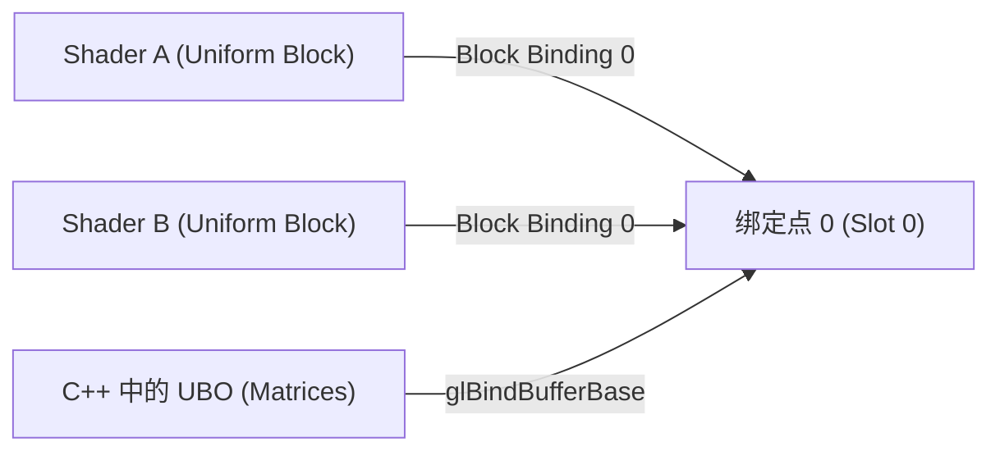

# OpenGL 从内建变量到 UBO

在 GLSL（OpenGL Shading Language）中，数据的传递和组织方式直接决定了渲染管线的效率和代码的可维护性。本文将深入探讨 GLSL 中的**内建变量**、**接口块（Interface Blocks）**，以及现代 OpenGL 中极为重要的**统一缓冲区对象（UBO - Uniform Buffer Objects）**，并详解困扰无数开发者的 **std140 内存对齐规则** 与 **实例化渲染（Instancing）**。

---

## 一、 GLSL 内置变量（Built-in Variables）

GLSL 提供了一系列以 `gl_` 前缀命名的预定义内置变量，用于在着色器阶段之间进行数据交互。

### 1.1 顶点着色器（VS）内置变量

| 变量 | 类型 | 作用 |
| :--- | :--- | :--- |
| `gl_Position` | `vec4` | **输出变量**，写入顶点的裁剪空间坐标（必须设置）。 |
| `gl_PointSize` | `float` | **输出变量**，设置点图元（`GL_POINTS`）的像素大小。 |
| `gl_VertexID` | `int` | **输入变量（只读）**，当前正在处理的顶点在缓冲区中的索引。 |

**gl_PointSize 应用示例：**
```glsl
void main()
{
    gl_Position = projection * view * model * vec4(aPos, 1.0);    
    // 模拟透视效果：距离相机越近，渲染出的点图元像素尺寸越大
    gl_PointSize = 10.0 / gl_Position.w; 
}
```
*注：要在窗口中启用 `gl_PointSize` 调整，必须在 C++ 代码中调用 `glEnable(GL_PROGRAM_POINT_SIZE);`。*

### 1.2 片元着色器（FS）内置变量

| 变量 | 类型 | 作用 |
| :--- | :--- | :--- |
| `gl_FragCoord` | `vec4` | **输入变量（只读）**，当前片元的窗口空间坐标 $(x, y, z, 1/w)$。其中 $z$ 是最终的深度值。 |
| `gl_FrontFacing` | `bool` | **输入变量（只读）**，指示当前片元是正面（`true`）还是背面（`false`）。 |
| `gl_FragDepth` | `float` | **输出变量**，允许手动覆盖计算出的深度值（会禁用 Early-Z 优化）。 |
| `gl_PointCoord` | `vec2` | **输入变量（只读）**，当前片元在点图元（Point Sprite）内部的局部坐标 $[0.0, 1.0]$。 |

**利用 gl_PointCoord 制作圆形粒子（点精灵）：**
```glsl
out vec4 FragColor;
uniform sampler2D particleTexture;

void main()
{
    // gl_PointCoord 的中心为 (0.5, 0.5)
    vec2 uv = gl_PointCoord;
    if (length(uv - vec2(0.5)) > 0.5) {
        discard; // 丢弃圆形半径外的片元
    }
    FragColor = texture(particleTexture, uv);
}
```

---

## 二、 接口块（Interface Blocks）

接口块用于在着色器阶段之间成组地传递数据。通过将相关的输入输出变量打包在一个块中，可以使着色器之间的传递逻辑更清晰，命名更规范。

### 1. 基本语法
顶点着色器的输出块与片元着色器的输入块**必须拥有相同的块名称（Block Name）**，但可以拥有不同的实例名称（Instance Name）。

**顶点着色器（VS）：**
```glsl
#version 330 core
layout (location = 0) in vec3 aPos;
layout (location = 1) in vec2 aTexCoords;

out VS_OUT {
    vec2 TexCoords;
    vec3 FragPos;
} vs_out; // 实例名称为 vs_out

void main() {
    gl_Position = projection * view * model * vec4(aPos, 1.0);
    vs_out.TexCoords = aTexCoords;
    vs_out.FragPos = vec3(model * vec4(aPos, 1.0));
}
```

**片元着色器（FS）：**
```glsl
#version 330 core
out vec4 FragColor;

in VS_OUT {
    vec2 TexCoords;
    vec3 FragPos;
} fs_in; // 块名一致为 VS_OUT，但实例名可以换为 fs_in

uniform sampler2D texture_diffuse;

void main() {
    FragColor = texture(texture_diffuse, fs_in.TexCoords);
}
```

---

## 三、 统一缓冲区对象（UBO - Uniform Buffer Objects）

随着场景复杂度的提升，我们往往会有多个不同的着色器程序都需要访问相同的数据（例如相机的 **投影矩阵** 和 **视图矩阵**）。

### 1. 为什么需要 UBO？
*   **传统 Uniform 缺点**：必须针对每一个 Shader 程序，使用 `glUniformMatrix4fv` 逐个上传相同的投影/视图矩阵。这会导致大量多余的 CPU 到 GPU 的数据传输。
*   **UBO 的优势**：在 GPU 显存中开辟一块缓冲区，将共享的 Uniform 数据一次性写入该缓冲区，所有相关的着色器可以直接读取这块内存，极大地减少了 API 调用开销。

### 2. UBO 的连接桥梁：绑定点（Binding Points）

在 OpenGL 中，Shader 中的 Uniform 块与 C++ 中的 UBO 并不是直接相连的，而是通过一个中介——**绑定点（Binding Points）**来实现连接：



#### C++ 绑定连接步骤：
```cpp
// 1. 获取 Shader 中 Uniform 块的索引 (Block Index)
GLuint blockIndex = glGetUniformBlockIndex(shader.ID, "Matrices");

// 2. 将该 Uniform 块关联到绑定点 0
glUniformBlockBinding(shader.ID, blockIndex, 0);

// 3. 将我们的 UBO 绑定到绑定点 0
glBindBufferBase(GL_UNIFORM_BUFFER, 0, uboMatrices);
```

#### 现代 OpenGL 捷径（GLSL 4.2+）：
在 GLSL 4.2 及以上版本中，我们可以在 Shader 中直接指定绑定点，从而**完全省略** C++ 中的 `glGetUniformBlockIndex` 和 `glUniformBlockBinding`：
```glsl
// 直接在 layout 中指定 binding = 0
layout (std140, binding = 0) uniform Matrices {
    mat4 view;
    mat4 projection;
};
```

---

## 四、 std140 内存布局与对齐规范（核心难点）

当我们在 C++ 中使用 `memcpy` 或 `glBufferSubData` 向 UBO 填充数据时，必须确保 C++ 结构体的数据排布与 GLSL 在显存中的对齐方式（**std140** 布局）**完全一致**，否则 Shader 读取出的变量将会错位。

### 1. std140 对齐基准
在 std140 布局中，每个变量根据其类型都有一个**基准对齐量（Base Alignment）**。每个变量在内存中的偏移量（Offset）必须是其基准对齐量的**倍数**。

| GLSL 变量类型 | 基准对齐量（字节） | 说明 |
| :--- | :--- | :--- |
| `float`, `int`, `bool` | 4 字节 | 标量占 4 字节。 |
| `vec2` | 8 字节 | 对齐到 8 字节边界。 |
| `vec3`, `vec4` | 16 字节 | **注意：vec3 也必须对齐到 16 字节！** |
| 标量/向量数组 | 每个元素对齐到 16 字节 | **极其关键**：例如 `float values[4]`，每个 float 元素都强制对齐到 16 字节，总共占用 64 字节！ |
| `mat3` | 48 字节 | 视为 3 个 `vec4` 的数组（列主序下，每列对齐至 16 字节）。 |
| `mat4` | 64 字节 | 视作 4 个 `vec4` 的数组。 |
| 结构体（`struct`） | 成员中对齐量最大值的倍数，且向上取整为 16 字节的倍数。 | |

### 2. 实战对齐推导示例
假设我们在 GLSL 中定义了如下 Uniform 块：
```glsl
layout (std140, binding = 0) uniform ExampleBlock {
    float value;     // 字节 0 ~ 3 （对齐 4）
                     // 字节 4 ~ 15 (空置填充！因为接下来的 vec3 要求 16 字节对齐)
    vec3 vector;     // 字节 16 ~ 27 （对齐 16）
    float scale;     // 字节 28 ~ 31 （对齐 4，当前偏移量 28 是 4 的倍数，紧跟在 vec3 后面）
                     // 字节 32 ~ 47 (空置填充！因为接下来的 mat4 要求 16 字节对齐)
    mat4 matrix;     // 字节 48 ~ 111（对齐 16）
};
```

### 3. C++ 端的正确结构体声明
为了与上述对齐规则匹配，我们在 C++ 中填充数据时，必须手动加入填充变量（Padding），或使用 `alignas` 关键字：

```cpp
// 方式一：手动添加填充
struct ExampleBlockManual {
    float value;
    float padding1[3]; // 填充 12 字节，使下一个 vec3 满足 16 字节对齐
    glm::vec3 vector;
    float scale;
    float padding2[3]; // 填充 12 字节，使下一个 mat4 满足 16 字节对齐
    glm::mat4 matrix;
};

// 方式二：利用 C++11 alignas 显式对齐（更优雅）
struct alignas(16) ExampleBlockAlign {
    float value;
    alignas(16) glm::vec3 vector; // 强制该成员从 16 字节边界开始
    float scale;
    alignas(16) glm::mat4 matrix;
};
```

---

## 五、 实例化渲染（Instancing）

当我们需要在屏幕上绘制上万个完全相同的物体（如草丛、森林、粒子系统）时，多次调用 `glDrawArrays` 会造成极高的 CPU 瓶颈。**实例化渲染** 允许我们通过一次 Draw Call 绘制大量重复网格。

### 1. 使用内建变量 `gl_InstanceID`
在进行实例化绘制时，顶点着色器内部的只读变量 `gl_InstanceID` 会从 0 开始递增（最大为 `实例数 - 1`）。
我们可以利用它作为索引，从 Uniform 数组中读取每个实例的位置偏置（Offsets）：

**顶点着色器（VS）：**
```glsl
#version 330 core
layout (location = 0) in vec3 aPos;

uniform vec3 instanceOffsets[100]; // 传入 100 个位置偏移量

void main() {
    vec3 offset = instanceOffsets[gl_InstanceID];
    gl_Position = vec4(aPos + offset, 1.0);
}
```

### 2. 高效方案：实例化数组（Instanced Arrays）
当实例数量极大（如 10,000 个）时，将其偏置放入 Uniform 数组会超出 Uniform 的最大容量限制。此时，最佳方案是使用**实例化数组**——将每个实例独有的变换属性（如 Model 矩阵或偏置）作为一个**顶点属性输入**。

这需要使用 `glVertexAttribDivisor` 接口：

```cpp
// 1. 生成并填充包含所有实例偏移位置的 VBO
unsigned int instanceVBO;
glGenBuffers(1, &instanceVBO);
glBindBuffer(GL_ARRAY_BUFFER, instanceVBO);
glBufferData(GL_ARRAY_BUFFER, sizeof(glm::vec2) * 10000, &offsets[0], GL_STATIC_DRAW);

// 2. 将其配置为顶点属性槽（例如使用槽 2）
glEnableVertexAttribArray(2);
glVertexAttribPointer(2, 2, GL_FLOAT, GL_FALSE, 2 * sizeof(float), (void*)0);

// 3. 核心调用：设置除数 (Divisor)
// 参数 2 设为 1 表示：OpenGL 在绘制每个新“实例”时递进一次该属性，而不是绘制每个“顶点”时递进。
glVertexAttribDivisor(2, 1); 
```

**渲染绘制：**
```cpp
// 一次性绘制 10000 个物体
glBindVertexArray(quadVAO);
glDrawArraysInstanced(GL_TRIANGLES, 0, 6, 10000);
glBindVertexArray(0);
```

---

## 六、 总结与最佳实践

1. **内置变量**：合理利用 `gl_FragCoord`、`gl_FrontFacing` 可实现丰富的离屏检测及单双面渲染逻辑；谨慎操作 `gl_FragDepth` 以防止硬件 Early-Z 剔除失效。
2. **UBO 优化**：凡是涉及全局共享的数据（如相机参数、环境光照参数等），均应首选 UBO 进行跨着色器管理。
3. **内存排布**：牢记 `std140` 布局下 `vec3`、数组和 `mat3` 的对齐空洞，在 C++ 端合理设计数据对齐，避免显存读取错位。
4. **大批量渲染**：一旦重复物体绘制数超过数百个，必须转用 `glDrawArraysInstanced` / `glDrawElementsInstanced` 结合 `glVertexAttribDivisor` 来减轻 CPU 提交压力。