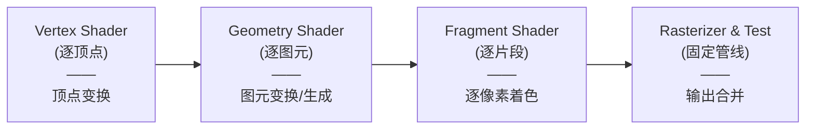

# OpenGL 几何着色器（Geometry Shader）详解

在 OpenGL 渲染管线中，顶点着色器（Vertex Shader）和片段着色器（Fragment Shader）是最基础、最常用的两个可编程阶段。但在它们之间，还存在着一个功能强大的可选阶段——**几何着色器（Geometry Shader）**。本文将深入探讨几何着色器的工作原理、语法结构、输入输出限定符、实战应用、常见陷阱以及现代图形学中的替代方案。

---

## 一、 几何着色器概述

几何着色器（Geometry Shader, GS）是位于顶点着色器之后、光栅化之前的可选着色器阶段。

与只负责“逐顶点”进行坐标变换和属性输出的顶点着色器不同，几何着色器以**图元（Primitive）**为单位进行处理。它可以接收顶点着色器输出的完整图元（如点、线、三角形），并拥有以下核心能力：
- **变换图元**：对输入图元的顶点进行空间变换或计算。
- **生成新图元**：将输入的一种图元转换为完全不同类型的图元（例如输入一个点，输出一个三角形或多边形）。
- **动态增删顶点**：能够输出比输入更多或更少的顶点，甚至可以不输出任何顶点（即丢弃该图元）。

在 C++ 主程序中，编译和链接包含几何着色器的着色器程序与编译普通着色器类似，其类型关键字为 `GL_GEOMETRY_SHADER`：

```cpp
// 编译几何着色器示例
GLuint geometryShader = glCreateShader(GL_GEOMETRY_SHADER);
glShaderSource(geometryShader, 1, &gShaderCode, NULL);
glCompileShader(geometryShader);

// 链接到着色器程序
glAttachShader(program, geometryShader);
glLinkProgram(program);
```

---

## 二、 在渲染管线中的位置

在整个 OpenGL 渲染管线中，几何着色器的数据流向如下：



由于几何着色器能够在 GPU 端**即时、动态地生成新的几何形体**，因此在需要动态细分、法线可视化、爆炸效果或粒子广告牌时，它提供了极大的灵活性，避免了频繁在 CPU 端修改顶点缓冲区（VBO）的昂贵开销。

---

## 三、 几何着色器语法结构

几何着色器的语法结构相比顶点和片段着色器更为特殊，它必须声明输入和输出的图元类型。以下是一个完整的几何着色器模板：

```glsl
#version 330 core

// 1. 声明输入的图元类型
layout (triangles) in;

// 2. 声明接收的顶点着色器输出数据（必须是数组形式）
in VS_OUT {
    vec3 color;
    vec2 texCoords;
} gs_in[]; // 数组大小由输入图元的顶点数决定

// 3. 声明输出的图元类型及最大顶点数
layout (triangle_strip, max_vertices = 3) out;

// 4. 输出到片段着色器的接口变量
out vec3 fColor;
out vec2 TexCoords;

void main() {
    // 遍历输入图元的每个顶点
    for(int i = 0; i < gl_in.length(); i++) {
        gl_Position = gl_in[i].gl_Position;
        fColor = gs_in[i].color;
        TexCoords = gs_in[i].texCoords;
        
        EmitVertex(); // 发射当前顶点
    }
    EndPrimitive(); // 结束当前图元，装配为新的图元
}
```

### 关键要素解析

1. **接口块数组（Interface Block Array）**：
   顶点着色器输出的属性传递到几何着色器时，由于是以图元为单位，几何着色器需要同时访问该图元的所有顶点属性。因此，任何来自顶点着色器的 `in` 变量或接口块都**必须声明为数组**（例如 `gs_in[]`），其数组长度等于输入图元的顶点数。
2. **`gl_in` 内置接口块**：
   OpenGL 提供了内置的输入接口块 `gl_in`，用于接收顶点着色器输出的内置变量（如 `gl_Position`）：
   ```glsl
   in gl_PerVertex {
       vec4  gl_Position;
       float gl_PointSize;
       float gl_ClipDistance[];
   } gl_in[]; // 同样是数组形式
   ```
3. **`EmitVertex()`**：
   指示几何着色器将当前设置的所有输出变量（包括内置的 `gl_Position` 和自定义的 `out` 变量）组合成一个顶点，并将其推送到输出图元流中。
4. **`EndPrimitive()`**：
   指示几何着色器将自上一次调用 `EndPrimitive()`（或函数开始）以来所有已发射（`EmitVertex`）的顶点，装配成指定的输出图元类型。如果之后再次发射顶点，它们将属于一个新的独立图元。

---

## 四、 输入布局限定符

几何着色器必须在头部声明它能够接收的图元类型。可用的输入布局限定符与 OpenGL 绘制命令（如 `glDrawArrays`）中的图元类型有严格的对应关系：

| 输入布局限定符               | 对应的 OpenGL 绘制模式                                         | 每个图元对应的顶点数 |
| :-------------------- | :------------------------------------------------------ | :--------- |
| `points`              | `GL_POINTS`                                             | 1          |
| `lines`               | `GL_LINES`, `GL_LINE_STRIP`, `GL_LINE_LOOP`             | 2          |
| `lines_adjacency`     | `GL_LINES_ADJACENCY`, `GL_LINE_STRIP_ADJACENCY`         | 4          |
| `triangles`           | `GL_TRIANGLES`, `GL_TRIANGLE_STRIP`, `GL_TRIANGLE_FAN`  | 3          |
| `triangles_adjacency` | `GL_TRIANGLES_ADJACENCY`, `GL_TRIANGLE_STRIP_ADJACENCY` | 6          |

---

## 五、 输出布局限定符

类似于输入，几何着色器也必须声明输出的图元类型，并**显式指定单次执行能够输出的最大顶点数（`max_vertices`）**：

| 输出布局限定符 | 说明 |
| :--- | :--- |
| `points` | 输出独立的点 |
| `line_strip` | 将输出的所有顶点依次连接成折线 |
| `triangle_strip` | 将输出的所有顶点依次连接成三角形带 |

### `max_vertices` 的重要性

- 几何着色器单次运行发射的顶点数**不能超过** `max_vertices` 的值。如果超过，多余的顶点会被 GPU 静默丢弃，导致图形显示不完整。
- 为什么不直接把 `max_vertices` 设得无限大？因为 GPU 需要根据该数值在片上为几何着色器分配输出缓冲区。`max_vertices` 设置得过大（例如 1024）会严重消耗显存带宽和片上寄存器，进而使渲染性能剧烈下降。

---

## 六、 实战：法线可视化

在 3D 开发中，调试顶点的法线方向是否正确是常见需求。使用几何着色器，我们可以非常方便地在原有三角形的每个顶点处绘制一条垂直于表面的短线段，从而实现法线的可视化。

### 1. 顶点着色器（normal_visualization.vs）

为了在几何着色器中以正确的空间计算线段，我们先在顶点着色器中将顶点和法线转换到**视图空间（View Space）**：

```glsl
#version 330 core
layout (location = 0) in vec3 aPos;
layout (location = 1) in vec3 aNormal;

out VS_OUT {
    vec3 normal; // 传递到几何着色器的视图空间法线
} vs_out;

uniform mat4 view;
uniform mat4 model;

void main()
{
    gl_Position = view * model * vec4(aPos, 1.0); // 视图空间坐标
    
    // 计算法线矩阵，保证在非均匀缩放时法线依然垂直于表面
    mat3 normalMatrix = mat3(transpose(inverse(view * model)));
    vs_out.normal = normalize(normalMatrix * aNormal);
}
```

### 2. 几何着色器（normal_visualization.gs）

几何着色器接收三角形，并输出代表法线的线段（`line_strip`），每个三角形顶点产生 2 个顶点（起点和沿法线偏移的终点），因此最大顶点数为 6：

```glsl
#version 330 core
layout (triangles) in;
layout (line_strip, max_vertices = 6) out;

in VS_OUT {
    vec3 normal;
} gs_in[];

uniform mat4 projection;

const float MAGNITUDE = 0.2; // 法线可视化线段的长度

void GenerateLine(int index)
{
    // 1. 起点：三角形顶点本身的位置，乘以投影矩阵变换到裁剪空间
    gl_Position = projection * gl_in[index].gl_Position;
    EmitVertex();
    
    // 2. 终点：沿法线方向偏移一定距离后的位置，再乘以投影矩阵
    vec4 offsetPosition = gl_in[index].gl_Position + vec4(gs_in[index].normal, 0.0) * MAGNITUDE;
    gl_Position = projection * offsetPosition;
    EmitVertex();
    
    // 3. 结束当前线段图元
    EndPrimitive();
}

void main()
{
    GenerateLine(0); // 为三角形第一个顶点绘制法线
    GenerateLine(1); // 为三角形第二个顶点绘制法线
    GenerateLine(2); // 为三角形第三个顶点绘制法线
}
```

### 3. 片段着色器（normal_visualization.fs）

输出纯色（例如明亮的黄色），以便与模型本身的渲染相区别：

```glsl
#version 330 core
out vec4 FragColor;

void main()
{
    FragColor = vec4(1.0, 1.0, 0.0, 1.0); // 亮黄色线段
}
```

---

## 七、 重要注意事项与常见陷阱

### 1. 输入属性始终是数组形式
即使输入布局限定符是 `points`（只有一个顶点），接收顶点着色器属性的接口块也**必须声明为数组**，访问时使用 `gs_in[0]`。
```glsl
// 错误写法
in vec3 vNormal; // 编译报错！

// 正确写法
in vec3 vNormal[]; // 必须带上数组符号 []
```

### 2. 顶点属性在 EmitVertex() 之后被锁定
每次调用 `EmitVertex()` 时，当前输出属性（如 `gl_Position`、输出颜色等）的值将被快照并锁定。如果在 `EmitVertex()` 之后修改了这些输出变量，新值只对**下一个**发射的顶点生效。
```glsl
gl_Position = vec4(0.0);
fColor = vec3(1.0, 0.0, 0.0);
EmitVertex(); // 发射一个红色顶点

fColor = vec3(0.0, 1.0, 0.0); // 修改颜色
gl_Position = vec4(1.0);
EmitVertex(); // 发射一个绿色顶点
```

### 3. 计算面法线时的向量叉乘顺序与类型匹配
在几何着色器中，我们常需要根据三角形的三个顶点动态计算整个三角形面片的法线（例如用于制作爆炸破碎效果）。
- **类型匹配**：`gl_in[i].gl_Position` 是一个四维的 `vec4`，而在计算叉乘时，我们必须先将坐标显式转换为三维 `vec3`，不能直接相减后隐式赋值，否则在严格的 GLSL 编译器上会报错。
- **叉乘顺序**：叉乘方向决定了法线的朝向（正面还是反面），这与三角形顶点的环绕顺序（Winding Order）密切相关。

```glsl
// 正确的面法线计算示例
vec3 GetNormal()
{
   vec3 a = vec3(gl_in[0].gl_Position) - vec3(gl_in[1].gl_Position);
   vec3 b = vec3(gl_in[2].gl_Position) - vec3(gl_in[1].gl_Position);
   // 叉乘顺序 (a x b) 与 (b x a) 会得到相反方向的法线
   return normalize(cross(a, b)); 
}
```

### 4. 颜色广播特性
如果你在几何着色器的主循环之外设置了一个输出变量，并且在循环发射顶点时没有更新它，那么这个变量的值会被“广播”到后续发射的所有顶点。为了保证数据正确性，建议在发射每一个顶点前，都显式对所有的 `out` 属性赋值。

---

## 八、 实际应用场景

### 1. 爆裂效果（Explode Effect）
通过在几何着色器中计算每个三角形面片的法线方向，并让顶点沿该面法线方向随时间（`time` 统一变量）逐渐向外平移，可以实现模型分裂并向四周爆炸飞散的效果。

### 2. 广告牌与粒子系统（Billboards / Points to Quads）
在粒子系统中，传统的做法是在 CPU 端为每个粒子创建由 4 个顶点组成的矩形。使用几何着色器后，CPU 只需要向 GPU 发送粒子的中心点坐标（`layout(points) in`），几何着色器接收此点后，在 GPU 端动态扩展出 4 个偏移顶点，装配成一个正对摄像机的 `triangle_strip` 四边形（Billboard），极大降低了 CPU 与 GPU 之间的带宽传输开销。

---

## 九、 性能考量与现代替代方案（Mesh Shader）

### 几何着色器的性能劣势

尽管几何着色器在设计上十分美妙，但在实际生产环境（尤其是现代游戏引擎和移动端）中，**并不推荐频繁或大量使用几何着色器**。

其背后的硬件原因主要在于：
- **串行瓶颈与分配延迟**：由于几何着色器输出的顶点数是动态且不确定的（由运行时的逻辑决定），硬件无法预先知道每个线程组需要分配多少片上缓存（Scratch Memory）来存储输出结果。这导致硬件必须进行动态显存分配，且无法在多处理器间实现完美的并行调度。
- **严重阻碍流水线**：如果前一阶段的顶点数据被几何着色器阻塞，管线后方的光栅化和片段着色器就必须等待，造成管线空转。

### 现代替代方案：Mesh Shader（网格着色器）

为了彻底解决几何着色器（以及细分着色器 Tessellation）的低效问题，Khronos 组委会在较新的图形 API（如 Vulkan 1.2+、DirectX 12 以及 OpenGL 扩展 `GL_NV_mesh_shader`）中引入了全新的**网格管线（Mesh Shading Pipeline）**。

网格管线用两个阶段替代了原有的顶点/几何/细分着色器：
1. **Task Shader（任务着色器）**：负责粗粒度的裁剪和工作流分发。
2. **Mesh Shader（网格着色器）**：采用类似于 Compute Shader（计算着色器）的**线程组（Thread Group）**工作模式，以高度并发的方式处理顶点 and 索引。它允许开发者直接在片上高速共享内存中，一次性定义输出一组微网格（Meshlet），从而将生成几何体的效率提升了数倍，是未来 3D 几何处理的主流方向。

---

## 十、 总结

1. **几何着色器**是 OpenGL 渲染管线中极其灵活的一环，能够在 GPU 端以图元为基础进行动态的几何创建与修改。
2. 它的输入总是数组（如 `gl_in[]`），且必须显式声明输入输出图元限制与 `max_vertices`。
3. 尽管它在实现法线可视化、爆炸粒子等调试或特效场景中非常方便，但由于硬件的动态分配瓶颈，不建议在大规模渲染流程中过度依赖它。
4. 随着现代 GPU 的演进，基于线程组协同的 **Mesh Shader** 已经成为更高效的几何处理替代方案。
