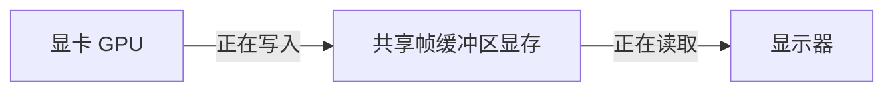
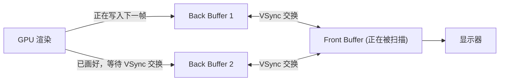

# OpenGL 单缓冲区渲染导致闪烁与撕裂的技术原因及解决方案

在图形渲染开发中，如果你在创建窗口时只使用了一个缓冲区（即单缓冲区渲染，Single Buffering），你会发现屏幕上的画面伴随着强烈的**闪烁（Flickering）**以及画面横向断开的**撕裂（Screen Tearing）**现象。

本文将从显卡与显示器的底层硬件同步机制出发，深入解析为什么单缓冲区会导致这些严重的视觉瑕疵，并详细介绍双缓冲区与垂直同步（VSync）以及三缓冲区是如何解决这些问题的。

---

## 一、 显示器的刷新机制与 VSync

要理解渲染瑕疵，首先需要明确显示器是如何把图像呈现给我们的：

### 1. 逐行扫描与刷新率
不论是 LCD、OLED 还是老式的 CRT 显示器，它们都是从屏幕左上角开始，**自左向右、自上而下**地逐个像素、逐行扫描，将像素数据绘制到屏幕上。
显示器以固定的频率执行这一扫描循环，这个频率被称为**刷新率（Refresh Rate）**，例如 60Hz 表示显示器每秒扫描并刷新屏幕 60 次。

### 2. 垂直同步信号（VSync）
当显示器完成一帧画面的扫描，光标位置到达屏幕的右下角时，显示控制芯片需要重新将扫描光标复位到屏幕的左上角，准备开始绘制下一帧。这个**复位的时间间隔**被称为**垂直消隐期（Vertical Blanking Interval）**。
在这个时间点，显示器硬件会发出一只同步信号，即**垂直同步信号（Vertical Synchronization, VSync）**，用来通知显卡：“我已经扫完了一帧，现在你可以安全地切换图像了。”

---

## 二、 单缓冲区渲染的致命缺陷：闪烁与撕裂

在单缓冲区渲染（Single Buffering）模式下，渲染系统和显示系统共享同一个帧缓冲区（Frame Buffer）内存区域：



显卡（GPU）正在异步且高速地向这块内存写入下一帧的像素，而显示器则以固定的时间间隔从这块内存中读取像素进行扫描。这种“读写共享”会导致两个致命问题：

### 1. 画面闪烁（Flickering）的技术原因
在游戏或 3D 渲染的每一帧开始时，我们通常会调用 `glClear(GL_COLOR_BUFFER_BIT)` 清空缓冲区，然后再绘制各种 3D 几何体。
- **冲突发生**：如果显示器正在扫描屏幕，而此时 GPU 刚好执行了 `glClear`，缓冲区内的数据瞬间变为空白（或背景色），或者刚好只画了一半的物体（半成品几何体）。
- **人眼感知**：显示器读到了这一瞬间的“空白”或“未画完”的数据，并将其投射在屏幕上。在连续的刷新中，人眼在极短的时间内经历了**“完整图像 -> 空白/半成品 -> 下一帧完整图像”**的交替，就形成了明显的明暗交替闪烁。

| 阶段 / 时间轴 | GPU 写入 | 显示器扫描 | 人眼看到 |
| :--- | :--- | :--- | :--- |
| **阶段 1** | `[渲染帧 A]` | `[扫描 A]` | 正常画面 |
| **阶段 2** | `[glClear 清空]` | `[扫描空白]` | 明暗闪烁 |
| **阶段 3** | `[绘制半成品 B]` | `[扫描半成品]` | 画面残缺 |
| **阶段 4** | `[渲染帧 B]` | `[扫描 B]` | 正常画面 |

### 2. 画面撕裂（Screen Tearing）的技术原因
即使 GPU 渲染速度极快，没有让显示器捕捉到 `glClear`，但如果 GPU 的写入速度与显示器的读取速度不一致：
- **冲突发生**：显示器扫到屏幕中部（例如第 300 行）时，GPU 完成了新一帧 B 的计算，并立刻向缓冲区覆盖写入新数据。
- **人眼感知**：显示器后半部分扫完剩下的 300 行时，读到的是已经更新后的帧 B 的内容。结果，最终的屏幕画面上半截是旧帧 A，下半截是新帧 B，两截画面在水平切线上产生位移偏差，这就叫**屏幕撕裂**。

---

## 三、 双缓冲区（Double Buffering）解决方案

为了解决单缓冲的上述问题，现代图形系统默认引入了**双缓冲区（Double Buffering）**机制：

```mermaid
flowchart TD
    subgraph GPU [GPU 渲染端]
        BackBuffer["后缓冲区 (Back Buffer)"]
    end

    subgraph Monitor [显示器端]
        FrontBuffer["前缓冲区 (Front Buffer)"]
    end

    GPU -- "1. 异步渲染写入" --> BackBuffer
    FrontBuffer -- "2. 读取并扫描" --> Monitor

    FrontBuffer <-->| "3. 垂直消隐期 (VSync) 交换" | BackBuffer
```

### 1. 工作原理
- **前缓冲区（Front Buffer）**：只用于供给显示器进行数据读取和屏幕扫描。
- **后缓冲区（Back Buffer）**：所有的 `glClear` 和 3D 渲染命令只针对后缓冲区进行写入。
- **交换操作（Swap Buffers）**：当后缓冲区的画面完全绘制完毕后，我们通过 API 发送命令交换这两个缓冲区（本质上是交换显存中两个缓冲区的首地址指针）。

在 C++ / GLFW 中，双缓冲默认是开启的：
```cpp
glfwWindowHint(GLFW_DOUBLEBUFFER, GLFW_TRUE); // 默认即为开启状态
```
在每次渲染循环末尾，我们调用交换命令：
```cpp
glfwSwapBuffers(window); // 交换前缓冲区和后缓冲区
```

由于显示器始终只读取完全绘制好、处于静态的前缓冲区，因此**彻底消除了因为清空或半成品绘制带来的画面闪烁问题**。

---

## 四、 垂直同步（VSync）与缓冲区交换

开启了双缓冲，画面闪烁彻底没有了，但**画面撕裂是否也彻底解决了呢？答案是否定的**。

### 1. 为什么双缓冲依然可能导致撕裂？
如果在代码中，我们的 GPU 渲染帧率非常高（例如 120 FPS），而显示器只有 60Hz，这意味着当显示器扫到一半时，GPU 已经在后缓冲画好了一帧，并立即调用 `glfwSwapBuffers` 交换了缓冲区。此时，前缓冲在扫描中途被强行替换，屏幕后半截依然会显示新帧的内容，导致撕裂依然存在。

### 2. 垂直同步（VSync）的介入
要彻底消除撕裂，我们必须限制缓冲区交换的时机：**只有在显示器发送 VSync 信号时（即垂直消隐期内，扫描光标回到左上角的空隙），才允许进行前/后缓冲区交换**。

在 GLFW 中，我们通过设置交换间隔来控制垂直同步：
```cpp
// 传入 1 表示启用垂直同步（VSync），每隔 1 个显示器刷新周期才允许交换一次缓冲区
// 传入 0 表示禁用垂直同步，不管显示器扫到哪里，立刻交换缓冲区（会导致撕裂，但帧率不受限制）
glfwSwapInterval(1); 
```

启用垂直同步后，即使 GPU 渲染速度超过了显示器的刷新率，`glfwSwapBuffers` 也会被阻塞，直到下一个 VSync 信号到来时才会完成交换，从而**彻底消除了屏幕撕裂**。

---

## 五、 进阶：三缓冲区（Triple Buffering）

垂直同步虽然消除了撕裂，但在双缓冲模式下，它带来了一个副作用：**严重的帧率折损和输入延迟**。

- **性能折损机制**：在双缓冲下，如果渲染帧率稍低于显示器刷新率（例如在 60Hz 显示器上渲染率降到 55 FPS），因为错过了当前 VSync 的交换窗口，GPU 必须等待下一个 VSync。这会导致实际显示帧率直接腰斩跳水到 30 FPS，画面产生严重的卡顿感（Stuttering）。
- **三缓冲（Triple Buffering）** 机制通过加入第二个后缓冲区（共三个缓冲区：Front Buffer, Back Buffer 1, Back Buffer 2）完美解决了此问题：



1. 当 Back Buffer 1 绘制完毕，若 VSync 还没来，GPU 不用停下来等待，它可以直接在空的 Back Buffer 2 上继续渲染下一帧。
2. 当 VSync 信号到来时，系统自动选择当前已画好的**最新的一帧**与 Front Buffer 交换。
3. **优势**：GPU 永远不需要被阻塞等待，帧率不会在 60 和 30 之间剧烈跳水，并且玩家的输入延迟（Input Lag）也得到了极大的改善。

---

## 六、 总结

1. **单缓冲区渲染**中显示扫描与 GPU 写入异步发生并共享同一内存，导致清空操作引发**闪烁**，以及中途修改数据引发**撕裂**。
2. **双缓冲区**通过将渲染限制在后缓冲区，将显示限制在前缓冲区，从根本上排除了闪烁问题。
3. 双缓冲下如果不启用**垂直同步（VSync, `glfwSwapInterval(1)`）**，在帧率不匹配时仍会发生**撕裂**。启用 VSync 可彻底消除撕裂，但可能会引发卡顿和延迟。
4. **三缓冲区**是图形工程中进一步平滑帧率抖动、降低输入延迟的高级硬件渲染方案。
