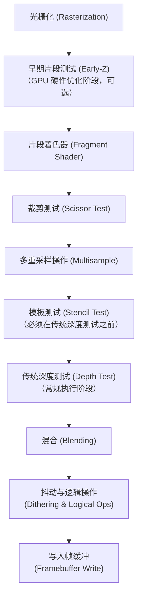
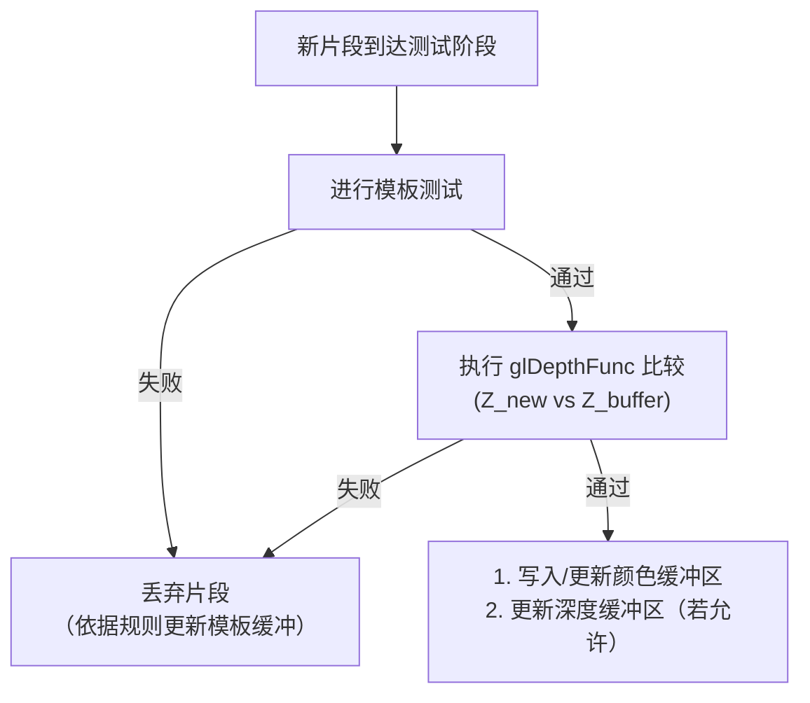
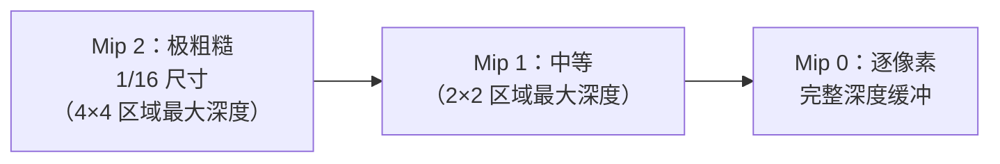
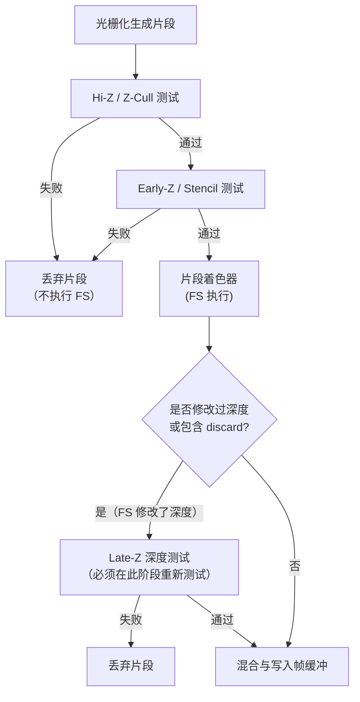

# OpenGL 深度测试及 Early-Z 详解

在 3D 渲染中，如何正确且高效地处理物体的遮挡关系是核心问题之一。本文将深入探讨 OpenGL 中的**传统深度测试（Depth Test）**以及现代 GPU 硬件优化技术——**Early-Z 拒绝（Early Depth Test）**的工作原理、管线位置、常见问题与优化方案。

---

## 一、 深度测试（Depth Test）基础

### 1. 渲染管线中的位置

传统深度测试发生在**光栅化（Rasterization）之后**、**混合（Blending）之前**。在片段操作阶段，其具体顺序如下：



**关键机制解析**：
1. **模板测试在深度测试之前**：若启用了模板测试，片段会首先进行模板比较。若模板测试失败，片段直接被丢弃，不再执行深度测试。
2. **传统测试在片段着色器之后**：因为传统的深度测试（Late-Z）在片段着色器（FS）执行完毕后才进行，这意味着即便片段最终因被遮挡而被深度测试丢弃，GPU 也已经为其运行了片段着色器。这造成了严重的计算资源浪费（即 Overdraw 重绘）。

---

### 2. 深度测试工作原理

#### (1) 深度缓冲（Depth Buffer）
- 深度缓冲是一个与颜色缓冲（Color Buffer）等大的一维/二维数组。
- 每个像素点对应存储一个深度值（常用格式为 24-bit 整数或 32-bit 浮点数）。
- 深度值范围通常被归一化在 `[0.0, 1.0]` 之间，`0.0` 代表近裁剪面（Near Plane），`1.0` 代表远裁剪面（Far Plane）。

#### (2) 深度测试比较
当光栅化生成的新片段到达深度测试阶段时，GPU 会将**当前片段的深度值（Z_new）**与**深度缓冲中对应位置已有的深度值（Z_buffer）**进行比较。

比较规则由 `glDepthFunc()` 函数设置：

| 比较函数 | 说明 |
| :--- | :--- |
| `GL_LESS` | 新深度值 `< 缓冲深度值时通过（**默认值**） |
| `GL_LEQUAL` | 新深度值 ≤ 缓冲深度值时通过 |
| `GL_GREATER` | 新深度值 >` 缓冲深度值时通过 |
| `GL_GEQUAL` | 新深度值 ≥ 缓冲深度值时通过 |
| `GL_EQUAL` | 新深度值 == 缓冲深度值时通过 |
| `GL_NOTEQUAL`| 新深度值 ≠ 缓冲深度值时通过 |
| `GL_ALWAYS` | 总是通过测试 |
| `GL_NEVER` | 从不通过测试 |

#### (3) 决策流程图



---

### 3. 启用与配置

在 OpenGL 中，深度测试的生命周期控制如下：

```c
// 1. 开启深度测试
glEnable(GL_DEPTH_TEST);

// 2. 设置比较函数（默认是 GL_LESS）
glDepthFunc(GL_LESS);

// 3. 控制深度写入权限
glDepthMask(GL_TRUE);  // 允许写入深度缓冲区（不透明物体）
glDepthMask(GL_FALSE); // 禁止写入深度缓冲区，只进行只读比较（半透明物体）

// 4. 设置深度范围映射（默认 0.0 到 1.0）
glDepthRange(0.0f, 1.0f);
```

---

### 4. 深度缓冲区的格式与精度

#### (1) 常见深度格式
- `GL_DEPTH_COMPONENT16`：16位非线性正规化整数，精度较低。
- `GL_DEPTH_COMPONENT24`：24位非线性正规化整数，**最常用的高性价比格式**。
- `GL_DEPTH_COMPONENT32F`：32位浮点数，高精度，常配合反向Z（Reversed-Z）使用。

#### (2) 深度值的非线性映射
在透视投影下，视空间中的深度 $Z_{view}$ 并不是线性映射到屏幕空间的 $Z_{window}$。映射公式如下：

$$F_{depth} = \frac{1/z - 1/near}{1/far - 1/near}$$

这种非线性映射使得**靠近近裁剪面（Near Plane）的区域精度极高，而靠近远裁剪面（Far Plane）的区域精度极低**。这也是导致深度冲突（Z-Fighting）的主要原因。

---

### 5. 深度冲突（Z-Fighting）

当两个表面距离非常近，且位于深度缓冲区精度较差的区域（如远处）时，GPU 无法区分两个片段的深度值大小，导致渲染画面中两个表面的图案相互闪烁穿插。

#### 解决方案详解：

1. **拉远近裁剪面（Near Plane）**
   * **原理**：根据透视投影的深度公式 $F_{depth} = \frac{f}{f - n} \cdot (1 - \frac{n}{z})$，深度值的变化率（即导数）与 $\frac{n}{z^2}$ 成正比。
   * **示例分析**：
     * 若设置近裁剪面 $n = 0.1$，远裁剪面 $f = 1000$。当物体从真实深度 $z = 0.1$ 移动到 $z = 1.0$ 时，深度值 $F_{depth}$ 会从 `0.0` 暴增到约 `0.9`。这意味着**前 1 米的空间消耗了整个深度缓冲 $90\%$ 的精度**，而剩下的 $999$ 米空间只能共享可怜的 $10\%$ 精度。
     * 若将近裁剪面拉远到 $n = 1.0$，则同样的 $1.0 \sim 10.0$ 米区间消耗 $90\%$ 精度。原先在 $1.0 \sim 1000$ 米区间的深度分辨率因此被放大了数倍，大大降低了中远景发生 Z-Fighting 的概率。
   * **最佳实践**：**尽量避免将 Near Plane 设为极小值（如 `0.001`）**，通常设为 `0.1` 或 `1.0` 为宜。

2. **提高深度缓冲区精度**
   * 使用 24 位（`GL_DEPTH_COMPONENT24`）甚至 32 位浮点型（`GL_DEPTH_COMPONENT32F`）深度缓冲区，从而增加可表达的深度数值范围和密度。

3. **Polygon Offset（多边形偏移）**
   * **原理**：在光栅化阶段，通过为片段的深度值手动附加一个与多边形斜率相关的偏移量（Offset），强制拉开共面或极度贴合的多边形深度差。
   * **代码示例**：
     ```c
     glEnable(GL_POLYGON_OFFSET_FILL);
     // 参数1: factor (缩放因子，针对多边形的最大深度斜率)
     // 参数2: units  (单位因子，针对深度缓冲的最小可分辨值)
     glPolygonOffset(1.0f, 1.0f); 
     ```

4. **使用反向Z（Reversed-Z）技术（配合浮点深度缓冲，极力推荐）**
   * **原理解析**：
     * **传统的精度错配**：非线性深度投影公式在**近裁剪面**（即 $F_{depth} \approx 0.0$ 附近）拥有极高几何精度；而浮点数（IEEE 754 标准）的存储特性也是**越靠近 0.0 精度越高，靠近 1.0 精度越低**。两者的最高精度点都堆叠在近裁剪面处，造成了浪费，而远裁剪面处（$F_{depth} \approx 1.0$）则两项精度都最差。
     * **反向对消**：反向 Z 将近裁剪面映射为 `1.0`，远裁剪面映射为 `0.0`。
       * **近裁剪面（z 较小）**：几何精度高，但由于映射为 `1.0`，浮点存储精度低。
       * **远裁剪面（z 较大）**：几何精度极低，但由于映射为 `0.0`，浮点存储拥有极其庞大的可用精度空间。
     * **效果**：这种“对向抵消”使得在整个视锥体空间中，可用的深度精度分布几乎达到了完美的线性均匀状态。配合 32-bit Float 深度缓冲，甚至能将远裁剪面设为无穷大（Infinity）而不会在任何距离发生 Z-Fighting。
   * **实现步骤**：
     1. 清空深度值设为 `0.0`：`glClearDepth(0.0f);`
     2. 将深度比较函数修改为大于通过：`glDepthFunc(GL_GREATER);`
     3. 投影矩阵修改：在生成透视投影矩阵时，反转 $n$ 和 $f$ 的映射输出。

---

### 6. 实战渲染流程与常见问题

#### (1) 经典渲染循环框架
```c
// 初始化阶段
glEnable(GL_DEPTH_TEST);
glDepthFunc(GL_LESS);

// 渲染主循环
while (!glfwWindowShouldClose(window)) {
    // 必须清空颜色缓冲与深度缓冲
    glClear(GL_COLOR_BUFFER_BIT | GL_DEPTH_BUFFER_BIT);

    // 1. 先绘制所有不透明物体 (开启深度测试、开启深度写入)
    glDepthMask(GL_TRUE);
    drawOpaqueObjects();

    // 2. 后绘制所有半透明物体 (开启深度测试、关闭深度写入)
    // 注意：半透明物体需要从远到近进行排序渲染
    glEnable(GL_BLEND);
    glBlendFunc(GL_SRC_ALPHA, GL_ONE_MINUS_SRC_ALPHA);
    glDepthMask(GL_FALSE); // 只做深度测试，不写入深度，避免遮挡后面的透明像素
    drawTransparentObjects();
    glDisable(GL_BLEND);
}
```

#### (2) 常见排错表
| 现象 | 可能原因 | 解决方案 |
| :--- | :--- | :--- |
| **画面重叠，后绘制的物体总是覆盖先绘制的物体** | 未启用深度测试，或者每帧未清空深度缓冲。 | 检查是否调用 `glEnable(GL_DEPTH_TEST)`；每帧使用 `glClear(GL_DEPTH_BUFFER_BIT)`。 |
| **透明物体相互遮挡关系混乱，或者直接把背景抠空** | 渲染透明物体时未关闭深度写入，导致其透明区域写入了较浅的深度。 | 渲染透明物体前调用 `glDepthMask(GL_FALSE)`，且确保排序正确。 |
| **远处的山体或建筑表面出现严重的黑色锯齿闪烁** | 发生了 Z-Fighting。 | 拉远近裁剪面，或使用 `glPolygonOffset`。 |

---

## 二、 Early-Z 优化详解

### 1. 基本概念

**Early-Z** 是现代 GPU 的一种**硬件层面优化技术**。
- **Late-Z（传统管线）**：光栅化 → 片段着色器 → 深度/模板测试。
- **Early-Z（优化管线）**：光栅化 → **Early-Z / Stencil 测试** → 片段着色器。

通过在片段着色器（FS）执行**之前**先一步进行深度和模板测试，凡是未通过测试的片段会被直接丢弃，从而**完全跳过该片段的片段着色器计算**。这对于复杂着色（多光源、重度光照计算）的场景能带来成倍的性能提升。

---

### 2. 硬件实现原理（Hi-Z）

为了在硬件层面更快速地过滤大面积被遮挡的区域，AMD 和 NVIDIA 引入了 **Hi-Z（Hierarchical Z，层次化 Z-Cache）** 机制。

#### (1) Z-Cache 金字塔结构
GPU 会在片上（On-Chip）维护一个低分辨率的深度金字塔。与纹理的 Mipmap 类似：
- **Mip 0（最精细）**：对应完整的逐像素深度缓冲（存于显存中）。
- **Mip 1**：将 Mip 0 按 $2\times2$ 区域合并，记录该区域内的最大深度值（$Z_{max}$，假设使用 `GL_LESS`）。
- **Mip 2（更粗糙）**：将 Mip 1 再按 $2\times2$ 合并，记录该区域的最大深度值。



#### (2) 快速剔除（Z-Cull / Hi-Z Test）
1. 当一个三角形光栅化时，GPU 首先将其包围盒与较粗糙层级（如 Mip 2）的 $Z_{max}$ 进行比较。
2. 如果该三角形在 Mip 2 对应区域的最小深度值仍大于 $Z_{max}$，则说明**整个三角形在屏幕上该区域被完全遮挡**。
3. GPU 会直接**整块丢弃（Z-Cull）**，无需访问耗时的逐像素显存深度缓冲。
4. 如果无法整块剔除，再逐级向下检查，直至在 Mip 0 级别进行精确 of Early-Z 测试。

---

### 3. 管线工作流程

下图展示了现代 GPU 在处理片段时的完整分支路径。



---

### 4. Early-Z 失效的场景

尽管 Early-Z 性能优异，但在编写片段着色器或配置管线时，以下操作会使得 GPU 无法在 FS 之前预知或确定深度，从而迫使 GPU **禁用 Early-Z（退化为 Late-Z）**：

1. **片段着色器中修改了深度值**：
   - 写入 `gl_FragDepth`。
   - 此时，GPU 无法在 FS 执行前得知最终深度，只能在 FS 执行完后进行 Late-Z。
2. **使用了丢弃操作（`discard`）**：
   - 即使没有修改深度，但如果 FS 中有 `discard`，GPU 就不能提前进行**深度写入**。因为如果提前写了深度，而 FS 随后执行了 `discard`，深度缓冲区就会被污染。
   - *注：部分现代 GPU 可以在有 `discard` 时执行 Early-Z 测试（Cull），但会禁用早期深度写入，待 FS 执行完确定不丢弃后才写入，这仍会损失一部分性能。*
3. **启用了 Alpha-to-Coverage** 或手工进行的 Alpha 测试：
   - 它们会在 FS 运行中动态改变片段的 Coverage（覆盖率），导致深度无法提前确定。
4. **混合状态或深度比较函数频繁切换**：
   - 频繁更改 `glDepthFunc` 会导致 Hi-Z 缓存数据失效，导致硬件保守地关闭优化。

---

### 5. 显式开启与优化方案

#### 方案 1：Pre-Z Pass（深度预通道，应用层控制）
这是大中型 3D 引擎最常用的方案，分两个 Pass 渲染：

```c
// ===== Pass 1: 仅填充深度缓冲 (Pre-Z Pass) =====
glColorMask(GL_FALSE, GL_FALSE, GL_FALSE, GL_FALSE); // 禁用颜色写入
glDepthMask(GL_TRUE);                                // 开启深度写入
glEnable(GL_DEPTH_TEST);
glDepthFunc(GL_LESS);

// 渲染所有不透明物体（此时 FS 可以是极简的空着色器，避免计算开销）
drawAllOpaqueObjectsWithSimpleShader();

// ===== Pass 2: 正常光照着色渲染 (Main Pass) =====
glColorMask(GL_TRUE, GL_TRUE, GL_TRUE, GL_TRUE);    // 恢复颜色写入
glDepthMask(GL_FALSE);                               // 关闭深度写入 (因为深度已在 Pass 1 确定)
glDepthFunc(GL_EQUAL);                               // 仅渲染深度完全相等的片段

// 使用复杂的 Shader 渲染物体（所有被遮挡的片段会在此瞬间被 Early-Z 剔除）
drawAllOpaqueObjectsWithComplexShader();
```

#### 方案 2：GLSL 显式声明（强制 Early-Z，Shader 层控制）
在 **GLSL 4.2+**（或使用 `ARB_shader_image_load_store` 扩展）中，你可以使用布局修饰符显式地告诉 GPU 强制进行 Early-Z 测试：

```glsl
#version 420 core

// 强制开启早期片段测试
layout(early_fragment_tests) in;

out vec4 FragColor;
in vec2 TexCoords;
uniform sampler2D alphaTex;

void main() {
    // 即使我们使用了 discard 操作，GPU 依然会在 FS 执行之前进行深度/模板测试
    // 如果测试失败，FS 直接不执行。如果测试通过，FS 执行并在通过后写入深度。
    if (texture(alphaTex, TexCoords).r < 0.1) {
        discard;
    }
    FragColor = vec4(1.0, 0.0, 0.0, 1.0);
}
```

#### 方案 3：保守深度修改（Conservative Depth）
如果你的片段着色器必须修改 `gl_FragDepth`，但你知道修改的趋势（如：深度只会变大或变小），可以使用保守深度布局修饰符（GLSL 4.2+），允许 GPU 在特定比较下保留 Early-Z 优化：

```glsl
#version 420 core

// 声明我们写入的深度只会比原插值深度大（即往远剪裁面方向推）
layout (depth_greater) out float gl_FragDepth;

void main() {
    float customDepth = calculateDepth(); // 计算出比插值深度更大的值
    gl_FragDepth = customDepth;           // 依然能够享受部分 Early-Z / Hi-Z 优化
}
```

---

### 6. Early-Z vs Late-Z 对比表

| 特性 | Early-Z (早期深度测试) | Late-Z (传统深度测试) |
| :--- | :--- | :--- |
| **执行时机** | 片段着色器（FS）执行**之前**。 | 片段着色器（FS）执行**之后**。 |
| **硬件要求** | 现代 GPU 硬件支持，默认自动尝试开启。 | 任何硬件皆支持。 |
| **深度缓存写入** | 可以在 FS 执行前写入，若含 `discard` 则需延迟写入。 | 仅在 FS 执行完毕并通过测试后写入。 |
| **主要性能优势** | 避免了被遮挡片段的 FS 计算，大幅降低重绘（Overdraw）开销。 | 无性能优势，为 FS 修改深度提供保底正确性。 |
| **触发失效的条件**| FS 写入 `gl_FragDepth`、启用 Alpha 测试等。 | 无限制。 |

---

相关官方规范参考：
- [OpenGL Wiki - Early Fragment Test](https://www.khronos.org/opengl/wiki/Early_Fragment_Test)
- [LearnOpenGL - Depth testing](https://learnopengl-cn.readthedocs.io/zh/latest/04%20Advanced%20OpenGL/01%20Depth%20testing/)