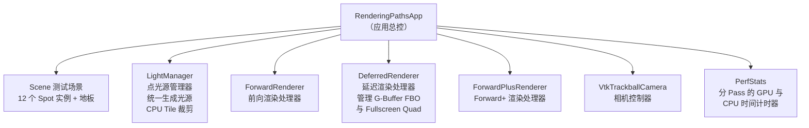

# OpenGL Forward、Deferred、Forward+ 三种渲染路径对比与实现

本篇总结围绕一个**运行时可切换**的对比 Demo 展开：在同一场景、同一套点光源、同一套 Blinn-Phong 光照公式下，通过 **Forward（前向渲染）**、**Deferred（延迟渲染）** 和 **Forward+（瓦片前向渲染）** 三条路径的渲染对比，提供深度的技术架构解析、关键着色器实现说明以及实际调试中的问题记录。

---

## 1. 核心概念与渲染路径对比

渲染路径（Rendering Path）回答的核心问题是：**给定 $N$ 个物体、$M$ 盏灯，GPU 按什么顺序和规则计算最终的像素颜色？**

### 1.1 前向渲染（Forward Rendering）
前向渲染是最直白的方法。绘制每个物体时，在 Fragment Shader 中针对当前片元循环遍历所有的光源，计算完光照贡献后直接写入帧缓冲。
* **计算复杂度**：$\mathcal{O}(\text{OpaqueObjects} \times \text{RasterizedFragments} \times \text{Lights})$。
* **优点**：思路简单直观；天然支持半透明混合；容易结合硬件抗锯齿（如 MSAA）。
* **缺点**：当光源数量 $M$ 很大（如数百盏）时，每个像素的 Fragment Shader 都会执行 $M$ 次光照计算循环，产生严重的 **Overdraw 与计算冗余**。即使某些片段最后被更近的物体遮挡，其光照计算也已被白白浪费。

### 1.2 延迟渲染（Deferred Rendering）
为了解决前向渲染的冗余，延迟渲染将几何计算与光照计算解耦。
* **Pass 1 - 几何通路（Geometry Pass）**：渲染场景中的不透明物体，但不执行任何光照计算，而是把不透明物体的几何属性（如反射率 Albedo、法线 Normal、材质参数、深度 Depth）存储在多个离屏纹理中。这一组离屏纹理称为 **G-Buffer（Geometry Buffer）**。
* **Pass 2 - 光照通路（Lighting Pass）**：绘制一个全屏四边形（Fullscreen Quad），在 Fragment Shader 中逐像素读取 G-Buffer 纹理，重建世界空间坐标，然后再循环遍历所有光源计算最终颜色。
* **计算复杂度**：$\mathcal{O}(\text{OpaqueObjects} \times \text{RasterizedFragments}) + \mathcal{O}(\text{ScreenPixels} \times \text{Lights})$。
* **优点**：光照计算的次数只与屏幕上可见的像素数量成正比，与场景复杂度无关，彻底解决了遮挡造成的冗余光照计算。
* **缺点**：不透明物体的深度测试由 G-Buffer 托管，**半透明物体**无法直接写入标准 G-Buffer，需要额外的前向渲染通道；G-Buffer 占用了极大的显存带宽；此外，由于 G-Buffer 多样本解析复杂，传统的硬件 MSAA 难以直接应用。

### 1.3 瓦片前向渲染（Forward+ / Tiled Forward）
Forward+ 依然属于前向渲染（在绘制 Mesh 时的 Fragment Shader 中计算光照），但引入了分块裁剪的思想：
* **Phase 0 - CPU/GPU 瓦片裁剪（Tile Culling）**：将屏幕划分成若干个二维瓦片（如 $16 \times 16$ 像素的小网格）。对于每一盏点光源，计算其在屏幕上的投影包围盒覆盖了哪些瓦片，并将该光源的索引登记到对应的瓦片列表中。每个瓦片维护一个候选光源索引列表。
* **Phase 1 - 前向着色（Forward Shading）**：绘制场景物体时，在 Fragment Shader 中利用当前像素坐标计算出它属于哪一个瓦片，然后**仅仅循环遍历该瓦片列表中的光源**。
* **优点**：大幅减少了每个片元的光照计算循环次数；保留了前向渲染对半透明混合、MSAA 以及自定义材质的天然支持。
* **缺点**：需要每帧维护和清空瓦片数据结构；本 Demo 在 CPU 端进行 Tile 剔除，在高分辨率、高光源数下 CPU 裁剪计算会成为新的瓶颈（工业界通常使用 Compute Shader 移至 GPU 执行）。

---

## 2. 总体架构与模块设计

Demo 项目设计遵循**“公平对比”**的原则：三条渲染路径共用同一个三维场景数据（网格与实例变换）、同一个点光源系统（`LightManager`）和完全一致的光照数学公式。

### 2.1 模块关系



### 2.2 核心状态驱动

为了实现运行时无缝切换，主控类 `RenderingPathsApp` 维护了以下核心状态：
* `currentPath_`：当前渲染路径模式（`Forward` / `Deferred` / `ForwardPlus`）。
* `cameraDirty_`：相机或光源改变时标记为 true。为了提高性能，Demo 采用了**事件驱动渲染**：当画面静止时，CPU/GPU 处于低负载等待状态，仅在有交互（拖拽相机、按键切换等）时才触发重绘并刷新。
* `showGBufferDebug_`：仅在延迟渲染模式下有效。开启后，将跳过 Lighting Pass，把 G-Buffer 的各个通道（Albedo, Normal, Depth 等）直接以伪彩色输出到全屏，用于 Debug。
* `lightPresetIndex_`：光源数量档位控制（支持 64 / 128 / 256 / 512 盏点光源）。按 `[` 或 `]` 键可以在档位间切换，并重新生成光源 SSBO 缓冲区。

---

## 3. 三条渲染路径的 C++ 与 Shader 实现

### 3.1 前向渲染（Forward）

#### 3.1.1 C++ 侧（ForwardRenderer.cpp）
前向渲染仅需绑定默认帧缓冲，然后上传光源 SSBO 缓冲区，并直接调用场景绘制：
```cpp
void ForwardRenderer::render(Scene &scene, LightManager &lights, const FrameCamera &camera) {
    glBindFramebuffer(GL_FRAMEBUFFER, 0); // 绑定默认帧缓冲
    glClearColor(0.0f, 0.0f, 0.0f, 1.0f);
    glClear(GL_COLOR_BUFFER_BIT | GL_DEPTH_BUFFER_BIT);

    // 绑定点光源 SSBO (binding = 0)
    glBindBufferBase(GL_SHADER_STORAGE_BUFFER, 0, lights.lightBuffer());

    shaderForward_->use();
    shaderForward_->setMat4("view", camera.view);
    shaderForward_->setMat4("projection", camera.projection);
    shaderForward_->setVec3("cameraPos", camera.position);
    shaderForward_->setUint("uLightCount", lights.activeCount());

    scene.draw(*shaderForward_); // 直接绘制场景物体
}
```

#### 3.1.2 着色器（forward.frag）
```glsl
#version 430 core
layout(location = 0) out vec4 FragColor;

in vec3 vWorldPos;
in vec3 vNormal;
in vec2 vTexCoord;

struct PointLight {
    vec4 positionRadius;  // xyz: position, w: radius
    vec4 colorIntensity;  // rgb: color, w: intensity
};

layout(std430, binding = 0) buffer LightBuffer {
    PointLight lights[];
};

uniform uint uLightCount;
uniform vec3 cameraPos;
uniform sampler2D texture_diffuse;

void main() {
    vec3 normal = normalize(vNormal);
    vec3 viewDir = normalize(cameraPos - vWorldPos);
    vec3 albedo = texture(texture_diffuse, vTexCoord).rgb;
    
    vec3 ambient = 0.15 * albedo;
    vec3 lightingAcc = vec3(0.0);

    for (uint i = 0u; i < uLightCount; ++i) {
        vec3 lightPos = lights[i].positionRadius.xyz;
        float radius = lights[i].positionRadius.w;
        vec3 lightColor = lights[i].colorIntensity.rgb;
        float intensity = lights[i].colorIntensity.w;

        vec3 lightDir = lightPos - vWorldPos;
        float dist = length(lightDir);
        
        // 范围外裁减
        if (dist > radius) continue;
        
        lightDir = normalize(lightDir);

        // 距离衰减 (0.7*radius 到 radius 之间平滑渐变到 0)
        float attenuation = 1.0 - smoothstep(radius * 0.7, radius, dist);
        attenuation *= intensity;

        // Lambert 漫反射
        vec3 diffuse = max(dot(normal, lightDir), 0.0) * lightColor * albedo;

        // Blinn-Phong 高光
        vec3 halfway = normalize(lightDir + viewDir);
        vec3 specular = pow(max(dot(normal, halfway), 0.0), 32.0) * lightColor * 0.35;

        lightingAcc += (diffuse + specular) * attenuation;
    }

    FragColor = vec4(ambient + lightingAcc, 1.0);
}
```

---

### 3.2 延迟渲染（Deferred）

延迟渲染将渲染分为两个 Pass。G-Buffer FBO 绑定了三个颜色附件和一个深度附件：
* `RT0`：Albedo (RGBA8)
* `RT1`：World Space Normal (RGB16F)
* `RT2`：Material (RGBA8 - 环境、漫反射、高光系数)
* `Depth`：32位浮点深度纹理（用于世界坐标反推）

#### 3.2.1 C++ 侧（DeferredRenderer.cpp）
```cpp
void DeferredRenderer::render(Scene &scene, LightManager &lights, const FrameCamera &camera) {
    // ---- Pass 1: Geometry Pass (写 G-Buffer) ----
    gBufferFbo_.bind(); // 绑定 GBuffer FBO
    glEnable(GL_DEPTH_TEST);
    glDepthMask(GL_TRUE);
    glClear(GL_COLOR_BUFFER_BIT | GL_DEPTH_BUFFER_BIT);

    shaderGeometry_->use();
    shaderGeometry_->setMat4("view", camera.view);
    shaderGeometry_->setMat4("projection", camera.projection);
    scene.draw(*shaderGeometry_);
    gBufferFbo_.unbind();

    // ---- Pass 2: Lighting Pass (全屏 Quad 打光) ----
    glBindFramebuffer(GL_FRAMEBUFFER, 0); // 目标为默认帧缓冲
    glDisable(GL_DEPTH_TEST);             // 全屏 Quad 不需要深度测试
    glDepthMask(GL_FALSE);
    glClear(GL_COLOR_BUFFER_BIT);

    if (showGBufferDebug_) {
        // Debug 模式：将 GBuffer 纹理原样拷贝/显示到屏幕上
        renderGBufferDebug();
        return;
    }

    shaderLighting_->use();
    // 激活并绑定 GBuffer 的 4 张纹理
    gBufferFbo_.bindTextures(0); // 绑定 Albedo, Normal, Material, Depth 纹理到 slot 0-3

    // 绑定点光源 SSBO
    glBindBufferBase(GL_SHADER_STORAGE_BUFFER, 0, lights.lightBuffer());

    shaderLighting_->setUint("uLightCount", lights.activeCount());
    shaderLighting_->setVec3("cameraPos", camera.position);
    shaderLighting_->setMat4("uInvProjection", glm::inverse(camera.projection));
    shaderLighting_->setMat4("uInvView", glm::inverse(camera.view));
    shaderLighting_->setVec2("uScreenSize", glm::vec2(width_, height_));

    drawFullscreenQuad(); // 绘制全屏遮罩进行 Shading
}
```

#### 3.2.2 几何通路着色器（geometry.frag）
```glsl
#version 430 core
layout (location = 0) out vec4 gAlbedo;
layout (location = 1) out vec3 gNormal;
layout (location = 2) out vec4 gMaterial;

in vec3 vNormal;
in vec2 vTexCoord;

uniform sampler2D texture_diffuse;

void main() {
    gAlbedo = texture(texture_diffuse, vTexCoord);
    gNormal = normalize(vNormal);
    gMaterial = vec4(0.15, 0.75, 0.35, 1.0); // 环境/漫反射/高光强度预乘系数
}
```

#### 3.2.3 光照通路着色器（deferred_lighting.frag）
```glsl
#version 430 core
layout(location = 0) out vec4 FragColor;

in vec2 textureCoord; // 全屏 UV

uniform sampler2D uGAlbedo;
uniform sampler2D uGNormal;
uniform sampler2D uGMaterial;
uniform sampler2D uGDepth; // 深度图

struct PointLight {
    vec4 positionRadius;
    vec4 colorIntensity;
};

layout(std430, binding = 0) buffer LightBuffer {
    PointLight lights[];
};

uniform uint uLightCount;
uniform vec3 cameraPos;
uniform mat4 uInvProjection;
uniform mat4 uInvView;
uniform vec2 uScreenSize;

// 从深度图中采样深度值，并反投影重建世界空间坐标
vec3 reconstructWorldPos(vec2 uv, float depthVal) {
    float zVal = depthVal * 2.0 - 1.0; // 映射到 NDC 空间的 [-1, 1]
    vec4 clipPos = vec4(uv * 2.0 - 1.0, zVal, 1.0);
    vec4 viewPos = uInvProjection * clipPos;
    viewPos /= viewPos.w;
    vec4 worldPos = uInvView * viewPos;
    return worldPos.xyz;
}

void main() {
    float depthVal = texture(uGDepth, textureCoord).r;
    
    // 如果深度为 1.0，说明是背景（天空盒），无物体，跳过光照
    if (depthVal >= 1.0) {
        FragColor = vec4(0.0, 0.0, 0.0, 1.0);
        return;
    }

    vec3 worldPos = reconstructWorldPos(textureCoord, depthVal);
    vec3 albedo = texture(uGAlbedo, textureCoord).rgb;
    vec3 normal = texture(uGNormal, textureCoord).rgb;
    vec4 material = texture(uGMaterial, textureCoord); // x: Ka, y: Kd, z: Ks

    vec3 viewDir = normalize(cameraPos - worldPos);
    vec3 ambient = material.x * albedo;
    vec3 lightingAcc = vec3(0.0);

    for (uint i = 0u; i < uLightCount; ++i) {
        vec3 lightPos = lights[i].positionRadius.xyz;
        float radius = lights[i].positionRadius.w;
        vec3 lightColor = lights[i].colorIntensity.rgb;
        float intensity = lights[i].colorIntensity.w;

        vec3 lightDir = lightPos - worldPos;
        float dist = length(lightDir);
        if (dist > radius) continue;

        lightDir = normalize(lightDir);
        float attenuation = (1.0 - smoothstep(radius * 0.7, radius, dist)) * intensity;

        // 漫反射
        vec3 diffuse = material.y * max(dot(normal, lightDir), 0.0) * lightColor * albedo;

        // 高光
        vec3 halfway = normalize(lightDir + viewDir);
        vec3 specular = material.z * pow(max(dot(normal, halfway), 0.0), 32.0) * lightColor;

        lightingAcc += (diffuse + specular) * attenuation;
    }

    FragColor = vec4(ambient + lightingAcc, 1.0);
}
```

---

### 3.3 瓦片前向渲染（Forward+）

#### 3.3.1 C++ 侧（ForwardPlusRenderer.cpp）
C++ 端每帧在渲染不透明场景前，先驱动点光源在 CPU 进行屏幕投影的瓦片裁剪与索引登记：
```cpp
void ForwardPlusRenderer::render(Scene &scene, LightManager &lights, const FrameCamera &camera) {
    // 1. 每帧先在 CPU 侧对所有光源进行 Tile 剔除，并将数据填充至 GPU Buffer
    lights.buildForwardPlusTiles(camera, width_, height_);

    // 2. 准备绘制前向着色
    glBindFramebuffer(GL_FRAMEBUFFER, 0);
    glEnable(GL_DEPTH_TEST);
    glDepthMask(GL_TRUE);
    glClear(GL_COLOR_BUFFER_BIT | GL_DEPTH_BUFFER_BIT);

    // 绑定光源基本数据 Buffer (binding = 0)
    glBindBufferBase(GL_SHADER_STORAGE_BUFFER, 0, lights.lightBuffer());
    // 绑定 Tile 内部光源计数的 SSBO (binding = 1)
    glBindBufferBase(GL_SHADER_STORAGE_BUFFER, 1, lights.tileCountBuffer());
    // 绑定 Tile 内部光源索引列表 of SSBO (binding = 2)
    glBindBufferBase(GL_SHADER_STORAGE_BUFFER, 2, lights.tileIndexBuffer());

    shaderForwardPlus_->use();
    shaderForwardPlus_->setMat4("view", camera.view);
    shaderForwardPlus_->setMat4("projection", camera.projection);
    shaderForwardPlus_->setVec3("cameraPos", camera.position);
    shaderForwardPlus_->setUint("uTilesX", lights.tilesXCount());
    shaderForwardPlus_->setInt("uTileSize", AppConfig::kTileSize);
    shaderForwardPlus_->setInt("uMaxLightsPerTile", AppConfig::kMaxLightsPerTile);

    scene.draw(*shaderForwardPlus_);
}
```

#### 3.3.2 着色器（forward_plus.frag）
```glsl
#version 430 core
layout(location = 0) out vec4 FragColor;

in vec3 vWorldPos;
in vec3 vNormal;
in vec2 vTexCoord;

struct PointLight {
    vec4 positionRadius;
    vec4 colorIntensity;
};

// SSBO 0：光源信息
layout(std430, binding = 0) buffer LightBuffer {
    PointLight lights[];
};

// SSBO 1：每个 Tile 当前登记的光源数量
layout(std430, binding = 1) buffer TileCounts {
    uint counts[];
};

// SSBO 2：扁平化一维数组，存储每个 Tile 的光源索引列表 (大小为 Tile数 * uMaxLightsPerTile)
layout(std430, binding = 2) buffer TileIndices {
    uint indices[];
};

uniform uint uTilesX;
uniform int uTileSize;
uniform int uMaxLightsPerTile;
uniform vec3 cameraPos;
uniform sampler2D texture_diffuse;

void main() {
    vec3 normal = normalize(vNormal);
    vec3 viewDir = normalize(cameraPos - vWorldPos);
    vec3 albedo = texture(texture_diffuse, vTexCoord).rgb;
    
    vec3 ambient = 0.15 * albedo;
    vec3 lightingAcc = vec3(0.0);

    // 1. 根据当前像素的屏幕坐标，换算所属的瓦片 (Tile)
    ivec2 tile = ivec2(gl_FragCoord.xy) / uTileSize;
    int tileIndex = tile.y * int(uTilesX) + tile.x;

    // 2. 读取当前瓦片上覆盖的光源数量
    uint localCount = counts[tileIndex];

    // 3. 仅仅循环遍历对当前瓦片有贡献的光源
    for (uint i = 0u; i < localCount; ++i) {
        // 从 SSBO 2 的平铺数组中获取光源在全局 LightBuffer 中的真实索引
        uint lightIndex = indices[tileIndex * uMaxLightsPerTile + int(i)];

        vec3 lightPos = lights[lightIndex].positionRadius.xyz;
        float radius = lights[lightIndex].positionRadius.w;
        vec3 lightColor = lights[lightIndex].colorIntensity.rgb;
        float intensity = lights[lightIndex].colorIntensity.w;

        vec3 lightDir = lightPos - worldPos;
        float dist = length(lightDir);
        if (dist > radius) continue;

        lightDir = normalize(lightDir);
        float attenuation = (1.0 - smoothstep(radius * 0.7, radius, dist)) * intensity;

        // 漫反射与高光计算
        vec3 diffuse = max(dot(normal, lightDir), 0.0) * lightColor * albedo;
        vec3 halfway = normalize(lightDir + viewDir);
        vec3 specular = pow(max(dot(normal, halfway), 0.0), 32.0) * lightColor * 0.35;

        lightingAcc += (diffuse + specular) * attenuation;
    }

    FragColor = vec4(ambient + lightingAcc, 1.0);
}
```

---

## 4. 点光源系统与 CPU 瓦片裁剪

光源位置随机生成于 Spot 模型四周。

### 4.1 AABB 投影边界框计算
在 Forward+ 模式中，为了将三维空间中的点光源求交投影到二维屏幕上，`LightManager::buildForwardPlusTiles()` 针对每一盏灯执行以下 CPU 剔除流程：

每个点光源在空间中呈球体，中心为 `center`，影响半径为 `radius`。通过对球体的 8 个极值角点进行世界空间到NDC空间转换，来求取其在屏幕上的包围矩形。
```cpp
// 对每个点光源生成 8 个 AABB 包围盒角点
glm::vec3 corners[8];
for (int z = 0; z < 2; ++z) {
    for (int y = 0; y < 2; ++y) {
        for (int x = 0; x < 2; ++x) {
            glm::vec3 offset(
                (x ? 1.0f : -1.0f) * radius,
                (y ? 1.0f : -1.0f) * radius,
                (z ? 1.0f : -1.0f) * radius
            );
            corners[z * 4 + y * 2 + x] = center + offset;
        }
    }
}
```
随后，利用相机 View 矩阵和 Projection 矩阵将这 8 个角点转换到屏幕像素坐标系中，计算出屏幕上的最小值 `(minX, minY)` 和最大值 `(maxX, maxY)`：
```cpp
float minX = screenWidth, maxX = 0.0f;
float minY = screenHeight, maxY = 0.0f;

for (int i = 0; i < 8; ++i) {
    glm::vec4 clipPos = projection * view * glm::vec4(corners[i], 1.0f);
    if (clipPos.w > 0.001f) {
        glm::vec3 ndc = glm::vec3(clipPos) / clipPos.w; // 归一化设备坐标
        float screenX = (ndc.x * 0.5f + 0.5f) * screenWidth;
        float screenY = (ndc.y * 0.5f + 0.5f) * screenHeight;
        minX = glm::clamp(glm::min(minX, screenX), 0.0f, (float)screenWidth);
        maxX = glm::clamp(glm::max(maxX, screenX), 0.0f, (float)screenWidth);
        minY = glm::clamp(glm::min(minY, screenY), 0.0f, (float)screenHeight);
        maxY = glm::clamp(glm::max(maxY, screenY), 0.0f, (float)screenHeight);
    }
}
```

### 4.2 像素包围框转瓦片登记
算出像素坐标区间后，除以 `kTileSize` (即 16 像素) 即可得到当前光源覆盖的瓦片行列索引范围：
```cpp
int tileMinX = glm::clamp((int)minX / kTileSize, 0, tilesX - 1);
int tileMaxX = glm::clamp((int)maxX / kTileSize, 0, tilesX - 1);
int tileMinY = glm::clamp((int)minY / kTileSize, 0, tilesY - 1);
int tileMaxY = glm::clamp((int)maxY / kTileSize, 0, tilesY - 1);

// 将该点光源 ID 登记到覆盖的所有 Tile 中
for (int ty = tileMinY; ty <= tileMaxY; ++ty) {
    for (int tx = tileMinX; tx <= tileMaxX; ++tx) {
        int tileIndex = ty * tilesX + tx;
        uint32_t currentCount = hostCounts_[tileIndex];
        if (currentCount < kMaxLightsPerTile) {
            hostIndices_[tileIndex * kMaxLightsPerTile + currentCount] = lightId;
            hostCounts_[tileIndex] = currentCount + 1;
        }
    }
}
```
最后使用 `glBufferSubData` 将 `hostCounts_` 和 `hostIndices_` 拷贝上传到对应的 SSBO GPU 缓冲区中。

---

## 5. 性能观察与实验数据

运行时主界面标题栏会打印关键的 CPU 与 GPU 时间统计，每隔 120 帧，控制台还会以 CSV 格式输出当前状态的数据记录。

### 5.1 性能表现总表

| 渲染路径 | 渲染通道 (Pass) 结构 | 核心瓶颈点 | 性能特征与典型表现 |
| :--- | :--- | :--- | :--- |
| **Forward** | 1 Pass：直接绘制场景输出 | Fragment Shader 内部的光照大循环 | 光源多时性能急剧下降，严重受 Overdraw 影响 |
| **Deferred** | 2 Pass：Geometry + Lighting | G-Buffer 数据吞吐带宽；全屏光照计算 | 帧率不受遮挡和物体复杂度影响，只随光源数与分辨率线性衰减 |
| **Forward+** | 2 Phase：CPU Culling + Forward Shading | CPU 灯光投影裁剪计算；多 Tile 带宽更新 | 高光源数量下体验最为跟手，CPU 裁剪时间开销小，GPU 侧计算极快 |

---

## 6. 常见问答与注意事项

### 6.1 延迟渲染中重建世界空间坐标时，为什么只需要采样一个深度值，而不用在几何阶段多存储一个 RGB 纹理？
世界空间坐标可以从当前的相机逆 Projection 和逆 View 矩阵通过归一化设备坐标 (NDC) 反向推导。存储一个 32 位的 Single Component 浮点深度纹理（`GL_DEPTH_COMPONENT32F`），比额外用一个 `GL_RGB16F`（48位）甚至 `GL_RGB32F`（96位）大纹理来记录世界坐标要划算得多，能极大地降低 G-Buffer 阶段的带宽瓶颈。

### 6.2 为什么延迟渲染不能直接像前向渲染那样进行半透明物体混合？
半透明物体的混合（如 `glBlendFunc(GL_SRC_ALPHA, GL_ONE_MINUS_SRC_ALPHA)`）在数学上是不满足交换律的，要求片段必须按从远到近的顺序进行绘制并立即与当前背景颜色融合。
而在延迟渲染中，Geometry Pass 仅仅向 G-Buffer 覆盖写入**最近**的那个像素几何参数。如果半透明物体写入 G-Buffer，它会把后面不透明物体的几何信息直接擦除覆盖，导致后面的物体在 Lighting Pass 中完全缺失。因此，延迟渲染处理半透明的常规做法是：先执行延迟管线渲染完所有不透明物体，然后再使用一个前向渲染 Pass，按照从远到近的顺序在深度缓冲只读的情况下混合半透明物体。

---

## 7. 调试与排查：RenderDoc 问题记录

在开发三条路径时，利用 RenderDoc 抓帧排查到的典型硬件状态与 Shader 问题整理如下：

### RP-05 · 光源 SSBO 未绑定
* **现象**：切到前向渲染多光源模式后，场景几乎呈现为全黑的 Ambient 状态，Spot 模型无任何彩色动态点光源光照效果。
* **原因**：在场景渲染的前置通道重构时，遗漏了 `glBindBufferBase(GL_SHADER_STORAGE_BUFFER, 0, lights.lightBuffer())`，导致 Shader 在绑定点 0 采样不到点光源数据缓冲区。
* **定位过程**：
  1. 使用 RenderDoc 抓取异常帧，选中任意实例物体的 `glDrawElements` 渲染事件。
  2. 切换到 **Pipeline State** 视图，进入 **Shader Storage Blocks (SSBO)** 项，观察发现 binding 0 绑定的 Buffer ID 为 0（Null），且大小为 0。
* **修复方法**：在 `ForwardRenderer::render()` 执行场景绘制前重新设置正确的绑定端口。

### RP-07 · Geometry Pass 未写入 GBuffer FBO
* **现象**：延迟渲染黑屏，开启 GBuffer 调试面板发现 Albedo 和 Normal 通道均显示为纯黑。
* **原因**：几何通道在清理后，不小心执行了 `glBindFramebuffer(GL_FRAMEBUFFER, 0)` 导致场景中的物体直接画到了系统的默认窗口帧缓冲中，而 G-Buffer 对应的离屏 FBO 内部颜色附件并没有写入任何内容。
* **定位过程**：在 Event Browser 中选中几何 Pass 中物体的 Draw 调用，检查 **DrawTargets** 项。预期应为 GBuffer FBO 的 RT0, RT1, RT2，但实际显示写入的是默认的 Framebuffer (0)。
* **修复方法**：检查 FBO 绑定时序，确保在 Geometry Pass 的 `draw` 动作前调用了 `gBufferFbo_.bind()`。

### RP-08 · G-Buffer 法线未归一化
* **现象**：GBuffer 调试下的法线预览伪彩图出现突变或条带噪声，Lighting Pass 渲染的高光斑形状扭曲，且高光在法线插值接缝处出现剧烈的光照明暗突变。
* **原因**：在 `geometry.frag` 着色器写入 RT1 时，忘记将插值传入的 `vNormal` 进行 `normalize()`，导致非单位向量在计算点积时破坏了 Blinn-Phong 的反射方向规律。
* **定位过程**：在 RenderDoc 几何 Pass 之后双击打开 **RT1 (Normal attachment)**，将其缩放到浮点数值视窗，发现很多边缘像素的 Normal RGBA 值模长大于 1.0。
* **修复方法**：在 Geometry Shader 侧加上归一化限制：`gNormal = vec3(normalize(vNormal))`。

### RP-09 · 深度重建时投影矩阵未使用逆矩阵
* **现象**：延迟渲染的光照出现随相机旋转而平移或拉伸的异常错位，高光斑滑出物体的表面，贴近背景的边缘区域尤其明显。
* **原因**：在 Lighting Pass 的 Uniform 上传阶段，C++ 侧错将当前帧的投影矩阵直接赋给了本该是逆矩阵的 Uniform 变量：`shaderLighting_->setMat4("uInvProjection", camera.projection)`，导致 Shader 重建世界空间位置的 NDC 反解运算完全错误。
* **定位过程**：
  1. 抓帧选中全屏打光事件，进入 **Uniforms** 面板查看 `uInvProjection`。
  2. 手动输入与 `projection` 的数据对比，发现完全一致。
* **修复方法**：修改参数为 `glm::inverse(camera.projection)`。

### RP-10 · Lighting Pass 误开启深度测试
* **现象**：延迟渲染 Lighting Pass 结果异常，屏幕部分区域全黑，只有近处部分有颜色。
* **原因**：Lighting Pass 绘制全屏 Quad 时，误将 `GL_DEPTH_TEST` 保持为 `glEnable`。全屏 Quad 处于 NDC 的 $Z=0$ 处，这会与 Geometry Pass 遗留下来的 Depth Buffer 中的非线性深度值进行错误的深度测试比较，导致深度小于背景或较近物体区域的像素被硬件深度测试裁剪丢弃。
* **定位过程**：在 Lighting Pass Draw 调用下查看 **Pipeline State** 的 **Depth State**，发现 `Depth Test` 显示为 `Enabled` 且深度比较模式为 `LESS`。
* **修复方法**：在 Lighting Pass 渲染前强制调用 `glDisable(GL_DEPTH_TEST)` 和 `glDepthMask(GL_FALSE)`。

### RP-11 · `uGDepth` 纹理绑定通道冲突
* **现象**：延迟光照大面积显示异常，高光散乱分布，与任何物体的立体几何结构均对不上。
* **原因**：在 C++ 的 `DeferredRenderer` 里激活绑定 GBuffer 纹理时，绑定 Albedo 纹理和绑定 Depth 纹理的 glBindTexture 命令指向了同一个纹理 ID，导致 Shader 采样深度信息重建位置时实际上读到的是颜色 Albedo 的 RGB 信息。
* **定位过程**：选中全屏 Lighting Draw 事件，进入 **Texture Viewer**，逐一核对绑定到 Texture Unit 3 (`uGDepth`) 的资源。发现内容并非灰度的深度分布图，而是 Albedo 彩色图。
* **修复方法**：修改并对准 `gDepth_.id` 绑定的 Slot。

### RP-12 · Forward+ 忘记执行 CPU Light Culling
* **现象**：切到 Forward+ 模式后场景区域光照异常，所有物体都是暗红色的 Ambient 效果，仿佛不存在任何动态光源。
* **原因**：主循环中漏掉了每帧调用 `lights.buildForwardPlusTiles()`，导致 GPU 端的 `TileCounts` 和 `TileIndices` 两个 SSBO 缓冲区维持在初始的 0 字节，Shader 运行计算时，片元发现自身所属 Tile 的 local 光源数量为 0。
* **定位过程**：在 Forward+ Shading Draw 事件上，双击查看 **Buffer Viewer**，指向 **SSBO Binding 1** (`TileCounts`)，观察到所有内存数值均为 0x00。
* **修复方法**：在 renderFrame 入口处加上 `lights.buildForwardPlusTiles(camera, width, height)` 预处理命令。

### RP-13 · Forward+ 瓦片数据 SSBO 绑定序号颠倒
* **现象**：Forward+ 渲染结果中光照出现严重撕裂、大量散乱的刺眼亮块，且部分区域出现不停变化的异常彩光。
* **原因**：在 C++ 侧绑定 `hostCounts_` 的 SSBO 时绑定到了 `binding = 2`，而将 `hostIndices_` 的 SSBO 绑定到了 `binding = 1`，刚好与 `forward_plus.frag` 声明的绑定关系相反。
* **定位过程**：对照 Shader 声明：`binding = 1` 为 `counts` 缓冲区，`binding = 2` 为 `indices` 缓冲区。但在 **Pipeline State** 的 **Shader Storage Blocks** 中观察，发现绑在 index 1 处的 Buffer 长度和 layout 与 counts 预期的字节长度不符。
* **修复方法**：检查并恢复 C++ 侧的 `glBindBufferBase` 调用顺序，确保与着色器内的 binding 序号严丝合缝。

### RP-14 · `uTileSize` 与 CPU Tile 步长尺寸不一致
* **现象**：Forward+ 渲染出的光照随相机视角变化产生一格一格的条带状拉丝和突变现象，且光照网格边界在物体表面明显可见。
* **原因**：Shader 中的 `uTileSize` 被硬编码或传入值为 8，而 CPU 裁剪计算所用的 `AppConfig::kTileSize` 为 16，导致同一个像素在 CPU 侧和 GPU 侧算出了不一样的瓦片索引，使片元采样到了错误的瓦片光源索引列表。
* **定位过程**：在渲染调用上核对 Uniform 变量 `uTileSize`，其数值与 C++ 常量配置不符。
* **修复方法**：在着色器运行时通过 `shaderForwardPlus_->setInt("uTileSize", AppConfig::kTileSize)` 将参数统一对齐。
