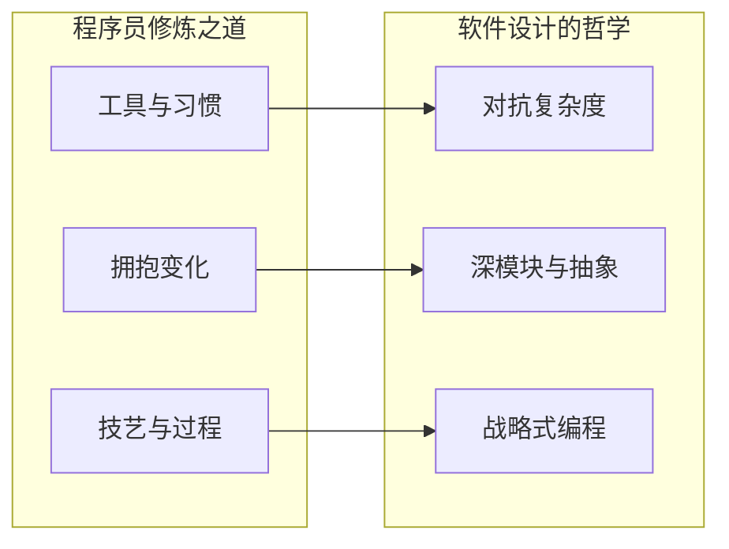

# 书籍笔记

> 深度思考 + 分章浓缩，与 [Qt/VTK 设计模式](README.md)、[设计模式通识](../design-patterns-essence.md) 并列。  
> 版本：均为 **第 2 版** · 更新：2026-07-07

---

## 两本书

| 书 | 定位 | 入口 |
|----|------|------|
| **程序员修炼之道**（第 2 版） | 务实哲学、工程习惯、工具与过程 | [pragmatic-programmer/](pragmatic-programmer/README.md) |
| | 整书浓缩 + 读后感 | [程序员修炼之道 · 读后感](pragmatic-programmer/book-summary-reflection.md) |
| **软件设计的哲学**（第 2 版） | 复杂度、模块、抽象与战略式编程 | [software-design-philosophy/](software-design-philosophy/README.md) |
| | 整书浓缩 + 读后感 | [软件设计的哲学 · 读后感](software-design-philosophy/book-summary-reflection.md) |

---

## 推荐阅读顺序

### 先建立「做事」观，再建立「设计」观

1. [程序员修炼之道 · 整书总结与读后感](pragmatic-programmer/book-summary-reflection.md) 或 [深度思考](pragmatic-programmer/00-overview.md)  
2. [软件设计的哲学 · 整书总结与读后感](software-design-philosophy/book-summary-reflection.md) 或 [深度思考](software-design-philosophy/00-overview.md)  
3. 按需刷分章；**快速复习**读 `book-summary-reflection` + 各章 **重点与注意**

### 与 design/pattern 系列的关系

| 系列 | 回答的问题 |
|------|------------|
| [ljz-design-patterns/](../ljz-design-patterns/) | GoF 23 种模式是什么 |
| [design-patterns-essence.md](../design-patterns-essence.md) | 模式本质与易混 |
| **本目录两本书** | 工程师素养 + 模块级设计哲学 |
| [qt/](qt/) · [vtk/](vtk/) | 模式在框架中的落点 |

---

## 两书对照（速记）

| 维度 | 程序员修炼之道 | 软件设计的哲学 |
|------|----------------|----------------|
| 重心 | 开发者如何**做事** | 代码如何**被组织** |
| 敌人 | 混乱、重复、僵化、沟通失败 | **复杂度**（尤其是依赖与模糊） |
| 关键词 | DRY、正交、务实、曳光弹、重构 | 深模块、信息隐藏、战略编程 |
| 时间观 | 持续交付、拥抱变化 | 前期多投设计、design it twice |
| 典型动作 | 自动化、测试、早崩溃 | 拉平接口、注释写非显而易见之事 |

---

[返回 pattern 系列](README.md)
