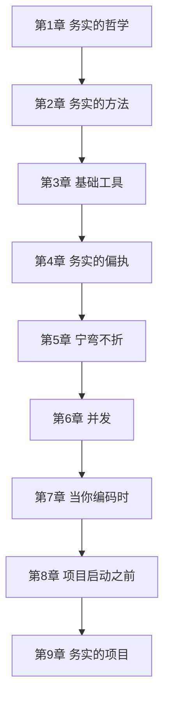

# 程序员修炼之道（第 2 版）· 全书深度思考

> 系列：[书籍笔记](../README.md) · [程序员修炼之道目录](README.md)  
> 姊妹篇：[软件设计的哲学 · 全书思考](../software-design-philosophy/00-overview.md)

---

## 写在前面

《程序员修炼之道》不是语法书，也不是设计模式目录。它谈的是：**一个务实的程序员，如何思考、如何做事、如何与变化共处**。  
第 2 版（2019）在保留经典 Tips 精神的同时，增补了并发、柔性架构、现代工具链等内容。全书 9 章、近百条提示，可按章阅读，也可当作案头随手翻的「职业素养手册」。

---

## 1. 全书主线：什么是「务实」

务实（Pragmatic）在这里不是「凑合」，而是：

- **对技艺负责**：关注 craft，持续打磨（Tips 1–2）  
- **对人生与选择负责**：你有权选择技术栈与工作环境（第 1 章）  
- **对变化有准备**：可逆性、解耦、宁弯不折（第 2、5 章）  
- **对团队与用户负责**：沟通、够好即可、早崩溃、可测试（贯穿全书）

务实 = **在真实约束下，做出可持续的正确决策**，而不是追求纸上完美的架构。

---

## 2. 九章地图：从心法到项目

| 章 | 回答的问题 |
|----|------------|
| 1 哲学 | 我是谁、我对什么负责、如何学习 |
| 2 方法 | 怎样设计才易变（DRY、正交、曳光弹） |
| 3 工具 | 用什么放大能力（Shell、VCS、调试） |
| 4 偏执 | 怎样在不确定世界里自我保护（契约、断言） |
| 5 宁弯不折 | 怎样让架构活得久（解耦、可撤销） |
| 6 并发 | 多任务时代如何少踩坑 |
| 7 编码时 | 日常写代码的习惯（测试、重构、命名） |
| 8 立项前 | 需求与利益相关者 |
| 9 项目 | 交付、团队、敏捷的务实理解 |

---

## 3. Tips 精华：按主题聚类（非逐条）

### 3.1 设计与变化

- **DRY**（Don't Repeat Yourself）：知识只在一处表达；复制粘贴是技术债的利息  
- **正交性**：改一处不应意外牵动另一处；与单一职责呼应  
- **可逆性**：不设「最终决定」；延迟绑定决策  
- **曳光弹 vs 原型**：曳光弹是「能跑通的端到端骨架」；原型是「用完即扔的学习工具」  
- **优秀设计**：比糟糕设计**更容易变更**——这是好设计的试金石

### 3.2 可靠与防御

- **契约式设计**：前置/后置条件文档化  
- **早崩溃**：宁可 fail fast，不要默默产生错误数据  
- **断言**：调试期抓住「绝不应发生」；与生产错误处理分工  
- **不要冲出前灯范围**：只优化看得清的部分，别占卜未来性能

### 3.3 工具与自动化

- **纯文本**：知识用可版本化、可工具处理的格式保存  
- **Shell 与编辑器**：手不离键盘，组合小工具完成大事  
- **版本控制**：一切重要产物进 VCS  
- **工程日记**：记录决策与上下文，对抗遗忘

### 3.4 人与项目

- **沟通**：最差的软技能也会毁掉最好的代码  
- **够好即可**：质量与交付的平衡，由上下文决定  
- **熵**：软件天然趋向混乱，要持续小步整理  
- **在作品上签名**：工匠骄傲——你交付的东西，你愿意署名的

---

## 4. 与《软件设计的哲学》如何配合读

| | 程序员修炼之道 | 软件设计的哲学 |
|--|----------------|----------------|
| 镜头 | 开发者**过程**与**习惯** | 代码**结构**与**复杂度** |
| 典型句 | 「不要重复自己」 | 「模块应深」 |
| 时间感 | 曳光弹、持续重构 | 战略式编程、设计两次 |

两书不冲突：务实之道教你**每天怎么干活**；设计哲学教你**模块怎么切才少债**。  
先读本书建立职业习惯，再读 Ousterhout 深化接口与抽象，效果更好。详见 [软件设计的哲学 · 全书思考](../software-design-philosophy/00-overview.md)。

---

## 5. 与 C++ / Qt / VTK 实践的轻量联系

- **DRY + 正交**：JMScan 类项目里，连接诊断、导出、上传若散落多处 `if`，正是 DRY 要消灭的对象  
- **早崩溃 + 断言**：`Q_ASSERT` / `vtkAssertMacro` 在调试构建中抓住不变量  
- **版本控制 + 纯文本**：`.pro` / CMake / 配置用文本，diff 可审  
- **并发**：UI 线程与扫描线程分离，对应第 6 章「打破时域耦合」  
- **重构**：VTK/Qt 老代码改交互时，小步重构优于一次重写（第 7 章）

不必强行套书；**感到痛处**，再回书里找名字。

---

## 6. 局限与争议（保持清醒）

- **够好即可**易被误读为「可以烂」——原意是**有意识的权衡**，不是放弃质量  
- **估算**章节在敏捷时代仍有用，但精度预期要放低  
- 部分工具描述随年代变化（具体编辑器），**原则**仍有效  
- 本书**少谈**模块深度与接口设计，需补 [软件设计的哲学](../software-design-philosophy/00-overview.md)

---

## 7. 个人启发（读后留什么）

1. 把「务实」当作日常自问：我今天是在**还债**还是在**投资**？  
2. 遇到复制粘贴，先想 DRY 的是**知识**还是**巧合**（重复代码不一定违反 DRY）  
3. 大功能先曳光弹打通路径，再填肉——与 Ousterhout 的「先设计两次」可串联：曳光弹探路，设计两次定结构  
4. 工具链值得花时间；自动化一次，受益多年  
5. 沟通和需求与写代码同等重要（第 8、9 章）

---

## 重点与注意

> **重点**：全书灵魂是 **务实**——对技艺、变化、沟通负责，而非追求理论完美。  
> **重点**：**DRY、正交、可逆性、曳光弹** 是第 2 章四大支柱，反复出现在后文。  
> **重点**：第 4 章「偏执」是褒义：契约、断言、早崩溃，让错误尽早暴露。  
> **注意**：DRY 指**知识**不重复，不是「两行像就不能存在」。  
> **注意**：够好即可 ≠ 低质量；是在约束下明确质量目标。  
> **注意**：本书重**过程**；模块级设计读姊妹篇《软件设计的哲学》。  
> **注意**：Tips 可当检查清单，不必一次全盘落地。

---

**延伸阅读**

- 分章笔记：[第 1 章 务实的哲学](01-chapter-philosophy.md) 起  
- [设计模式的本质](../../design-patterns-essence.md)  
- [软件设计的哲学 · 全书思考](../software-design-philosophy/00-overview.md)

---

*文档版本：2026-07-07*
