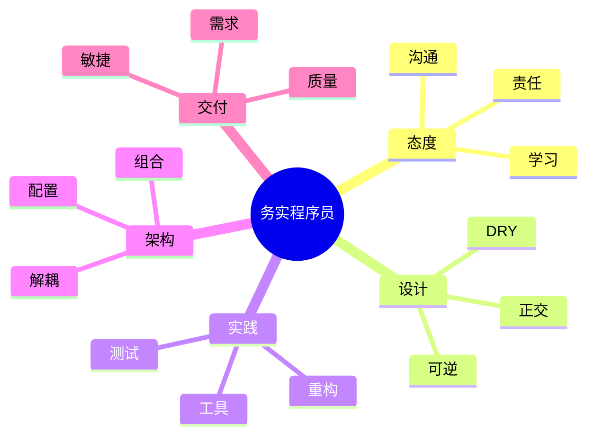

# 程序员修炼之道（第 2 版）· 整书总结与读后感

> 系列：[程序员修炼之道](README.md) · 读后浓缩  
> 深度分析见：[00-overview.md](00-overview.md) · 分章见 [01](01-chapter-philosophy.md)–[09](09-chapter-projects.md)

---

## 用三句话读完这本书

1. **务实**不是凑合，而是在真实约束下对技艺、用户和团队负责。  
2. 软件必然变乱（熵），要靠 **DRY、正交、可逆、解耦** 和持续小步重构对抗。  
3. 工具、测试、沟通与交付习惯和写代码本身一样重要——**优秀程序员是终身学习者**。

---

## 全书脉络（一张表）

| 章 | 主题 | 你应带走的一个词 |
|----|------|------------------|
| 1 务实的哲学 | 价值观 | **责任** |
| 2 务实的方法 | 设计应对变化 | **DRY / 正交** |
| 3 基础工具 | 放大产能 | **自动化** |
| 4 务实的偏执 | 防御性编程 | **早崩溃** |
| 5 宁弯不折 | 架构弹性 | **解耦** |
| 6 并发 | 多任务 | **少共享** |
| 7 当你编码时 | 日常习惯 | **重构 + 测试** |
| 8 项目启动之前 | 需求与范围 | **反馈环** |
| 9 务实的项目 | 协作交付 | **可工作软件** |

```text
心法(1) → 方法(2) → 工具(3) → 防御(4) → 架构(5) → 并发(6) → 编码(7) → 立项(8) → 交付(9)
```

---

## 知识点浓缩

### A. 哲学与态度

| 概念 | 浓缩 |
|------|------|
| 软件熵 | 不维护必然腐烂；每次改动尽量让代码比来时干净 |
| 够好即可 | 在期限与资源下**明确**质量目标，非降低专业标准 |
| 知识组合 | 批判阅读、多学语言与领域；投资组合式学习 |
| 沟通 | 文档、API、评审、会议都是沟通；失败沟通毁掉好代码 |
| 人生是你的 | 技术栈与环境可选择，别只做受害者 |

### B. 设计与架构（全书最硬知识）

| 概念 | 浓缩 |
|------|------|
| **DRY** | 每一条**知识**只在一处权威表达；形似代码≠重复知识 |
| **正交** | 改 A 不应意外牵动 B；低耦合 |
| **可逆性** | 无最终决定；延迟绑定、保留回退 |
| **曳光弹** | 端到端可运行薄骨架，要演进保留 |
| **原型** | 探索用，常丢弃；≠ 曳光弹 |
| **优秀设计** | 比烂设计**更容易修改**——试金石 |
| **解耦** | 模块少假设；消息、接口、事件 |
| **继承税** | 继承昂贵；优先组合 |
| **配置** | 易变外置；防配置地狱 |

### C. 可靠与编码

| 概念 | 浓缩 |
|------|------|
| 契约式设计 | 前置/后置条件写清假设 |
| 早崩溃 | 非法状态立即失败，不传播脏数据 |
| 断言 | 抓「绝不应发生」；与可恢复错误分工 |
| 尽早重构 | 见坏味道就整理，别等大版本 |
| 测试 | 自动化回归，给重构发许可证 |
| 命名 | 揭示意图、可搜索、一致 |
| 前灯范围 | 只优化/profile 证实的热点 |

### D. 并发与项目

| 概念 | 浓缩 |
|------|------|
| 打破时域耦合 | 不必同步的不要写在一起 |
| 共享状态 | 默认怀疑；消息传递、不可变 |
| 需求 | 流动资产，反馈环澄清 |
| 务实敏捷 | 价值观（反馈、勇气），非仪式 |
| 签名作品 | 对交付质量骄傲与负责 |

### E. Tips 主题索引（复习用，非 99 条全列）

| 主题 | 代表 Tips 精神 |
|------|----------------|
| 技艺 | 关注 craft；思考你的工作 |
| 重复 | DRY；让复用容易 |
| 变化 | 正交；不设最终决定 |
| 探路 | 曳光弹；用原型学习 |
| 工具 | 纯文本；Shell；VCS |
| 防御 | 契约；早崩溃；断言 |
| 协作 | 沟通；够好即可；在作品上签名 |

---

## 全书逻辑图



---

## 读后感

### 这本书在解决什么

读第一遍时容易觉得「散」——哲学、工具、并发、项目都有。重读后才明白：作者在建一整个**职业操作系统**。  
它不是教你某一门语言，而是教你：**当需求变、人换、技术债堆起来时，一个清醒的人怎么做事才不会被自己拖死。**

### 印象最深的几处

**DRY 与正交**几乎可以当作日后读所有技术书的滤镜。看到复制粘贴，先问是知识重复还是巧合；看到改一处坏十处，先想正交被破坏了。

**曳光弹**对做桌面端、设备端软件特别治愈。连接、扫描、导出、上传这种长链路，若不能先跑通一条「假数据端到端」，很容易在细节里迷路半年。

**务实的偏执**里「早崩溃」改变了我对错误的态度：用户看到崩溃至少知道失败了；静默写坏数据才是噩梦。连接预检、导出路径校验，都应倾向于**明确失败 + 可诊断信息**。

**第 8、9 章**提醒技术人：很多失败不是算法，而是**需求没说清、范围没守住、沟通断了**。这对长期做 B 端、医疗、工业软件的人尤其真实。

### 与《软件设计的哲学》合读

| 本书 | 姊妹篇 |
|------|--------|
| 教你**每天怎么活** | 教你**代码怎么长骨头** |
| 熵、重构、工具 | 复杂度、深模块、接口 |
| 曳光弹探路 | design it twice 定形 |

两本不打架：没有务实习惯，设计哲学落不了地；没有模块观，重构会永远在搬沙子。

### 对工作实践的启发

1. **小步可逆**：连接诊断拆阶段、导出后删 staging，都是可回滚的小步。  
2. **工具即投资**：日志打包、脚本同步工程文件，一次自动化长期受益。  
3. **线程边界**：UI 与设备 IO 解耦，是第 6 章在 Qt 项目里的日常应用。  
4. **别等「大重构周」**：见坏味道就改，与 Ousterhout 的战略式编程一致。  
5. **沟通写进 DoD**：发布 checklist、失败提示文案，都是沟通产物。

### 冷静看待

- 「够好即可」易被误用，在数据与安全敏感领域要更严。  
- 部分工具举例随年代变，**原则**比工具名重要。  
- 本书少谈接口深度，需补《软件设计的哲学》。

### 若只记五句

1. 软件会变乱，你要持续整理。  
2. DRY 的是知识，正交的是变更。  
3. 先曳光弹，再填肉。  
4. 错了就早崩溃，别撒谎。  
5. 在作品上签名——你交付的，你要认。

---

## 重点与注意

> **重点**：全书关键词是 **务实**——责任、变化、沟通，不是完美主义。  
> **重点**：**DRY + 正交 + 可逆 + 解耦** 是技术章节的四条主线。  
> **重点**：**工具与测试** 不是附录，是日常战斗力。  
> **注意**：本书偏**过程与习惯**；模块设计读《软件设计的哲学》。  
> **注意**：深度分析见 [00-overview.md](00-overview.md)，分章细节见 01–09。  
> **注意**：复习时本文 + 各章 **重点与注意** 即可快速过一遍。

---

**延伸阅读**

- [全书深度思考](00-overview.md)
- [软件设计的哲学 · 整书总结与读后感](../software-design-philosophy/book-summary-reflection.md)
- [书籍总索引](../README.md)

---

*文档版本：2026-07-07*
