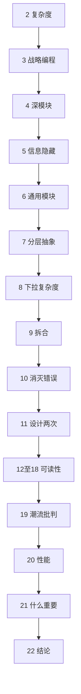

# 软件设计的哲学（第 2 版）· 全书深度思考

> 系列：[书籍笔记](../README.md) · [软件设计的哲学目录](README.md)  
> 姊妹篇：[程序员修炼之道 · 全书思考](../pragmatic-programmer/00-overview.md)

---

## 写在前面

John Ousterhout 在本书中只做一件事：**把「降低复杂度」讲透**。  
不同于《程序员修炼之道》的职业习惯全景，本书聚焦**模块如何切、接口如何设计、注释与命名如何服务可读性**。第 2 版（2021）增补「决定什么重要」、加强与《Clean Code》的对比、强化通用模块等论述。

若你只能记住一句话：**Working code isn't enough**——能跑只是起点，长期成本在复杂度。

---

## 1. 核心命题

### 1.1 复杂度是主要敌人

复杂度 = 开发者**理解**与**修改**系统所需的认知负担。症状：

- 修改需改很多处（**变更放大**）  
- 认知负荷高（**认知负荷**）  
- 不知该改哪（**未知未知**）

成因：**依赖**与**模糊**；且复杂度**增量累积**——每次小凑合都加一点。

### 1.2 战略式编程 vs 战术式编程

| | 战术式 | 战略式 |
|--|--------|--------|
| 目标 | 尽快让功能跑 | 降低长期复杂度 |
| 做法 | 能跑就交差 | 多投 10–20% 设计时间 |
| 结果 | 短期快、长期慢 | 前期略慢、后期快 |

Ousterhout 主张：**战略式编程是默认姿态**；战术式仅用于明确的一次性原型。

---

## 2. 二十二章逻辑链

**前半**：模块与接口（第 4–11 章）——本书心脏。  
**中段**：注释、命名、一致性（第 12–18 章）——让深模块**可被理解**。  
**后半**：潮流、性能、取舍（第 19–21 章）——不盲从方法论。

---

## 3. 深模块：全书最重要概念

**深模块** = 接口简单、实现强大。  
**浅模块** = 接口与实现信息量差不多，调用方仍要懂很多细节。

反模式 **classitis**：为「每个类都小」而拆碎，接口泛滥，复杂度反而上升。

对比：

| 深模块 | 浅模块 |
|--------|--------|
| `open(path, flags)` 背后处理缓存、权限 | 调用方自己拼五个 setter 再 `init()` |
| `vtkAlgorithm::Update()` 背后整管线 | 调用方逐步调五个 Filter 的内部步骤 |

设计目标：**让常见用法极简，把难藏在实现里**（第 8 章：下拉复杂度）。

---

## 4. 设计原则与红旗（书末浓缩）

### 原则（节选）

- 模块应深  
- 信息隐藏，避免泄漏  
- 不同层不同抽象；相邻层可区分  
- 拉复杂度向下（ toward 实现）  
- 通用模块更深  
- 设计两次  
- 注释描述代码**不明显**之事  
- 命名清晰、一致、可搜

### 红旗（节选）

- 浅模块  
- 信息泄漏、临时分解  
- 过度通用、过度专用  
- 重复、依赖链过长  
- 注释解释「做什么」而非「为什么」  
- API 强迫调用方处理本可内部消化的情况

复习时可当 **code review 检查表**。

---

## 5. 与 GoF / 设计模式

第 10 章：**设计模式应拆解为工具**，而非仪式。  
模式是手段；若引入模式后接口变复杂、模块变浅，则适得其反。  
与 [design-patterns-essence.md](../../design-patterns-essence.md) 一致：模式是变化点管理，不是类图 KPI。

与 [ljz-design-patterns](../../../ljz-design-patterns/)：GoF 教「常见形状」；Ousterhout 教「**深不深**」。先判断模块是否深，再谈是否套模式。

---

## 6. 与《Clean Code》的分歧（第 2 版明示）

| 话题 | Ousterhout | Clean Code 常见主张 |
|------|------------|---------------------|
| 方法长度 | 可为长，若利于深模块与隐藏细节 | 宜短 |
| 注释 | 重要，写非显而易见信息 | 部分流派贬低注释 |

不必站队宗教：**深模块 + 好注释** 可同时成立。

---

## 7. 与 Qt / VTK

- **深模块**：`QIODevice::read()`、`vtkMapper::Render()`——简单入口，复杂实现  
- **浅模块反例**：为每个小步骤暴露的 Filter 组合 API，强迫应用层编排  
- **信息隐藏**：`vtkObject` 内部 `vtkSubjectHelper` 管理 observer，外部只 `AddObserver`  
- **分层**：UI（Qt）→ 业务 Session → VTK 渲染；层间抽象应不同（第 7 章）  
- **vtkCommand 命名**：接口像 Command，语义是回调——深不深看**调用方要懂多少**，见 [VTK 专题](../../vtk-observer-and-command-pattern.md)

---

## 8. 与《程序员修炼之道》的配合

| 程序员修炼之道 | 软件设计的哲学 |
|----------------|----------------|
| DRY、正交 | 信息隐藏、减少重复依赖 |
| 曳光弹探需求 | design it twice 定结构 |
| 重构习惯 | 修改既有代码时保持深模块 |
| 工具与测试 | 注释、命名、显而易见 |

务实之道保证**你在持续整理**；设计哲学告诉你**往哪个方向整理**。

---

## 9. 个人启发

1. 写新类前问：**调用方最少需要知道什么？** 能否再少？  
2. 代码评审多盯**接口**，少盯行数迷信  
3. 「能跑」之后留 15% 时间做**第二次设计**对比  
4. 注释写给六个月后的自己：假设、约束、为何不用另一种做法  
5. 潮流（纯 OOP、TDD 万能、微服务）用第 19 章眼光审视：**是否降复杂度？**

---

## 重点与注意

> **重点**：**复杂度**是唯一主敌；战略式编程是默认心态。  
> **重点**：**深模块**（简单接口 + 强实现）是全书轴心；浅模块与 classitis 是头号红旗。  
> **重点**：**信息隐藏**、**下拉复杂度**、**设计两次** 是日常最可执行的三板斧。  
> **注意**：战术式编程只适用于**明确丢弃**的原型，不是常态。  
> **注意**：模式、OOP、短函数都是工具；判断标准是复杂度升降。  
> **注意**：注释不是失败，要写**代码看不出的**信息。  
> **注意**：与《程序员修炼之道》互补：一本管**习惯**，一本管**结构**。

---

**延伸阅读**

- 分章笔记：[第 1 章 引言](01-chapter-introduction.md) 起  
- [程序员修炼之道 · 全书思考](../pragmatic-programmer/00-overview.md)  
- [设计模式的思考](../../design-patterns-reflections.md)

---

*文档版本：2026-07-07*
