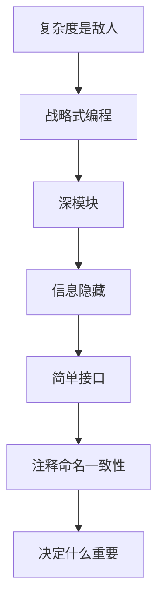

# 软件设计的哲学（第 2 版）· 整书总结与读后感

> 系列：[软件设计的哲学](README.md) · 读后浓缩  
> 深度分析见：[00-overview.md](00-overview.md) · 分章见 [01](01-chapter-introduction.md)–[22](22-chapter-conclusion.md)

---

## 用三句话读完这本书

1. **能跑远远不够**，长期成本取决于复杂度，而复杂度几乎总是增量堆上去的。  
2. 好设计 = **深模块**：接口简单、实现强大，把难藏在模块里。  
3. **战略式编程**是默认：愿多投一点时间设计，换后面改得动、读得懂。

---

## 全书脉络（一张表）

| 段 | 章 | 主题 | 带走一词 |
|----|-----|------|----------|
| 基础 | 1–3 | 为何写、复杂度、战略编程 | **复杂度** |
| 模块 | 4–11 | 深模块、隐藏、分层、错误、设计两次 | **深** |
| 可读 | 12–18 | 注释、命名、一致性、显而易见 | **显而易见** |
| 反思 | 19–22 | 潮流、性能、取舍、结论 | **决定什么重要** |

```text
复杂度(2) → 战略心态(3) → 模块设计(4–11) → 可读性(12–18) → 取舍与结论(19–22)
```

---

## 知识点浓缩

### A. 复杂度与编程心态

| 概念 | 浓缩 |
|------|------|
| 复杂度定义 | 理解 + 修改系统的认知负担 |
| 三大症状 | 变更放大、认知负荷、未知未知 |
| 两大成因 | **依赖**、**模糊** |
| 增量性 | 每次小凑合加一点；没有「突然变烂」 |
| 战术式编程 | 能跑就交差；短期快长期慢 |
| 战略式编程 | 默认多投 10–20% 设计；长期快 |
| Working code isn't enough | 全书命题句 |

### B. 模块设计（核心）

| 概念 | 浓缩 |
|------|------|
| **深模块** | 接口简单、实现强大；常见用法极简 |
| **浅模块** | 接口仍复杂，调用方懂太多 |
| **classitis** | 为小而拆，接口泛滥 |
| 信息隐藏 | 决策藏实现内；减少泄漏 |
| 信息泄漏 | 接口暴露本可内部的决策（格式、协议、时序） |
| 临时分解 | 按时间步骤拆模块，常导致泄漏 |
| 通用模块 | 适度通用更深；过窄过宽都浅 |
| 不同层不同抽象 | 相邻层应能区分；忌透传 |
| 下拉复杂度 | 难留给实现，简留给接口 |
| 拆还是合 | 合并减接口；拆分防巨型类——权衡 |
| Define errors out | 从 API 设计消灭非法状态 |
| Design it twice | 至少两套方案对比再定稿 |

### C. 可读性

| 概念 | 浓缩 |
|------|------|
| 注释四借口 | 「代码即文档」等——常不成立 |
| 注释写什么 | **代码看不出的**：假设、why、约束 |
| 先写注释 | 设计过程的一部分，非事后补丁 |
| 命名 | 清晰、一致、可搜；减少注释需求 |
| 一致性 | 降低认知负荷；跟随局部惯例 |
| Obvious code | 读者第一次读就懂；靠命名与结构 |
| 改旧代码 | 每次改深一点；别战术式打补丁 |

### D. 潮流、性能与取舍

| 概念 | 浓缩 |
|------|------|
| 软件潮流 | OOP/TDD/敏捷等——问是否降复杂度 |
| 性能设计 | 先清晰再优化；设计留余地 |
| 决定什么重要 | 分离重要与不重要；深度投入在重要处 |
| vs Clean Code | 方法可长、注释有用——若利于深模块 |

### E. 设计原则（书末浓缩）

- 模块应深  
- 信息隐藏  
- 不同层不同抽象  
- 复杂度下沉  
- 通用模块更深  
- 设计两次  
- 注释写非显而易见之事  
- 命名与一致

### F. 红旗（Code Review 用）

- 浅模块、接口膨胀  
- 信息泄漏、临时分解  
- 重复、长依赖链  
- 注释只重复代码在做什么  
- API 把本可内部处理的事推给调用方  
- 过度通用 / 过度专用

---

## 全书逻辑图



---

## 读后感

### 这本书在解决什么

Ousterhout 几乎只做一件事：**把「复杂度」从口号变成可操作的判断标准**。  
读完后你会开始用新眼睛看代码——不是「这行丑不丑」，而是「调用方要懂多少才能用对」「改一个需求要动几处」。

这和《程序员修炼之道》的「务实习惯」是互补的：Hunt & Thomas 教你别把自己累死；Ousterhout 教你别把下一个人（往往是六个月后的自己）累死。

### 印象最深的几处

**深模块**是全书轴心。以前以为「类小、函数短」就是好；Ousterhout 说：若接口仍复杂，拆只是**把复杂度推给调用方**。  
`QIODevice::read()`、`vtkAlgorithm::Update()` 之所以好，正因为常见路径极短，背后一团乱麻被藏住了。

**战略式编程**缓解了我的焦虑：不是一上来就完美架构，而是**默认**愿多花 10–20% 想接口和边界，而不是「先糊上再说」。战术式只留给明确要扔的原型。

**Define errors out of existence** 和务实之道的「早崩溃」形成有趣对照：一个从 API 设计让错误难发生，一个从运行时立刻暴露——都反对静默坏状态。

**注释**一章颠覆「好代码不需要注释」的教条。注释应写**why、假设、线程约束、为何不用另一种写法**——这正是大型 C++/Qt/VTK 工程里真正缺的东西。

**第 19 章**对潮流的冷静让人松口气：OOP、设计模式、TDD 不是宗教；唯一标准是复杂度升降。与 [design-patterns-essence.md](../../design-patterns-essence.md) 里「模式不是银弹」完全同频。

### 与 Qt / VTK 读源码

- `vtkObject` + `AddObserver`：外部接口小，内部分发复杂——深。  
- `vtkCommand` 名字误导，但若调用方只需 `AddObserver`，仍算把回调机制藏得不错。  
- 反例：强迫应用层手动编排多个 Filter 内部步骤而不提供高层 `Update()`——浅。

### 与《程序员修炼之道》合读

| 修炼之道 | 设计哲学 |
|----------|----------|
| DRY、正交 | 减依赖、减重复、信息隐藏 |
| 曳光弹 | 探需求；design it twice 定结构 |
| 尽早重构 | 改旧代码时加深模块 |
| 工具与测试 | 支撑战略式投入 |

### 对工作实践的启发

1. 写新类前问：**调用方最少知多少？** 能否再少一个 setter？  
2. Code review 多盯**接口**和**泄漏**，少盯行数 KPI。  
3. 连接、导出、上传多条路径——用**深模块**收口，别让 UI 层编排十步。  
4. 改遗留代码：每次触摸**略深一点**，别再加一个 if 了事。  
5. 性能：先结构清晰，再 profile；与第 20 章一致。

### 冷静看待

- 「深模块」不是接口越少越好，而是**常见用例**简单。  
- 与 Clean Code 分歧要有意识：长方法若隐藏细节，可能优于十个浅函数。  
- 全书偏**单进程库与系统**经验，分布式需另补；但复杂度思维仍适用。

### 若只记五句

1. 复杂度是增量堆出来的。  
2. 能跑只是起点。  
3. 深模块：接口简单，实现强大。  
4. 注释写代码看不出的。  
5. 重要的事设计两次，不重要的事别过度设计。

---

## 重点与注意

> **重点**：**复杂度**是唯一主敌；**深模块**是唯一主药（之一）。  
> **重点**：**战略式编程**是默认心态，战术式仅限明确丢弃的原型。  
> **重点**：书末 **原则 + 红旗** 可当评审清单。  
> **注意**：与《程序员修炼之道》互补：一本管**习惯**，一本管**结构**。  
> **注意**：深度分析见 [00-overview.md](00-overview.md)，分章见 01–22。  
> **注意**：复习：本文 + 各章 **重点与注意** 即可快速过一遍。

---

**延伸阅读**

- [全书深度思考](00-overview.md)
- [程序员修炼之道 · 整书总结与读后感](../pragmatic-programmer/book-summary-reflection.md)
- [设计模式的本质](../../design-patterns-essence.md)
- [书籍总索引](../README.md)

---

*文档版本：2026-07-07*
