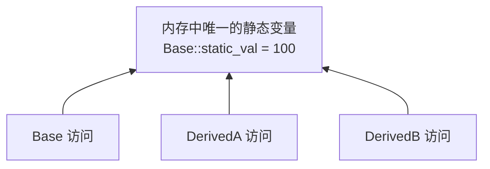

# C++ 面向对象深剖：动态多态（RTTI）与静态成员继承

在 C++ 面向对象设计中，多态允许我们使用父类指针操作子类对象。而在处理更复杂的继承关系时，运行时类型识别以及静态成员变量在继承链中的表现，是容易产生理解偏差的高危区域。

本篇将深入剖析 C++ 动态多态核心—— **RTTI（运行时类型识别）** 的工作原理，并解答关于 **基类静态成员（static）在派生类中继承表现** 的核心疑难。

---

## 1. 运行时类型识别（RTTI）原理

### 1.1 什么是 RTTI？
RTTI（Run-Time Type Information）是程序在**运行期**确定对象实际物理类型的机制。C++ 主要通过两个运算符来支持 RTTI：
1. **`dynamic_cast`**：将基类指针/引用安全地强转为子类指针/引用（转换失败则指针返回 `nullptr`，引用抛出异常）。
2. **`typeid`**：获取一个对象或表达式的实际类型，返回 `std::type_info` 的引用。

### 1.2 typeid 的“动静之分”（核心避坑）
许多人误以为 `typeid` 永远能返回运行时的实际类型，这是一个极大的误区。它的求值行为由**类本身是否具有多态性（是否有虚函数）**决定：

* **非多态类（无虚函数）**：`typeid` 在**编译期**静态确定类型。它只关心指针声明的静态类型，不关心实际指向什么。
  ```cpp
  class Base {}; // 无虚函数
  class Derived : public Base {};
  
  Base* p = new Derived();
  std::cout << typeid(*p).name(); // ❌ 输出 "Base"！因为无虚函数，编译期静态判定
  ```
* **多态类（包含虚函数）**：`typeid` 在**运行期**动态确定类型。编译器会在虚函数表（vtable）中存放类型描述信息的指针（RTTI 指针），在运行期去查找实际对象的类型。
  ```cpp
  class Base { virtual ~Base() {} }; // 含有虚析构函数（多态）
  class Derived : public Base {};
  
  Base* p = new Derived();
  std::cout << typeid(*p).name(); // ✅ 输出 "class Derived"！运行期动态识别
  ```

---

## 2. 基类静态成员在继承链中的规则

关于静态成员变量（`static`），初学继承时常有一个疑问：**派生类（子类）继承基类（父类）后，子类是否会拥有一份独立的静态成员副本？**

### 2.1 核心规则
**在整个程序中，无论基类派生出多少个子类，也无论创建了多少个实例，该静态成员变量在内存中永远只有一份，所有类和对象共享这同一个变量。**



### 2.2 实战代码验证
```cpp
#include <iostream>

class Base {
public:
    static int static_val; // 基类声明静态成员
};

// 静态成员类外定义并初始化
int Base::static_val = 10; 

class DerivedA : public Base {};
class DerivedB : public Base {};

int main() {
    // 1. 通过子类 A 修改静态变量
    DerivedA::static_val = 99;

    // 2. 观察基类及其他子类的变化
    std::cout << "Base::static_val:     " << Base::static_val << std::endl;     // 输出 99
    std::cout << "DerivedA::static_val: " << DerivedA::static_val << std::endl; // 输出 99
    std::cout << "DerivedB::static_val: " << DerivedB::static_val << std::endl; // 输出 99

    return 0;
}
```

### 2.3 结论与工程启示
* 子类修改 `static_val` 实际上直接改写了基类的静态变量，因此所有其他子类读取到的值也会同步发生改变。
* 派生类对基类静态成员的继承，实质上只是**继承了对该成员的访问权限**（根据 `public` / `protected` / `private` 规则限制），而不是在物理内存上克隆复制了一份新的变量。
