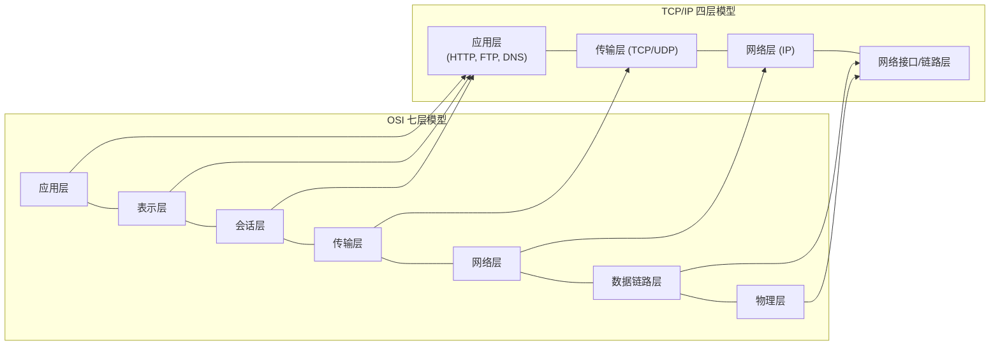
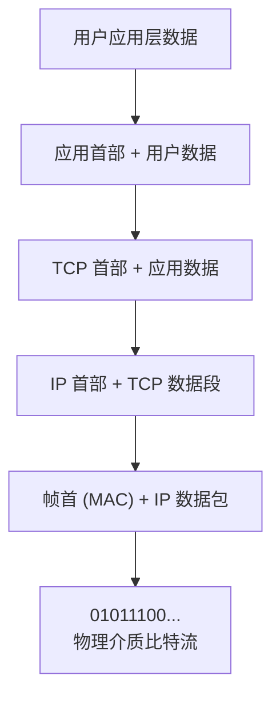
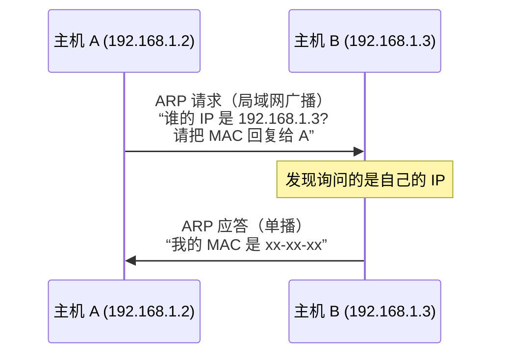
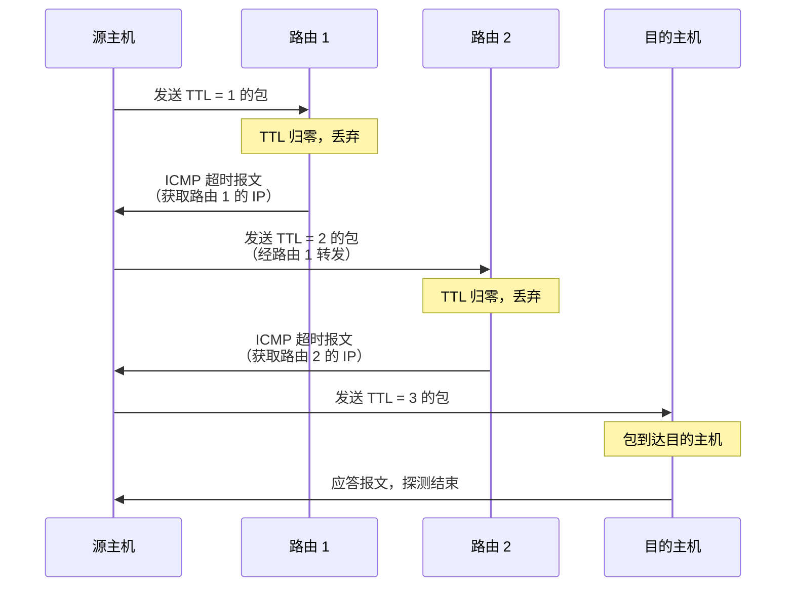

# TCP/IP 底层基础：网络分层模型与以太网路由寻址

在现代网络通信中，数据的传输并不是一蹴而就的，而是通过一整套高度结构化的协议体系层层配合完成的。理解网络协议分层、以太网物理寻址（ARP），以及网络层诊断机制（ICMP），是分析多线程网络通信与网络排障的必备素养。

本篇将深入拆解 TCP/IP 四层分层模型、数据封装解包过程、ARP/RARP 地址解析协议的工作原理，以及 Ping 与 Tracert 的底层 ICMP 诊断机制。

---

## 1. TCP/IP 模型与数据封装

为了降低网络协议设计的复杂度，网络世界采用了**分层设计**。最经典的实用模型是 **TCP/IP 四层协议族模型**：

数据封装流向（自上而下逐层加首部）：

### 1.1 数据装箱与拆箱（封装与解包）
* **封装（Encapsulation）**：发送方发送数据时，数据从应用层自上而下传递。每经过一层，该层协议都会在数据头部（有时包括尾部，如链路层）包裹上自己的**控制首部（Header）**。
* **解包（Decapsulation）**：接收方收到物理比特流后，数据自下而上传递。每经过一层，该层协议会将自己对应的首部拆掉，并将剩下的净荷（Payload）交付给上层，直到最终恢复出应用数据。

---

## 2. 数据链路层与 ARP 地址解析协议

### 2.1 链路层帧定位
在局域网内，物理网卡是通过唯一的 **MAC 地址（物理地址，48位）** 进行标识和帧路由的。网络层的 IP 数据包，必须被打包进链路层的 **以太网帧（Ethernet Frame）** 中才能在网线中传送，帧头中必须包含源 MAC 地址和目的 MAC 地址。

### 2.2 ARP（Address Resolution Protocol）工作原理
IP 地址是逻辑地址，MAC 地址是物理地址。**ARP 协议的作用就是根据目标的 IP 地址获取其对应的 MAC 地址**。

1. **查表（ARP 高速缓存）**：主机 A 要向 IP 为 `192.168.1.3` 的主机 B 发送数据时，首先在本地的 ARP 缓存表中查找该 IP 是否已有对应的 MAC 记录。
2. **广播询问（ARP Request）**：如果缓存未命中，主机 A 会在局域网内发送一个 **ARP 请求广播包**。局域网内的所有主机都会收到这个包，但只有 IP 为 `192.168.1.3` 的主机 B 才会理会它。
3. **单播回复（ARP Reply）**：主机 B 将 A 的 IP-MAC 关系记入自己的表，并向 A 发送一个 **ARP 应答单播包**，在包中附带上自己的物理 MAC 地址。
4. **更新缓存**：主机 A 收到应答，将 B 的 IP-MAC 映射存入本地 ARP 缓存表，随后开始正常打包发送以太网帧。

> 💡 **RARP（逆地址解析协议）**：工作原理与 ARP 相反，用于无盘工作站等通过自己的物理 MAC 地址向服务器询问自己分配到了什么 IP 地址。

---

## 3. 网络层与 IP 数据报

### 3.1 IP 协议特征
IP（Internet Protocol）是网络层核心协议。它是**无连接、不可靠、尽力而为交付**的协议。IP 协议不负责确认接收、不进行超时重传，这些可靠性保障全部转交给了上层协议（如 TCP）。

### 3.2 IP 首部中的关键字段：TTL（Time To Live）
* **定义**：生存时间（TTL）规定了该数据包在网络中最多可以穿过多少个路由器。
* **防环机制**：数据包每经过一个路由器，路由器都会将该包首部中的 TTL 值减 1。**当 TTL 归零时，该包会被当前路由器直接丢弃**，并向源主机发送一个 ICMP 超时报文。这能彻底防止因网络路由环路导致数据包在网内无限死循环，榨干带宽。

---

## 4. ICMP 协议与网络诊断（Ping / Tracert）

由于 IP 协议不可靠，当传输发生错误时需要一种通知机制，**ICMP（Internet Control Message Protocol，网际控制报文协议）** 应运而生。它是 IP 层的辅助协议。

### 4.1 Ping 命令工作机制
Ping 是检测网络主机双向连通性最著名的工具，基于 ICMP 协议实现：
1. **Echo Request**：源主机向目的主机发送一个 **ICMP 回显请求报文**（类型码为 8）。
2. **Echo Reply**：目的主机收到请求后，必须即时向源主机回传一个 **ICMP 回显应答报文**（类型码为 0）。
3. **计算延迟**：源主机计算从发出请求到收到应答的时间差，从而评估网络往返延迟（RTT）与丢包率。

### 4.2 Tracert (Traceroute) 路由追踪工作机制
Tracert 用于探测数据包到达目的主机所经过的所有路由器节点：

1. **第一轮测试**：源主机向目的主机发送一个 IP 包，故意将 **TTL 设为 1**。
2. **获取第一跳**：第一个路由器（网关）收到包后将 TTL 减 1 变为 0，包被丢弃，路由器向源主机发送 **ICMP 超时报文**。源主机从而获取了第一个路由器的 IP 地址。
3. **递增 TTL 探测**：源主机接着发送 **TTL = 2** 的包，获取第二个路由器的 IP；接着发送 **TTL = 3** 的包...
4. **结束探测**：直到包最终到达目的主机，目的主机发现端口不可达（或者收到了 Echo 包），向源主机发送一个端口不可达报文，探测结束。一条完整的网络路由轨迹图成功绘出。
