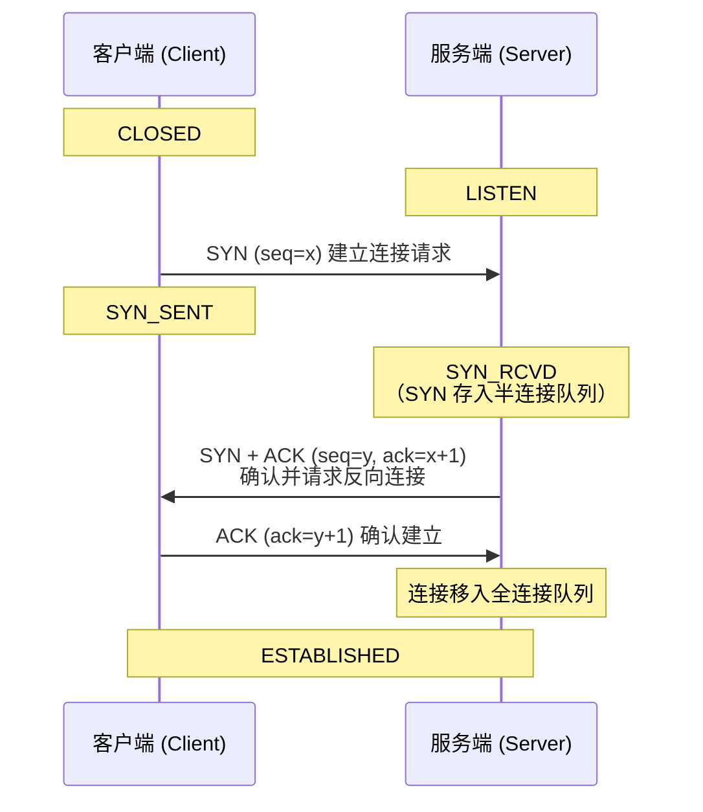
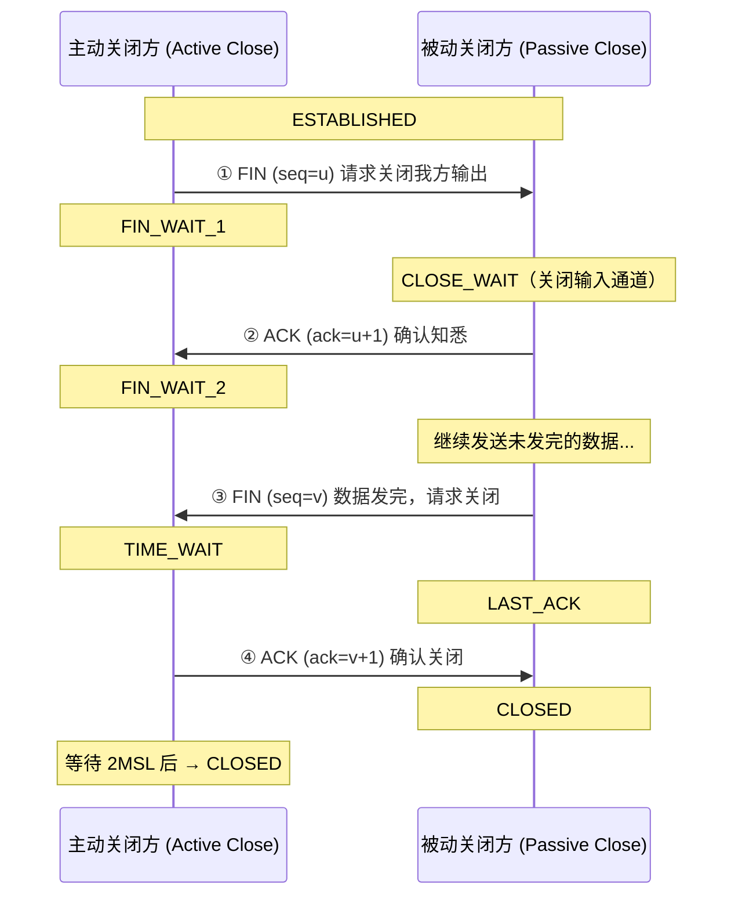
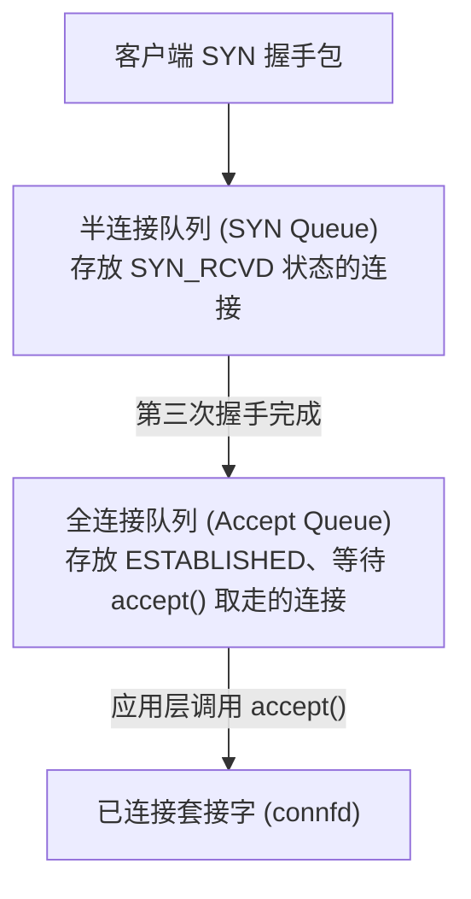
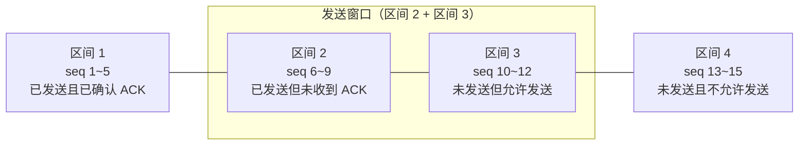

# TCP 核心机制：三次握手、四次挥手与滑动窗口流量控制

TCP（Transmission Control Protocol）是一种**面向连接的、可靠的、基于字节流**的传输层协议。在网络编程和系统性能优化中，TCP 连接的建立与释放、内核队列的缓冲限制、以及窗口流量控制，是分析通信延迟和吞吐量瓶颈的关键点。

本篇将从三次握手与四次挥手的状态机、TIME_WAIT 与 2MSL 的安全考量、`listen` 函数的内核半/全连接队列，以及滑动窗口的流量控制，进行深剖。

---

## 1. TCP 三次握手与四次挥手深度剖析

### 1.1 三次握手（Connection Setup）
三次握手是为了在不可靠的 IP 网络上安全地建立双向可靠连接。

#### 核心考点：为什么不能是“两次握手”？
1. **防止已失效的连接请求报文突然又传送到了服务端，产生资源浪费**：
   * 假设是两次握手。客户端发送的第一个 `SYN` 报文段在某个网络节点长时间滞留，客户端超时重传并完成了连接。
   * 之后，那个滞留的旧 `SYN` 终于到达服务端。服务端以为是一个新连接，立即回复 `SYN-ACK` 并单方面进入 `ESTABLISHED`。
   * 但此时客户端早已忽略该报文。服务端的连接资源将被无限挂空闲挂死，造成严重内存损耗。
2. **确认双向的发送与接收能力完全正常**：三次握手是让双方都确认自己“发得出去”且“收得到回信”的最小交互次数。

---

### 1.2 四次挥手（Connection Teardown）
由于 TCP 是全双工的（双方可以同时独立发送和接收），断开连接必须双方分别确认关闭各自方向的通道。

#### 核心考点：为什么 TIME_WAIT 状态需要等待 2MSL？
`MSL`（Maximum Segment Lifetime）是报文在网络中的最大存活时间。等待 `2MSL`（通常为 2 到 4 分钟）有两个关键目的：
1. **保证最后一个 ACK 能够安全到达被动关闭方**：
   * 如果主动方发送的最后一个 `ACK` 在网络中丢包，被动方因收不到确认，会超时重传 `FIN` 包。
   * 主动方在 `2MSL` 时间内如果再次收到重传的 `FIN`，会重新发送 `ACK` 并刷新定时器。如果主动方直接关闭，被动方重传的 `FIN` 将收到 `RST` 报错，导致连接非正常退出。
2. **使本次连接中产生的所有旧报文在网络中彻底消失**：
   * 确保下一次建立相同 IP 和端口的“新连接”时，不会收到本次连接滞留的“旧脏数据”报文，防止新连接逻辑错乱。

---

## 2. 内核连接队列：`listen` 的第二个参数（Backlog）

在 Socket 编程中，服务端的监听逻辑为：`int listen(int sockfd, int backlog);`。这里的 `backlog` 在内核中对应两个队列的大小上限：

1. **半连接队列（SYN Queue）**：存放收到 `SYN` 后、尚未完成三次握手的连接（状态为 `SYN_RCVD`）。
2. **全连接队列（Accept Queue）**：存放已完成三次握手、但应用层尚未调用 `accept()` 取走的连接（状态为 `ESTABLISHED`）。

### ️ Linux 2.2 之后的 Backlog 行为变迁
* **变化**：在 Linux 2.2 之后，`backlog` 参数**仅代表全连接队列（Accept Queue）的最大长度**，而非半连接队列大小。半连接队列大小由系统参数 `/proc/sys/net/ipv4/tcp_max_syn_backlog` 全局控制。
* **溢出后果**：如果应用层处理太慢，导致全连接队列满了，新的客户端发送 `SYN` 时，内核默认会**忽略该 SYN 分节**（不回复任何包）。客户端在收不到响应后会触发超时重传 `SYN`，期望全连接队列腾出空位。这是一种平滑限流保护机制。

---

## 3. 流量控制：滑动窗口（Sliding Window）

为了防止发送方发送速度过快，撑爆接收方的接收缓冲区，TCP 使用滑动窗口进行流量控制。

### 3.1 发送方窗口内存布局
发送缓存内的数据可分为四个区间，其中**区间 2 + 区间 3 构成了发送窗口**：

> 区间 1 与区间 2 的分界为**窗口左边界**，区间 3 与区间 4 的分界为**窗口右边界**，区间 2 与区间 3 的分界为**可用窗口右边界**。

* **窗口移动规则**：
  * **左边界向右滑动**：只有当收到已发送数据的对应 `ACK`（如收到 6 和 7 的 ACK）时，左边界才会向右滑动。
  * **窗口大小缩放**：接收方在回复的 `ACK` 报文中，会通过首部中的 **Window Size（窗口大小）** 字段实时告知自己当前的剩余接收缓冲区大小。发送方会动态调整发送窗口右边界，确保“已发送未确认 + 未发送允许发”的总大小不超过对端的接收能力。
