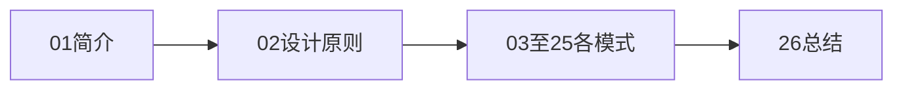

# 01 设计模式简介

> 系列：[李建忠设计模式](README.md) · 第 01/26 讲

---

## 引子

软件里反复出现同类问题：想加功能就得改旧代码、类越写越大、继承层次失控。设计模式不是语法，而是前人总结的**可复用设计方案**——在特定上下文里，用固定角色分工解决问题。

---

## 要解决什么问题

没有模式意识时，常见坏味道：

```cpp
// 每加一种导出格式，改一处
void exportData(const std::string& path, int format) {
  if (format == 0) exportCsv(path);
  else if (format == 1) exportJson(path);
  else if (format == 2) exportXml(path);  // 又加一种…
}
```

痛点：修改扩散、难以测试、团队协作时「各写各的 if-else」。

设计模式提供的是**命名过的结构**：看到「策略」「观察者」就知道在谈哪种解耦方式。

---

## 什么是设计模式

| 要素 | 说明 |
|------|------|
| **模式名称** | 沟通词汇，如 Strategy、Observer |
| **问题** | 在什么场景下反复出现 |
| **解决方案** | 哪些类、如何协作 |
| **后果** | 带来的灵活性与代价 |

GoF（1994）归纳 **23 种**经典模式，分三类：

- **创建型**（5）：对象如何诞生  
- **结构型**（7）：类与对象如何组合  
- **行为型**（11）：职责如何分配与通信  

本系列按**李建忠课程顺序**讲解（与书本分类顺序不同），但 23 种模式全覆盖。

---

## 学习设计模式的目的

李建忠课程强调的目标不是「背 UML」，而是：

1. **识别变化点**：哪里会变，就把变化隔离出去  
2. **依赖抽象**：面向接口编程，而非具体类  
3. **组合优于继承**：用对象组合获得灵活性  
4. **在重构中运用**：从能工作的代码出发，消除坏味道  

模式是**目标结构**；重构是**到达路径**。先写能跑的代码，再识别模式，比一上来就「模式驱动设计」更务实。

---

## 如何使用本系列



- 每讲含 **C++ 极简示例**，可在 [code/](code/README.md) 找到可编译版本  
- 每讲文末 **重点与注意** 便于复习  
- 与框架无关；若需 Qt/VTK 落点，见兄弟系列 `pattern/`（本系列不展开）

---

## 模式不是银弹

- 不要为模式而模式；简单问题用简单解法  
- 模式带来**间接层**，过度使用会降低可读性  
- 语言与库已内置部分模式（如 STL 迭代器），不必重复造轮子  

这些在 [26 总结](26-summary.md) 会系统回顾。

---

## 重点与注意

> **重点**：设计模式 = **可复用的面向对象设计经验**，不是库也不是框架。  
> **重点**：学习主线是「坏味道 → 原则 → 模式」，不是背 23 个名字。  
> **注意**：模式描述的是**角色关系**；同一项目里常多个模式组合出现。  
> **注意**：本课程先讲行为类模式，是为先建立「消除分支、延迟绑定」直觉。

---

## 小结

设计模式是团队沟通与代码演进的共同语言。下一讲建立评判好坏设计的尺子：**面向对象设计原则**。

**延伸阅读**

- 下一篇：[02 面向对象设计原则](02-oop-principles.md)
- 系列索引：[README](README.md)
