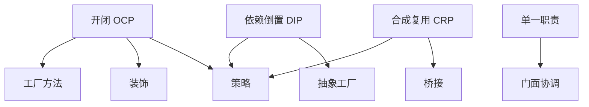

# 02 面向对象设计原则

> 系列：[李建忠设计模式](README.md) · 第 02/26 讲

---

## 引子

模式是「药方」，原则是「诊断标准」。李建忠课程在讲具体模式前，先讲**如何判断设计好坏**——后续每个模式都可追溯到：它满足了哪条原则、消除了哪种违反。

---

## 六大原则概览

| 原则 | 英文 | 一句话 |
|------|------|--------|
| 单一职责 | SRP | 一个类只因一种原因而修改 |
| 开闭 | OCP | 对扩展开放，对修改关闭 |
| 里氏替换 | LSP | 子类可替换父类且行为正确 |
| 依赖倒置 | DIP | 依赖抽象，不依赖具体 |
| 接口隔离 | ISP | 接口小而专，不强迫实现无用方法 |
| 合成复用 | CRP | 优先组合对象，而非继承复用 |

加上课程常强调的：**封装变化点**、**针对接口编程**。

---

## 单一职责原则（SRP）

### 违反示例

```cpp
class Report {
public:
  void generate() { /* 业务数据 */ }
  void saveToFile(const std::string& path) { /* IO */ }
  void sendEmail() { /* 网络 */ }
};
```

`Report` 因「报表逻辑」「持久化」「邮件」三种原因被修改。

### 改进方向

拆成 `ReportGenerator`、`ReportWriter`、`EmailSender`。  
**关联模式**：门面可把多个职责类**协调**给客户端一个简单入口（见 [14 门面](14-facade.md)），但职责仍应在不同类里。

---

## 开闭原则（OCP）

### 违反示例

```cpp
void drawShape(Shape& s) {
  if (s.type == Circle) drawCircle(s);
  else if (s.type == Rect) drawRect(s);
}
```

每加一种图形改 `drawShape`。

### 改进方向

```cpp
struct Shape { virtual void draw() = 0; };
struct Circle : Shape { void draw() override; };
```

通过**多态扩展**新图形，而不改原有调用代码。  
**关联模式**：[策略](04-strategy.md)、[装饰](06-decorator.md)、[工厂方法](08-factory-method.md) 都是 OCP 的典型实现手段。

---

## 里氏替换原则（LSP）

子类必须能**无损替换**父类。违反时多态会「骗人」：

```cpp
struct Bird { virtual void fly() = 0; };
struct Penguin : Bird {
  void fly() override { throw std::runtime_error("cannot fly"); }
};
```

`Penguin` 不应继承「会飞」的 `Bird`；应拆接口或改用组合。  
LSP 是 OCP 的基石：不能替换，扩展就危险。

---

## 依赖倒置原则（DIP）

高层模块不应依赖低层模块，二者都应依赖**抽象**。

```cpp
// 坏：高层直接 new 具体类
class Application {
  MySqlDatabase db;  // 绑死 MySQL
};

// 好：依赖抽象
class Application {
  std::unique_ptr<IDatabase> db;
public:
  explicit Application(std::unique_ptr<IDatabase> db) : db(std::move(db)) {}
};
```

**关联模式**：策略、抽象工厂、依赖注入容器思想。

---

## 接口隔离原则（ISP）

不要强迫客户端依赖它用不到的方法。

```cpp
struct IWorker {
  virtual void work() = 0;
  virtual void eat() = 0;  // 机器人也要实现 eat？
};
```

拆成 `IWorkable`、`IFeedable`，或更小的角色接口。

---

## 合成复用原则（CRP）

继承是白盒复用，组合是黑盒复用。优先：

```cpp
class Car {
  Engine engine;   // 组合
  Wheel wheels[4];
};
```

而非为复用代码而深层继承。  
**关联模式**：[策略](04-strategy.md)（Has-A 算法）、[装饰](06-decorator.md)（Has-A 增强）、[桥接](07-bridge.md)（抽象与实现组合）。

---

## 原则与模式关系图



---

## 重点与注意

> **重点**：原则之间有关联：DIP + OCP 是多数行为/结构模式的理论基础。  
> **重点**：「封装变化点」= 找到最可能变的那条轴，用抽象隔离开。  
> **注意**：原则不是教条；小项目可适度放松，但**识别违反**的能力要有。  
> **注意**：继承过深常同时违反 LSP、CRP；遇到时优先考虑组合。

---

## 小结

原则是模式的「为什么」。从下一讲开始，每个模式都可问：它让哪条原则落地了？

**延伸阅读**

- 上一篇：[01 设计模式简介](01-intro.md) · 下一篇：[03 模板方法](03-template-method.md)
- 系列索引：[README](README.md)
