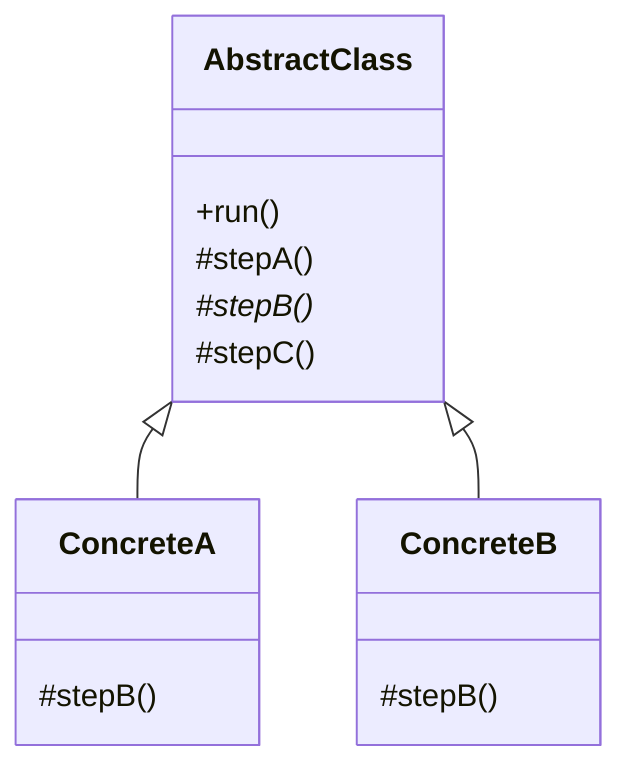

# 03 模板方法模式

> 系列：[李建忠设计模式](README.md) · 第 03/26 讲 · GoF 行为型

---

## 引子

导出报表：先读数据、再格式化、最后写文件——**步骤顺序固定**，只有「格式化」因 CSV/PDF 不同。若把全流程写死在基类的一个函数里，子类只能整体重写；模板方法让基类**定骨架**，子类**填步骤**。

---

## 要解决什么问题

```cpp
void exportCsv() { read(); formatCsv(); write(); }
void exportPdf() { read(); formatPdf(); write(); }
// read()、write() 重复
```

痛点：流程重复、子类易漏步骤、扩展新格式要复制粘贴。

---

## 模式结构

| 角色 | 职责 |
|------|------|
| AbstractClass | 定义模板方法 `run()`，调用各步骤 |
| ConcreteClass | 实现 `stepHook()` 等可变步骤 |
| 模板方法 | `final` 或不宜被子类覆盖的整体算法 |



---

## C++ 示例

```cpp
#include <iostream>
#include <memory>

class DataExporter {
public:
  void run() {  // 模板方法：固定流程
    readData();
    format();
    write();
  }
  virtual ~DataExporter() = default;

protected:
  void readData() { std::cout << "read\n"; }
  virtual void format() = 0;  // 变化点
  void write() { std::cout << "write\n"; }
};

class CsvExporter : public DataExporter {
protected:
  void format() override { std::cout << "format CSV\n"; }
};

class JsonExporter : public DataExporter {
protected:
  void format() override { std::cout << "format JSON\n"; }
};

int main() {
  std::unique_ptr<DataExporter> exp = std::make_unique<CsvExporter>();
  exp->run();
  return 0;
}
```

**钩子方法（Hook）**：基类提供带默认实现的 `virtual void beforeWrite() {}`，子类可选覆盖——介于抽象步骤与固定步骤之间。

---

## 适用 / 不适用

| 适用 | 不适用 |
|------|--------|
| 多子类共享**相同算法骨架**，仅部分步骤不同 | 算法骨架本身经常变 |
| 要控制子类扩展点、防止乱改流程 | 只有一处实现，无变化点 |
| 框架定义生命周期（`Init`→`Run`→`Cleanup`） | 应用层应用策略/状态更自然 |

---

## 与其他模式对比

| 对比 | 区别 |
|------|------|
| **模板方法 vs 策略** | 模板方法：继承、基类**定流程**；策略：组合、**整段算法**可换 |
| **模板方法 vs 工厂方法** | 工厂方法常是模板方法里的一个步骤（`create()` 钩子） |
| **模板方法 vs 状态** | 状态：对象内部状态换行为；模板方法：子类类型决定步骤 |

---

## 重点与注意

> **重点**：模板方法 = **好莱坞原则**：「别调用我们，我们调用你」（Hollywood Principle）。  
> **重点**：变化点做成 `protected virtual` 抽象或钩子，稳定步骤做成 `private` 或非虚。  
> **注意**：C++ 中析构函数若涉及多态步骤，基类析构应为 `virtual`。  
> **注意**：不要为只有两个相同步骤的代码硬套模板方法。

---

## 小结

模板方法在**类层次**上固定算法、延迟子类实现细节，是行为型模式的起点。下一讲把「变化点」从继承换成组合：**策略模式**。

**延伸阅读**

- 上一篇：[02 设计原则](02-oop-principles.md) · 下一篇：[04 策略模式](04-strategy.md)
- 代码：[code/03-template-method.cpp](code/03-template-method.cpp)
