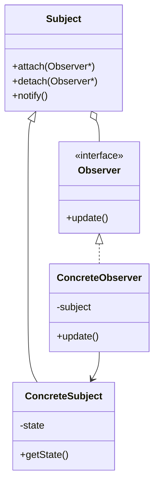

# 05 观察者模式

> 系列：[李建忠设计模式](README.md) · 第 05/26 讲 · GoF 行为型

---

## 引子

股票涨跌：多个显示器、手机 App、报警器都要在价格变化时更新。若 `Stock` 里写死 `updateDisplay1(); updateApp();`，每加一个订阅者就改 `Stock`。观察者让主题**只负责通知**，订阅者**自己响应**。

---

## 要解决什么问题

```cpp
class Stock {
  void setPrice(double p) {
    price_ = p;
    displayA_.refresh(p);
    displayB_.refresh(p);  // 紧耦合
  }
};
```

痛点：主题知道太多具体类、难以动态订阅/退订、违反开闭原则。

---

## 模式结构

| 角色 | 职责 |
|------|------|
| Subject | 维护观察者列表，`attach` / `detach` / `notify` |
| Observer | 更新接口 `update()` |
| ConcreteSubject | 状态变化时 `notify` |
| ConcreteObserver | 实现 `update`，拉取或接收推送数据 |



---

## C++ 示例（推模型）

```cpp
#include <iostream>
#include <vector>
#include <algorithm>
#include <string>

class Observer {
public:
  virtual void update(double price) = 0;
  virtual ~Observer() = default;
};

class Stock {
  double price_ = 0;
  std::vector<Observer*> observers_;
public:
  void attach(Observer* o) { observers_.push_back(o); }
  void detach(Observer* o) {
    observers_.erase(
      std::remove(observers_.begin(), observers_.end(), o),
      observers_.end());
  }
  void setPrice(double p) {
    price_ = p;
    notify();
  }
  void notify() {
    for (auto* o : observers_) o->update(price_);
  }
};

class Display : public Observer {
  std::string name_;
public:
  explicit Display(std::string n) : name_(std::move(n)) {}
  void update(double price) override {
    std::cout << name_ << ": price=" << price << "\n";
  }
};

int main() {
  Stock stock;
  Display d1("Screen"), d2("App");
  stock.attach(&d1);
  stock.attach(&d2);
  stock.setPrice(10.5);
  stock.detach(&d1);
  stock.setPrice(11.0);
  return 0;
}
```

**推 vs 拉**：推模型在 `notify` 里传数据；拉模型 Observer 自己 `subject->getState()`。实际系统常混合。

---

## 适用 / 不适用

| 适用 | 不适用 |
|------|--------|
| 一个对象状态变化，许多对象需联动 | 只有一对一回调，用函数指针即可 |
| 订阅关系运行期可变 | 通知链复杂、网状依赖（考虑中介者） |
| 抽象耦合（Subject 不知 Observer 具体类型） | 更新顺序严格依赖且难控制 |

---

## 与其他模式对比

| 对比 | 区别 |
|------|------|
| **观察者 vs 中介者** | 观察者：Subject **广播**；中介者：同事经 **Mediator** 间接通信 |
| **观察者 vs 发布-订阅** | 经典观察者 Subject 知道 Observer；事件总线可完全解耦（进阶） |
| **观察者 vs 职责链** | 职责链：请求沿链传递、可中断；观察者：通常**全部**通知 |

---

## 重点与注意

> **重点**：观察者实现 **开闭**：加新 Observer 不改 Subject 源码（仅 attach）。  
> **重点**：注意**循环更新**与**内存泄漏**（Observer 销毁前要 detach）。  
> **注意**：`notify` 里再改观察者列表要小心迭代器失效；可先拷贝列表再通知。  
> **注意**：C++ 可用 `std::function` + 信号槽思想；本讲保持 GoF 经典结构。

---

## 小结

观察者解决「一对多依赖、自动同步」。下一讲进入结构型：**装饰模式**——在不改类的前提下动态叠加职责。

**延伸阅读**

- 上一篇：[04 策略模式](04-strategy.md) · 下一篇：[06 装饰模式](06-decorator.md)
- 代码：[code/05-observer.cpp](code/05-observer.cpp)
