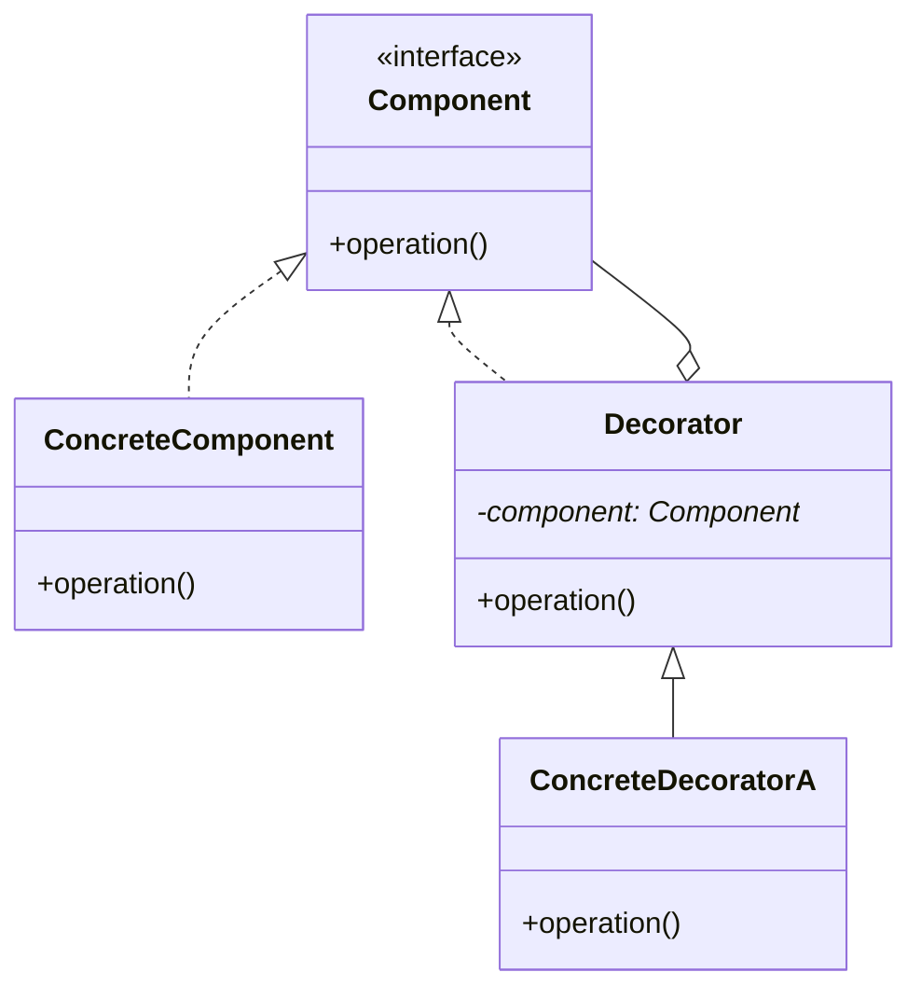

# 06 装饰模式

> 系列：[李建忠设计模式](README.md) · 第 06/26 讲 · GoF 结构型

---

## 引子

咖啡：浓缩 + 牛奶 + 摩卡，每种加料叠加价格与描述。若用 `MochaMilkEspresso` 子类组合爆炸。装饰模式用**同接口的包装器**一层层叠加功能，比继承更灵活。

---

## 要解决什么问题

```cpp
class Coffee { virtual double cost() = 0; };
class MilkCoffee : Coffee { /* 仅牛奶 */ };
class MochaCoffee : Coffee { /* 仅摩卡 */ };
class MilkMochaCoffee : Coffee { /* 又要新子类 */ };
```

痛点：功能组合导致子类数量指数增长、静态绑定无法运行期叠加。

---

## 模式结构

| 角色 | 职责 |
|------|------|
| Component | 统一接口 `operation()` |
| ConcreteComponent | 被装饰的核心对象 |
| Decorator | 持 Component 引用，同接口，前后可增强 |
| ConcreteDecorator | 具体增强逻辑 |



---

## C++ 示例

```cpp
#include <iostream>
#include <memory>
#include <string>

class Beverage {
public:
  virtual std::string description() const = 0;
  virtual double cost() const = 0;
  virtual ~Beverage() = default;
};

class Espresso : public Beverage {
public:
  std::string description() const override { return "Espresso"; }
  double cost() const override { return 2.0; }
};

class CondimentDecorator : public Beverage {
protected:
  std::unique_ptr<Beverage> beverage_;
public:
  explicit CondimentDecorator(std::unique_ptr<Beverage> b)
    : beverage_(std::move(b)) {}
};

class Milk : public CondimentDecorator {
public:
  using CondimentDecorator::CondimentDecorator;
  std::string description() const override {
    return beverage_->description() + ", Milk";
  }
  double cost() const override { return beverage_->cost() + 0.5; }
};

int main() {
  std::unique_ptr<Beverage> drink =
    std::make_unique<Milk>(std::make_unique<Espresso>());
  std::cout << drink->description() << " = " << drink->cost() << "\n";
  return 0;
}
```

装饰可多层嵌套：`Milk(Mocha(Espresso()))`。

---

## 适用 / 不适用

| 适用 | 不适用 |
|------|--------|
| 动态、任意组合地给对象加职责 | 只需固定一种增强，继承即可 |
| 比子类组合更灵活 | 客户端需区分「裸对象」与装饰链（接口相同） |
| 符合开闭：新装饰器不改原类 | 装饰层过多时调试困难 |

---

## 与其他模式对比

| 对比 | 区别 |
|------|------|
| **装饰 vs 组合** | 装饰：单层包装同一接口；组合：树形部分-整体 |
| **装饰 vs 代理** | 装饰：增强功能；代理：控制访问，常管理生命周期 |
| **装饰 vs 适配器** | 装饰：接口不变；适配器：改变接口 |

---

## 重点与注意

> **重点**：装饰与组件实现**同一接口**，客户端可透明使用。  
> **重点**：体现 **合成复用**：Has-A Component，而非 Is-A 多重功能子类。  
> **注意**：`operation()` 内通常先/后调用 `component_->operation()`。  
> **注意**：C++ 用 `unique_ptr` 时注意所有权；多层装饰形成链。

---

## 小结

装饰模式在运行期为对象「穿外套」。下一讲拆抽象与实现两个维度：**桥模式**。

**延伸阅读**

- 上一篇：[05 观察者](05-observer.md) · 下一篇：[07 桥模式](07-bridge.md)
- 代码：[code/06-decorator.cpp](code/06-decorator.cpp)
