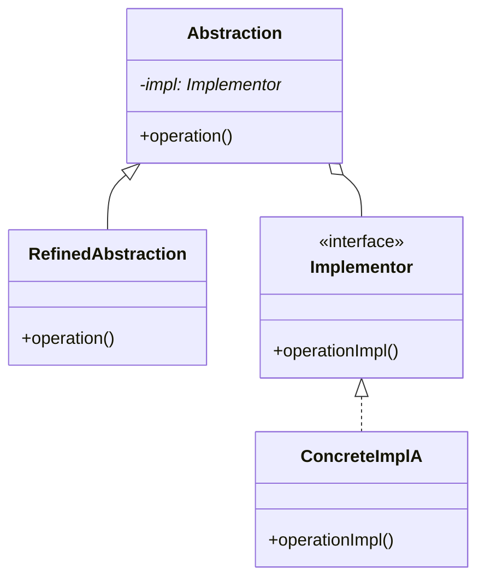

# 07 桥模式

> 系列：[李建忠设计模式](README.md) · 第 07/26 讲 · GoF 结构型

---

## 引子

遥控器与电器：遥控器（抽象）可控制不同品牌的电视/收音机（实现），且品牌与遥控器型号可**独立变化**。若用 `SonyRemote`、`PanasonicRemote` 继承爆炸。桥模式把「抽象」与「实现」拆成两棵继承树，用组合连接。

---

## 要解决什么问题

```cpp
class Remote { };
class SonyRemote : Remote { };
class PanasonicRemote : Remote { };
class SonyTVRemote : SonyRemote { };  // 维度交叉 → 类爆炸
```

痛点：两个独立变化维度用继承绑定，导致 M×N 个子类。

---

## 模式结构

| 角色 | 职责 |
|------|------|
| Abstraction | 面向客户端的高层接口，持 Implementor |
| RefinedAbstraction | 扩展抽象 |
| Implementor | 实现层接口 |
| ConcreteImplementor | 具体平台/设备实现 |



---

## C++ 示例

```cpp
#include <iostream>
#include <memory>
#include <string>

class DrawingAPI {
public:
  virtual void drawCircle(double x, double y, double r) = 0;
  virtual ~DrawingAPI() = default;
};

class DrawingAPI1 : public DrawingAPI {
public:
  void drawCircle(double x, double y, double r) override {
    std::cout << "API1 circle at (" << x << "," << y << ") r=" << r << "\n";
  }
};

class Shape {
protected:
  std::unique_ptr<DrawingAPI> api_;
public:
  explicit Shape(std::unique_ptr<DrawingAPI> api) : api_(std::move(api)) {}
  virtual void draw() = 0;
  virtual ~Shape() = default;
};

class Circle : public Shape {
  double x_, y_, r_;
public:
  Circle(double x, double y, double r, std::unique_ptr<DrawingAPI> api)
    : Shape(std::move(api)), x_(x), y_(y), r_(r) {}
  void draw() override { api_->drawCircle(x_, y_, r_); }
};

int main() {
  Circle c(1, 2, 3, std::make_unique<DrawingAPI1>());
  c.draw();
  return 0;
}
```

抽象侧（Shape）与实现侧（DrawingAPI）可独立扩展。

---

## 适用 / 不适用

| 适用 | 不适用 |
|------|--------|
| 抽象与实现都有**多级扩展** | 只有一个实现，无需桥 |
| 要在运行期切换实现 | 补救接口不兼容（用适配器） |
| 想对客户端隐藏实现细节 | 变化维度其实只有一个 |

---

## 与其他模式对比

| 对比 | 区别 |
|------|------|
| **桥接 vs 适配器** | 桥接：**设计期**拆分维度；适配器：**事后**包装旧接口 |
| **桥接 vs 策略** | 桥接：稳定结构，抽象与实现分层；策略：强调算法替换 |
| **桥接 vs 状态** | 状态：对象行为随内部状态变；桥接：实现委托给 Implementor |

---

## 重点与注意

> **重点**：桥模式解决 **多维度变化** 的类爆炸，核心是两棵继承树 + 组合。  
> **重点**：体现 **依赖倒置**：抽象依赖 Implementor 接口。  
> **注意**：与 PIMPL idiom 思想相近：实现细节隐藏在另一对象。  
> **注意**：不要与适配器混淆：桥是主动设计，适配器常是集成遗留代码。

---

## 小结

桥模式把「是什么」与「怎么做」拆开。接下来进入创建型：**工厂方法**。

**延伸阅读**

- 上一篇：[06 装饰](06-decorator.md) · 下一篇：[08 工厂方法](08-factory-method.md)
- 代码：[code/07-bridge.cpp](code/07-bridge.cpp)
