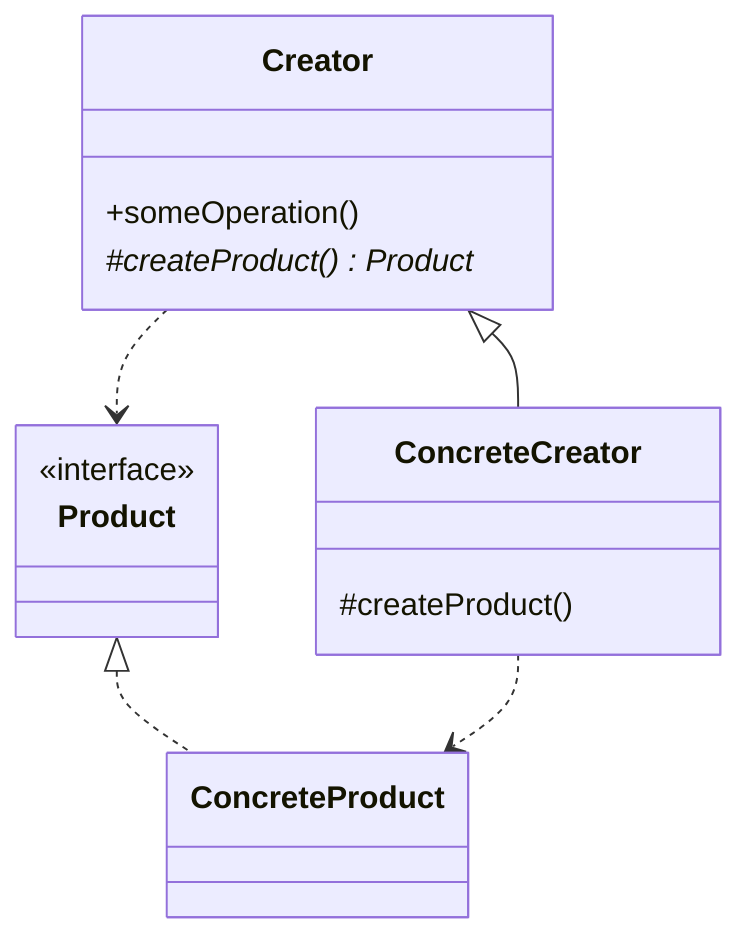

# 08 工厂方法模式

> 系列：[李建忠设计模式](README.md) · 第 08/26 讲 · GoF 创建型

---

## 引子

日志框架要创建 `FileLogger` 或 `ConsoleLogger`，但框架代码不想写死 `new FileLogger`。工厂方法把**实例化延迟到子类**：基类定义流程，子类决定创建哪种产品。

---

## 要解决什么问题

```cpp
void useLogger() {
  Logger* log = new FileLogger();  // 写死
  log->write("msg");
}
```

痛点：高层依赖具体类、换产品要改调用方、违反依赖倒置。

---

## 模式结构

| 角色 | 职责 |
|------|------|
| Product | 产品接口 |
| ConcreteProduct | 具体产品 |
| Creator | 声明工厂方法 `createProduct()` |
| ConcreteCreator | 实现工厂方法，返回具体产品 |



`someOperation()` 里调用 `createProduct()`，常是模板方法 + 工厂方法的组合。

---

## C++ 示例

```cpp
#include <iostream>
#include <memory>

class Logger {
public:
  virtual void write(const std::string& msg) = 0;
  virtual ~Logger() = default;
};

class FileLogger : public Logger {
public:
  void write(const std::string& msg) override {
    std::cout << "file: " << msg << "\n";
  }
};

class ConsoleLogger : public Logger {
public:
  void write(const std::string& msg) override {
    std::cout << "console: " << msg << "\n";
  }
};

class LoggerFactory {
public:
  virtual ~LoggerFactory() = default;
  virtual std::unique_ptr<Logger> createLogger() = 0;
  void log(const std::string& msg) {
    auto logger = createLogger();
    logger->write(msg);
  }
};

class FileLoggerFactory : public LoggerFactory {
public:
  std::unique_ptr<Logger> createLogger() override {
    return std::make_unique<FileLogger>();
  }
};

int main() {
  FileLoggerFactory factory;
  factory.log("hello");
  return 0;
}
```

---

## 适用 / 不适用

| 适用 | 不适用 |
|------|--------|
| 创建逻辑复杂或需多态选择 | 构造简单，直接 `make_unique` 即可 |
| 框架定义流程，应用选产品 | 需要创建**一族**相关产品（用抽象工厂） |

---

## 与其他模式对比

| 对比 | 区别 |
|------|------|
| **工厂方法 vs 简单工厂** | 简单工厂：一个函数 if-else；工厂方法：子类化创建点 |
| **工厂方法 vs 抽象工厂** | 工厂方法：一种产品等级；抽象工厂：多个产品族 |
| **工厂方法 vs 原型** | 原型：克隆已有对象；工厂方法：new 新实例 |

---

## 重点与注意

> **重点**：工厂方法的核心是 **virtual 创建函数**，把 `new` 从业务代码挪到子类。  
> **重点**：常与 **模板方法** 联用：固定算法骨架，创建是其中一步。  
> **注意**：C++ 也可用函数指针 / `std::function<std::unique_ptr<Logger>()>` 作轻量工厂。  
> **注意**：不要为每个 `new` 都建工厂层次，过度设计。

---

## 小结

工厂方法用多态解决「创建谁」的问题。下一讲扩展为一整族产品：**抽象工厂**。

**延伸阅读**

- 上一篇：[07 桥模式](07-bridge.md) · 下一篇：[09 抽象工厂](09-abstract-factory.md)
- 代码：[code/08-factory-method.cpp](code/08-factory-method.cpp)
