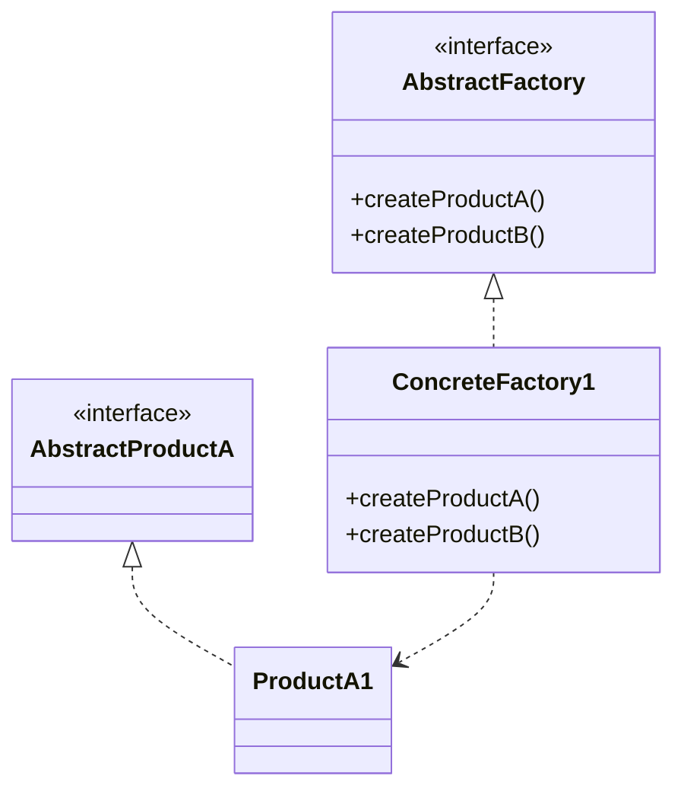

# 09 抽象工厂模式

> 系列：[李建忠设计模式](README.md) · 第 09/26 讲 · GoF 创建型

---

## 引子

UI 主题：Win 风格按钮+滚动条，Mac 风格另一套——要保证**同一族**控件风格一致。抽象工厂提供创建**多个相关产品**的接口，而不必写 `if (win) new WinButton + new WinScroll`。

---

## 要解决什么问题

```cpp
if (theme == Win) {
  auto btn = new WinButton();
  auto bar = new MacScrollBar();  // 混族错误
}
```

痛点：产品族一致性难保证、切换主题要改多处 `new`。

---

## 模式结构

| 角色 | 职责 |
|------|------|
| AbstractFactory | 创建产品 A、B 的接口 |
| ConcreteFactory | 创建一族具体产品 |
| AbstractProductA/B | 各类产品抽象 |
| ConcreteProductA1/B1 | 族 1 的实现 |



---

## C++ 示例

```cpp
#include <iostream>
#include <memory>
#include <string>

class Button {
public:
  virtual void paint() = 0;
  virtual ~Button() = default;
};
class ScrollBar {
public:
  virtual void scroll() = 0;
  virtual ~ScrollBar() = default;
};

class WinButton : public Button {
public:
  void paint() override { std::cout << "Win button\n"; }
};
class WinScrollBar : public ScrollBar {
public:
  void scroll() override { std::cout << "Win scroll\n"; }
};

class MacButton : public Button {
public:
  void paint() override { std::cout << "Mac button\n"; }
};
class MacScrollBar : public ScrollBar {
public:
  void scroll() override { std::cout << "Mac scroll\n"; }
};

class GUIFactory {
public:
  virtual std::unique_ptr<Button> createButton() = 0;
  virtual std::unique_ptr<ScrollBar> createScrollBar() = 0;
  virtual ~GUIFactory() = default;
};

class WinFactory : public GUIFactory {
public:
  std::unique_ptr<Button> createButton() override {
    return std::make_unique<WinButton>();
  }
  std::unique_ptr<ScrollBar> createScrollBar() override {
    return std::make_unique<WinScrollBar>();
  }
};

int main() {
  std::unique_ptr<GUIFactory> factory = std::make_unique<WinFactory>();
  auto btn = factory->createButton();
  auto bar = factory->createScrollBar();
  btn->paint();
  bar->scroll();
  return 0;
}
```

---

## 适用 / 不适用

| 适用 | 不适用 |
|------|--------|
| 需要保证多个产品属于同一族 | 只有一种产品要创建 |
| 系统独立于产品如何创建 | 增加新产品**种类**（新维度）要改工厂接口（开闭难点） |

---

## 与其他模式对比

| 对比 | 区别 |
|------|------|
| **抽象工厂 vs 工厂方法** | 抽象工厂：多产品接口；工厂方法：单产品创建点 |
| **抽象工厂 vs 建造者** | 建造者：分步构建**一个**复杂对象；抽象工厂：多个简单产品 |
| **抽象工厂 vs 原型** | 原型：克隆；抽象工厂：new 各具体类 |

---

## 重点与注意

> **重点**：抽象工厂强调 **产品族一致性**（Win 全套 / Mac 全套）。  
> **重点**：切换族 = 换整个 `GUIFactory` 实例。  
> **注意**：新增「滑块」类产品要改 `AbstractFactory` 所有子类——这是该模式的已知代价。  
> **注意**：现代 UI 常用主题资源包 + 依赖注入，思想同源。

---

## 小结

抽象工厂管理二维变化：产品种类 × 产品族。下一讲用克隆代替 new：**原型模式**。

**延伸阅读**

- 上一篇：[08 工厂方法](08-factory-method.md) · 下一篇：[10 原型模式](10-prototype.md)
- 代码：[code/09-abstract-factory.cpp](code/09-abstract-factory.cpp)
