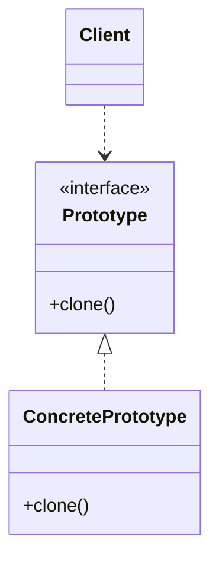

# 10 原型模式

> 系列：[李建忠设计模式](README.md) · 第 10/26 讲 · GoF 创建型

---

## 引子

复制粘贴一份配置好的图形对象，比重新设置颜色、线宽、坐标更快。原型模式通过**克隆**已有实例来创建新对象，避免依赖具体类名的 `new`，也避免重复初始化。

---

## 要解决什么问题

```cpp
Shape* createShape(const std::string& type) {
  if (type == "circle") return new Circle();
  // 复杂分支 + 昂贵初始化
}
```

痛点：创建成本高、类型运行时才知道、希望复制现有状态而非默认值。

---

## 模式结构

| 角色 | 职责 |
|------|------|
| Prototype | 声明 `clone()` |
| ConcretePrototype | 实现深/浅拷贝 |
| Client | 通过原型复制创建对象 |



---

## C++ 示例

```cpp
#include <iostream>
#include <memory>
#include <string>

class Document {
public:
  virtual std::unique_ptr<Document> clone() const = 0;
  virtual void show() const = 0;
  virtual ~Document() = default;
};

class Report : public Document {
  std::string title_;
public:
  explicit Report(std::string t) : title_(std::move(t)) {}
  std::unique_ptr<Document> clone() const override {
    return std::make_unique<Report>(*this);
  }
  void show() const override { std::cout << "Report: " << title_ << "\n"; }
};

int main() {
  Report original("Q1");
  auto copy = original.clone();
  copy->show();
  return 0;
}
```

C++ 拷贝构造函数 + `clone()` 是常见实现；注意 **深拷贝** 指针成员。

---

## 适用 / 不适用

| 适用 | 不适用 |
|------|--------|
| 复制比构造+配置更自然 | 对象极简单，`make_unique` 即可 |
| 运行时决定复制哪种原型 | 克隆逻辑复杂易错且难维护 |
| 保存/恢复快照的语义 | 需要严格单例（用单件） |

---

## 与其他模式对比

| 对比 | 区别 |
|------|------|
| **原型 vs 工厂方法** | 原型：复制实例；工厂方法：子类决定 new 谁 |
| **原型 vs 备忘录** | 备忘录：保存状态给 Caretaker；原型：为了得到新对象 |
| **原型 vs 享元** | 享元：共享内在状态；原型：刻意复制 |

---

## 重点与注意

> **重点**：`clone()` 应明确 **深拷贝 vs 浅拷贝** 语义。  
> **重点**：C++ 可用虚 `clone()` 实现多态复制，弥补缺少虚拟拷贝构造的限制。  
> **注意**：含 `unique_ptr` 成员时需手写 `clone()` 深拷贝逻辑。  
> **注意**：`std::shared_ptr` + `make_shared` 的共享语义不是原型模式。

---

## 小结

原型用「复制」代替「构造」。下一讲分步构建复杂对象：**构建器模式**。

**延伸阅读**

- 上一篇：[09 抽象工厂](09-abstract-factory.md) · 下一篇：[11 构建器](11-builder.md)
- 代码：[code/10-prototype.cpp](code/10-prototype.cpp)
