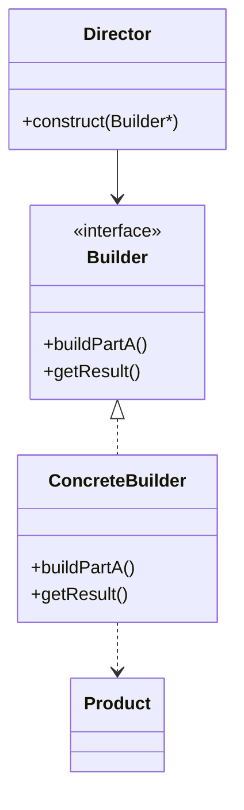

# 11 构建器模式

> 系列：[李建忠设计模式](README.md) · 第 11/26 讲 · GoF 创建型

---

## 引子

盖房子：打地基、砌墙、封顶——步骤固定，但材料、层数可配。若用 telescoping constructor（构造函数参数越来越多）会难读难维护。构建器**分步设置**，最后 `build()` 产出产品。

---

## 要解决什么问题

```cpp
House h(3, true, false, "red", 200.0);  // 参数含义不清
```

痛点：复杂对象构造参数多、可选参数组合多、构造过程需要顺序步骤。

---

## 模式结构

| 角色 | 职责 |
|------|------|
| Builder | 各 `buildPart()` 步骤接口 |
| ConcreteBuilder | 实现步骤，维护中间状态 |
| Director | （可选）定义组装顺序 |
| Product | 复杂结果对象 |



Director 可选：简单场景客户端直接调 Builder。

---

## C++ 示例

```cpp
#include <iostream>
#include <string>

class Pizza {
public:
  std::string dough, sauce, topping;
  void describe() const {
    std::cout << dough << " + " << sauce << " + " << topping << "\n";
  }
};

class PizzaBuilder {
public:
  virtual void buildDough(const std::string& d) = 0;
  virtual void buildSauce(const std::string& s) = 0;
  virtual void buildTopping(const std::string& t) = 0;
  virtual Pizza getResult() = 0;
  virtual ~PizzaBuilder() = default;
};

class MargheritaBuilder : public PizzaBuilder {
  Pizza pizza_;
public:
  void buildDough(const std::string& d) override { pizza_.dough = d; }
  void buildSauce(const std::string& s) override { pizza_.sauce = s; }
  void buildTopping(const std::string& t) override { pizza_.topping = t; }
  Pizza getResult() override { return pizza_; }
};

int main() {
  MargheritaBuilder builder;
  builder.buildDough("thin");
  builder.buildSauce("tomato");
  builder.buildTopping("cheese");
  Pizza p = builder.getResult();
  p.describe();
  return 0;
}
```

C++ 也可用 **链式调用** `builder.setA().setB().build()`（Fluent Builder）。

---

## 适用 / 不适用

| 适用 | 不适用 |
|------|--------|
| 构造过程多步骤、顺序重要 | 对象字段少，聚合初始化即可 |
| 同一构造过程不同表示 | 只需创建产品族（抽象工厂） |
| 隔离复杂组装与表示 | |

---

## 与其他模式对比

| 对比 | 区别 |
|------|------|
| **建造者 vs 抽象工厂** | 建造者：**一个**复杂产品分步；抽象工厂：**多个**产品一次给出 |
| **建造者 vs 工厂方法** | 工厂方法：单步创建；建造者：多步累积 |
| **建造者 vs 组合** | 组合：树形结构；建造者：扁平产品组装 |

---

## 重点与注意

> **重点**：建造者把 **表示与构造过程** 分离，Director 封装固定顺序。  
> **重点**：`getResult()` 后 Builder 是否可复用要文档说明（常 reset 或新建 Builder）。  
> **注意**：C++17 指定初始化器、`std::optional` 可替代部分 Builder 场景。  
> **注意**：与 JSON 反序列化构建对象思想类似，但模式强调分步 API。

---

## 小结

建造者让复杂对象的创建可读、可配。下一讲全局唯一实例：**单件模式**。

**延伸阅读**

- 上一篇：[10 原型](10-prototype.md) · 下一篇：[12 单件模式](12-singleton.md)
- 代码：[code/11-builder.cpp](code/11-builder.cpp)
