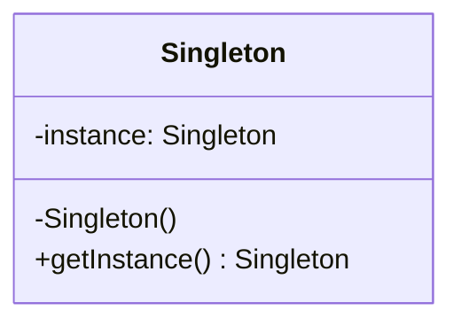

# 12 单件模式

> 系列：[李建忠设计模式](README.md) · 第 12/26 讲 · GoF 创建型

---

## 引子

配置管理器、线程池调度器——整个进程只需**一个**实例，且全局访问点唯一。单件模式保证类仅有一个实例，并提供 `instance()` 访问。

---

## 要解决什么问题

```cpp
Config cfg1;
Config cfg2;  // 两份配置不一致
```

痛点：多实例导致状态不一致、资源重复占用（数据库连接池等）。

---

## 模式结构

| 角色 | 职责 |
|------|------|
| Singleton | 私有构造、禁用拷贝、静态 `instance()` |



---

## C++ 示例（Meyers 单件，推荐）

```cpp
#include <iostream>
#include <map>
#include <string>

class Config {
public:
  static Config& instance() {
    static Config inst;  // C++11 线程安全
    return inst;
  }
  void set(const std::string& k, std::string v) { data_[k] = std::move(v); }
  std::string get(const std::string& k) const {
    auto it = data_.find(k);
    return it == data_.end() ? "" : it->second;
  }
  Config(const Config&) = delete;
  Config& operator=(const Config&) = delete;

private:
  Config() = default;
  std::map<std::string, std::string> data_;
};

int main() {
  Config::instance().set("host", "127.0.0.1");
  std::cout << Config::instance().get("host") << "\n";
  return 0;
}
```

现代 C++ 优先 **Meyers Singleton**（`static` 局部变量，C++11 起线程安全）。饿汉 / 懒汉 / 双重检查锁在 pre-C++11 教材常见，新项目不必手写。

---

## 适用 / 不适用

| 适用 | 不适用 |
|------|--------|
| 确实需要全局唯一协调者 | 仅为「全局访问方便」 |
| 无状态或集中管理有状态资源 | 单元测试需 mock（单件难测） |
| | 多线程下自己实现懒汉（易错） |

---

## 与其他模式对比

| 对比 | 区别 |
|------|------|
| **单件 vs 静态类** | 单件：可继承、可实现接口；静态类：纯函数集合 |
| **单件 vs 享元** | 单件：唯一实例；享元：每类内在状态一个，可多种 |
| **单件 vs 依赖注入** | DI 容器管理单例生命周期更利于测试 |

---

## 重点与注意

> **重点**：删除拷贝构造与赋值，构造函数 **private**。  
> **重点**：李建忠课程称「单件」；注意滥用是常见**反模式**。  
> **注意**：多线程 + 动态库卸载时，静态局部对象析构顺序仍可能坑。  
> **注意**：优先考虑传入依赖（DIP）而非全局 `instance()`。

---

## 小结

单件解决唯一实例与全局访问。创建型五讲结束，下一讲回到结构型：**享元模式**。

**延伸阅读**

- 上一篇：[11 构建器](11-builder.md) · 下一篇：[13 享元模式](13-flyweight.md)
- 代码：[code/12-singleton.cpp](code/12-singleton.cpp)
