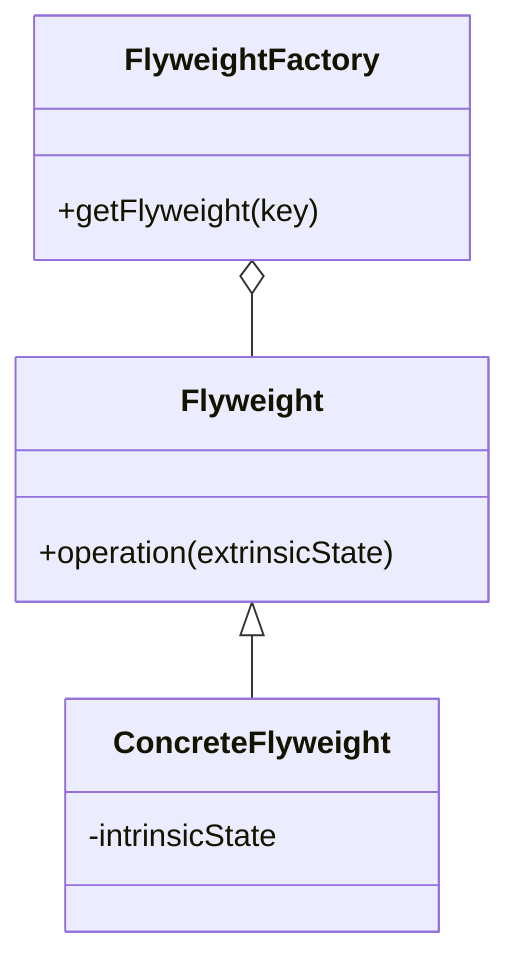

# 13 享元模式

> 系列：[李建忠设计模式](README.md) · 第 13/26 讲 · GoF 结构型

---

## 引子

文本编辑器里成千上万个字符，大多重复——不必每个字符对象都存一份字体名、字号。享元把**内在状态（可共享）**与**外在状态（每实例不同）**分离，用工厂复用享元对象。

---

## 要解决什么问题

```cpp
struct Glyph {
  char ch;
  std::string font;  // 重复存储
  int size;
};
Glyph glyphs[100000];  // 内存爆炸
```

痛点：大量细粒度对象、重复内在状态、GC/内存压力大。

---

## 模式结构

| 角色 | 职责 |
|------|------|
| Flyweight | 共享内在状态 |
| FlyweightFactory | 管理享元池，`get(key)` 返回复用对象 |
| Client | 传入外在状态，调用 `operation(extrinsic)` |



---

## C++ 示例

```cpp
#include <iostream>
#include <map>
#include <string>
#include <memory>

class TreeType {  // 享元：内在状态
  std::string name_, color_, texture_;
public:
  TreeType(std::string n, std::string c, std::string t)
    : name_(std::move(n)), color_(std::move(c)), texture_(std::move(t)) {}
  void draw(int x, int y) const {  // 外在状态 x,y 由调用方传入
    std::cout << "draw " << name_ << " at (" << x << "," << y << ")\n";
  }
};

class TreeFactory {
  std::map<std::string, std::shared_ptr<TreeType>> pool_;
public:
  std::shared_ptr<TreeType> get(const std::string& name) {
    if (!pool_.count(name))
      pool_[name] = std::make_shared<TreeType>(name, "green", "oak");
    return pool_[name];
  }
};

struct Tree {
  int x, y;
  std::shared_ptr<TreeType> type;
  void draw() const { type->draw(x, y); }
};

int main() {
  TreeFactory factory;
  Tree t1{1, 2, factory.get("Oak")};
  Tree t2{3, 4, factory.get("Oak")};  // 共享同一 TreeType
  t1.draw(); t2.draw();
  return 0;
}
```

---

## 适用 / 不适用

| 适用 | 不适用 |
|------|--------|
| 大量对象、内在状态可枚举且重复 | 对象状态几乎都不同 |
| 外在状态可由客户端传入 | 享元池管理成本高于收益 |
| 对象多数状态为只读共享 | 需要频繁修改内在状态 |

---

## 与其他模式对比

| 对比 | 区别 |
|------|------|
| **享元 vs 单件** | 单件：全局唯一一个；享元：每类内在状态一个，可多种 |
| **享元 vs 对象池** | 对象池：借还完整对象；享元：共享不可变部分 |
| **享元 vs 原型** | 原型：克隆整对象；享元：刻意不复制内在状态 |

---

## 重点与注意

> **重点**：区分 **intrinsic（内部/共享）** 与 **extrinsic（外部/每用例）** 状态。  
> **重点**：享元对象通常**不可变**或内在状态只读。  
> **注意**：线程安全：工厂池需同步；`shared_ptr` 常作享元句柄。  
> **注意**：C++ 字符串 SSO、小对象优化已是语言层享元思想。

---

## 小结

享元用空间换时间中的「去重」。下一讲简化子系统入口：**门面模式**。

**延伸阅读**

- 上一篇：[12 单件模式](12-singleton.md) · 下一篇：[14 门面模式](14-facade.md)
