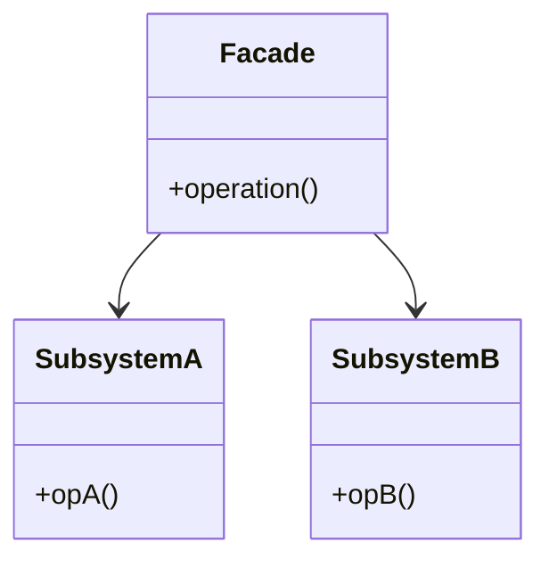

# 14 门面模式

> 系列：[李建忠设计模式](README.md) · 第 14/26 讲 · GoF 结构型

---

## 引子

家庭影院：开灯、降幕布、开投影、开功放、选输入——用户只想按「观影」。门面提供一个**统一的高层接口**，内部协调多个子系统，降低客户端复杂度。

---

## 要解决什么问题

```cpp
void watchMovie() {
  lights.dim();
  screen.down();
  projector.on();
  amp.setInput(DVD);
  dvd.play();
  // 客户端知道太多子系统细节
}
```

痛点：客户端与子系统紧耦合、难以替换子系统组合、学习成本高。

---

## 模式结构

| 角色 | 职责 |
|------|------|
| Facade | 对外的简化接口 |
| SubsystemA/B/C | 已有复杂类，门面**组合调用** |



门面通常**不禁止**客户端直接访问子系统；它只是提供便捷路径。

---

## C++ 示例

```cpp
#include <iostream>

class Cpu { public: void freeze() { std::cout << "CPU freeze\n"; } };
class Memory { public: void load(long addr) { std::cout << "load " << addr << "\n"; } };
class HardDrive { public: void read(long lba) { std::cout << "read " << lba << "\n"; } };

class ComputerFacade {
  Cpu cpu_;
  Memory mem_;
  HardDrive hd_;
public:
  void start() {
    cpu_.freeze();
    mem_.load(0x1000);
    hd_.read(0);
    std::cout << "boot done\n";
  }
};

int main() {
  ComputerFacade pc;
  pc.start();
  return 0;
}
```

---

## 适用 / 不适用

| 适用 | 不适用 |
|------|--------|
| 子系统复杂，需要分层入口 | 只需调用单个子系统的一个方法 |
| 想解耦客户端与多个类 | 门面膨胀成「上帝类」（违反 SRP） |

---

## 与其他模式对比

| 对比 | 区别 |
|------|------|
| **门面 vs 适配器** | 门面：简化**自家**子系统；适配器：转换**外部**接口 |
| **门面 vs 中介者** | 门面：单向对外；中介者：同事之间双向协调 |
| **门面 vs 抽象工厂** | 抽象工厂：创建产品族；门面：编排已有对象行为 |

---

## 重点与注意

> **重点**：门面是**结构型包装**，不一定引入新抽象层接口给子系统实现。  
> **重点**：常与分层架构中的 **Service 层** 思想一致。  
> **注意**：门面类仍应遵守单一职责：一个门面对应一个用例场景。  
> **注意**：不要门面里堆业务规则，规则应在子系统或领域层。

---

## 小结

门面让复杂系统「一个按钮搞定」。下一讲控制访问：**代理模式**。

**延伸阅读**

- 上一篇：[13 享元](13-flyweight.md) · 下一篇：[15 代理模式](15-proxy.md)
