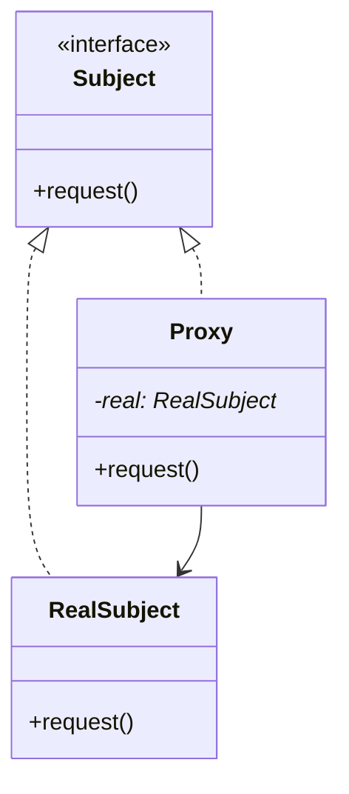

# 15 代理模式

> 系列：[李建忠设计模式](README.md) · 第 15/26 讲 · GoF 结构型

---

## 引子

明星有经纪人挡请求：谈合同、过滤广告。客户端仍认为在找「明星」，实际是**代理**在控制访问、可加缓存/权限/延迟加载。代理与真实对象实现**同一接口**。

---

## 要解决什么问题

```cpp
class HugeImage {
  void display() { loadFromDisk(); /* 很慢 */ }
};
// 每次 display 都加载
```

痛点：需要控制访问时机、加间接层做权限或缓存，又不想改真实类接口。

---

## 模式结构

| 角色 | 职责 |
|------|------|
| Subject | 抽象接口 |
| RealSubject | 真正干活的类 |
| Proxy | 同接口，持有 RealSubject，前后可加逻辑 |



常见变体：**虚拟代理**（延迟创建）、**保护代理**（权限）、**远程代理**（RPC stub）、**智能引用**（引用计数）。

---

## C++ 示例（虚拟代理）

```cpp
#include <iostream>
#include <memory>
#include <string>

class Image {
public:
  virtual void display() = 0;
  virtual ~Image() = default;
};

class RealImage : public Image {
  std::string file_;
  void load() { std::cout << "load " << file_ << " from disk\n"; }
public:
  explicit RealImage(std::string f) : file_(std::move(f)) { load(); }
  void display() override { std::cout << "show " << file_ << "\n"; }
};

class ImageProxy : public Image {
  std::string file_;
  std::unique_ptr<RealImage> real_;
public:
  explicit ImageProxy(std::string f) : file_(std::move(f)) {}
  void display() override {
    if (!real_) real_ = std::make_unique<RealImage>(file_);
    real_->display();
  }
};

int main() {
  ImageProxy img("photo.png");
  std::cout << "proxy created, not loaded yet\n";
  img.display();
  return 0;
}
```

---

## 适用 / 不适用

| 适用 | 不适用 |
|------|--------|
| 需控制对对象的访问 | 无额外间接层需求，直接调用即可 |
| 延迟昂贵对象的创建 | 接口需要改变（用适配器） |
| 本地代表远程对象 | 功能需要层层叠加（考虑装饰） |

---

## 与其他模式对比

| 对比 | 区别 |
|------|------|
| **代理 vs 装饰** | 代理：管理访问、常一对一；装饰：叠加职责、可多层 |
| **代理 vs 适配器** | 代理：同接口；适配器：不同接口 |
| **代理 vs 门面** | 代理：一个替身；门面：多个子系统编排 |

---

## 重点与注意

> **重点**：代理与 RealSubject **接口一致**，客户端常无感。  
> **重点**：虚拟代理的懒加载是 C++ `unique_ptr` + PIMPL 的常见动机。  
> **注意**：智能指针本身不是代理模式，但可实现智能引用语义。  
> **注意**：远程代理需处理网络失败、序列化等，已超出经典 GoF 范围。

---

## 小结

代理在不变接口的前提下加一层控制。下一讲兼容旧接口：**适配器模式**。

**延伸阅读**

- 上一篇：[14 门面](14-facade.md) · 下一篇：[16 适配器模式](16-adapter.md)
- 代码：[code/15-proxy.cpp](code/15-proxy.cpp)
