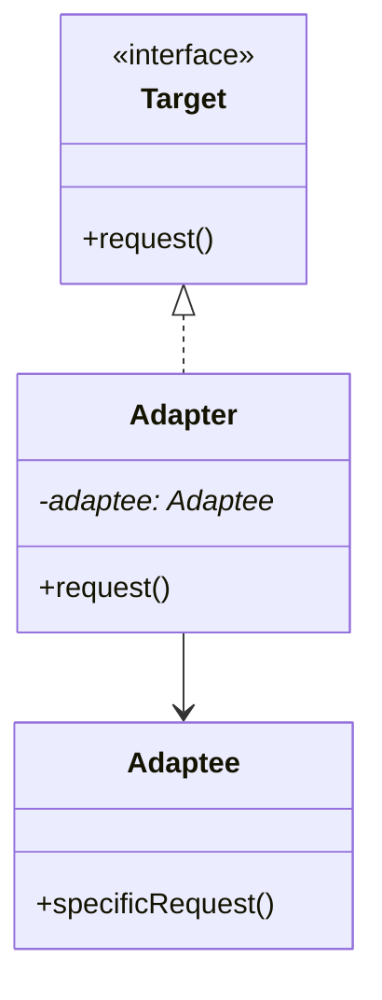

# 16 适配器模式

> 系列：[李建忠设计模式](README.md) · 第 16/26 讲 · GoF 结构型

---

## 引子

欧标插头无法插入国标插座——需要**转换器**。软件里已有类接口与客户端期望不一致，又不想改旧代码，用适配器包装一层，把 `request()` 转成 `specificRequest()`。

---

## 要解决什么问题

```cpp
class OldPrinter {
public:
  void printOld(const std::string& s) { /* ... */ }
};
// 客户端只认
class Printer {
  virtual void print(const std::string& s) = 0;
};
```

痛点：集成第三方库、遗留系统，接口无法统一修改。

---

## 模式结构

| 角色 | 职责 |
|------|------|
| Target | 客户端期望的接口 |
| Adaptee | 已有、接口不匹配的类 |
| Adapter | 实现 Target，内部调用 Adaptee |

**类适配器**（多重继承 Adaptee + Target，C++ 少用）  
**对象适配器**（组合 Adaptee，推荐）



---

## C++ 示例（对象适配器）

```cpp
#include <iostream>
#include <string>

class Adaptee {
public:
  void specificRequest() { std::cout << "specific request\n"; }
};

class Target {
public:
  virtual void request() = 0;
  virtual ~Target() = default;
};

class Adapter : public Target {
  Adaptee adaptee_;
public:
  void request() override { adaptee_.specificRequest(); }
};

int main() {
  Target* t = new Adapter();
  t->request();
  delete t;
  return 0;
}
```

---

## 适用 / 不适用

| 适用 | 不适用 |
|------|--------|
| 复用已有类，接口不兼容 | 可改 Adaptee 源码且成本低 |
| 统一多个遗留 API | 设计期就拆好抽象（用桥接） |

---

## 与其他模式对比

| 对比 | 区别 |
|------|------|
| **适配器 vs 桥接** | 适配器：**事后**补救；桥接：**事前**拆维度 |
| **适配器 vs 装饰** | 适配器：改接口；装饰：不改接口只增强 |
| **适配器 vs 门面** | 适配器：一对一转换；门面：多子系统简化 |

---

## 重点与注意

> **重点**：适配器解决 **接口不匹配**，是集成遗留代码的常用模式。  
> **重点**：优先 **对象适配器**（组合），符合合成复用。  
> **注意**：C++ 可用包装函数、`std::function` 做函数级适配。  
> **注意**：与代理同有「中间层」，判断依据是目的：**转换** vs **控制访问**。

---

## 小结

适配器让旧代码在新接口下继续工作。下一讲进入行为型：**中介者模式**。

**延伸阅读**

- 上一篇：[15 代理](15-proxy.md) · 下一篇：[17 中介者模式](17-mediator.md)
- 代码：[code/16-adapter.cpp](code/16-adapter.cpp)
