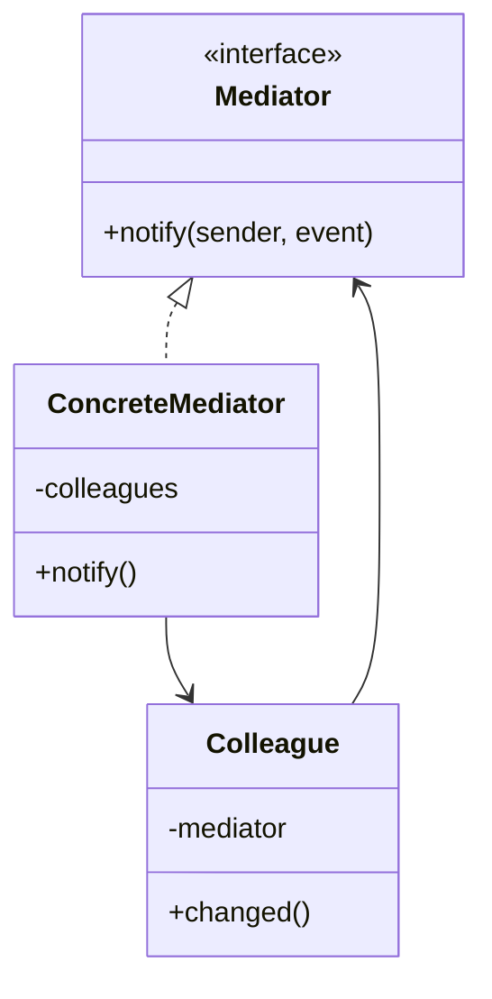

# 17 中介者模式

> 系列：[李建忠设计模式](README.md) · 第 17/26 讲 · GoF 行为型

---

## 引子

机场塔台协调飞机起降，飞机之间不直接对话。GUI 里多个控件互相联动，若每个按钮都持有其他控件的指针，网状依赖爆炸。中介者让同事对象**只与 Mediator 通信**。

---

## 要解决什么问题

```cpp
class Button {
  ListBox* list_; TextBox* text_;
  void onClick() { list_->clear(); text_->set(""); }
};
// 每个控件互相引用
```

痛点：对象间多对多耦合、难以复用单个控件、改一个联动牵一片。

---

## 模式结构

| 角色 | 职责 |
|------|------|
| Mediator | 定义同事间通信接口 |
| ConcreteMediator | 实现协调逻辑 |
| Colleague | 持有 Mediator，发消息给它 |



---

## C++ 示例

```cpp
#include <iostream>
#include <string>
#include <vector>

class Mediator;

class Widget {
protected:
  Mediator* med_;
  std::string name_;
public:
  Widget(Mediator* m, std::string n) : med_(m), name_(std::move(n)) {}
  virtual void changed() = 0;
  virtual ~Widget() = default;
  const std::string& name() const { return name_; }
};

class Mediator {
public:
  virtual void notify(Widget* sender, const std::string& event) = 0;
  virtual ~Mediator() = default;
};

class Button : public Widget {
public:
  using Widget::Widget;
  void click() { changed(); }
  void changed() override { med_->notify(this, "click"); }
};

class DialogMediator : public Mediator {
  std::vector<Widget*> widgets_;
public:
  void registerWidget(Widget* w) { widgets_.push_back(w); }
  void notify(Widget* sender, const std::string& event) override {
    std::cout << sender->name() << " -> " << event << ", refresh others\n";
  }
};

int main() {
  DialogMediator med;
  Button ok(&med, "OK");
  med.registerWidget(&ok);
  ok.click();
  return 0;
}
```

---

## 适用 / 不适用

| 适用 | 不适用 |
|------|--------|
| 多对象复杂交互，网状结构 | 对象间交互简单 |
| 想集中控制交互规则 | Mediator 本身变成上帝类 |
| 对话框、聊天室、协作编辑 | 一对一通知（用观察者） |

---

## 与其他模式对比

| 对比 | 区别 |
|------|------|
| **中介者 vs 观察者** | 观察者：Subject 广播；中介者：多向经中心协调 |
| **中介者 vs 门面** | 门面：对外简化子系统；中介者：同事之间解耦 |
| **中介者 vs 命令** | 命令：封装请求可排队；中介者：路由事件 |

---

## 重点与注意

> **重点**：中介者把 **多对多** 变成 **星型** 拓扑。  
> **重点**：Colleague 不应直接引用其他 Colleague。  
> **注意**：Mediator 逻辑复杂时要再拆分，避免违反 SRP。  
> **注意**：现代事件总线、消息队列是中介思想的放大版。

---

## 小结

中介者集中管理对象间交互。下一讲行为随状态而变：**状态模式**。

**延伸阅读**

- 上一篇：[16 适配器](16-adapter.md) · 下一篇：[18 状态模式](18-state.md)
