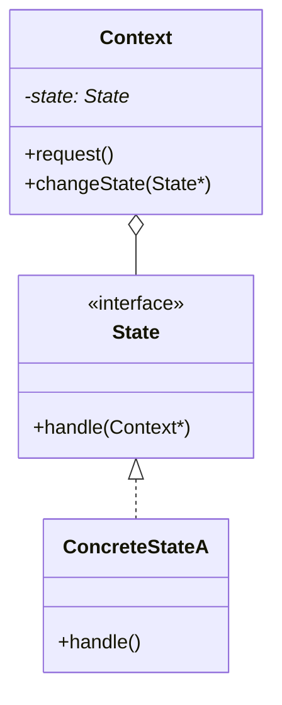

# 18 状态模式

> 系列：[李建忠设计模式](README.md) · 第 18/26 讲 · GoF 行为型

---

## 引子

自动售货机：投币、选货、出货——行为取决于**当前状态**，若用 `enum State` + 巨型 `switch`，每加状态改所有分支。状态模式把每个状态做成类，Context 委托给当前 State 对象。

---

## 要解决什么问题

```cpp
void onCoin(Context& c) {
  if (c.state == Idle) c.state = HasCoin;
  else if (c.state == HasCoin) { /* ... */ }
}
```

痛点：`switch` 膨胀、状态转换分散、难维护状态图。

---

## 模式结构

| 角色 | 职责 |
|------|------|
| Context | 持当前 State，把请求委托给 State |
| State | 状态接口，各事件处理 |
| ConcreteState | 具体状态，可切换 Context 的 state |



---

## C++ 示例

```cpp
#include <iostream>
#include <memory>

class VendingMachine;

class State {
public:
  virtual void insertCoin(VendingMachine& m) = 0;
  virtual ~State() = default;
};

class VendingMachine {
  std::unique_ptr<State> state_;
public:
  void setState(std::unique_ptr<State> s) { state_ = std::move(s); }
  void insertCoin() { state_->insertCoin(*this); }
};

class IdleState : public State {
public:
  void insertCoin(VendingMachine& m) override;
};

class HasCoinState : public State {
public:
  void insertCoin(VendingMachine& m) override {
    std::cout << "already has coin\n";
  }
};

void IdleState::insertCoin(VendingMachine& m) {
  std::cout << "coin inserted\n";
  m.setState(std::make_unique<HasCoinState>());
}

int main() {
  VendingMachine vm;
  vm.setState(std::make_unique<IdleState>());
  vm.insertCoin();
  vm.insertCoin();
  return 0;
}
```

---

## 适用 / 不适用

| 适用 | 不适用 |
|------|--------|
| 行为随状态变，状态多且转换复杂 | 只有 2～3 个简单状态，enum 即可 |
| 状态转换规则要清晰可扩展 | 行为主要由**客户端选择**（用策略） |

---

## 与其他模式对比

| 对比 | 区别 |
|------|------|
| **状态 vs 策略** | 状态：**对象内部**切换；策略：**客户端** `setStrategy` |
| **状态 vs 模板方法** | 状态：运行时换 State 对象；模板方法：子类固定步骤 |
| **状态 vs 职责链** | 职责链：请求传递；状态：同一 Context 不同行为 |

结构相似（接口 + 多实现），**谁改变当前实现**是判断关键。

---

## 重点与注意

> **重点**：状态类可持有 Context 引用以触发 `changeState`（注意循环依赖，用前置声明）。  
> **重点**：状态转换表可集中文档化，避免散落在各 State 里难以追踪。  
> **注意**：C++ 用 `unique_ptr<State>` 管理状态对象生命周期。  
> **注意**：与有限状态机（FSM）理论一致，状态模式是 OOP 实现 FSM 的方式。

---

## 小结

状态模式消除 Context 上的巨型分支。下一讲保存与恢复内部状态：**备忘录模式**。

**延伸阅读**

- 上一篇：[17 中介者](17-mediator.md) · 下一篇：[19 备忘录模式](19-memento.md)
- 代码：[code/18-state.cpp](code/18-state.cpp)
