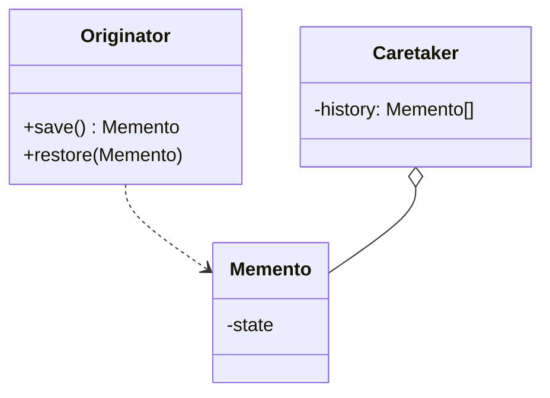

# 19 备忘录模式

> 系列：[李建忠设计模式](README.md) · 第 19/26 讲 · GoF 行为型

---

## 引子

编辑器「撤销」：需要把文档某一时刻的状态存起来，日后可恢复，又不能破坏封装——不能把私有字段全暴露给 Caretaker。备忘录在 **Originator 与 Caretaker 之间**传递状态快照。

---

## 要解决什么问题

```cpp
class Editor {
  std::string text_;
public:
  std::string text_;  // 为撤销暴露成员 → 封装破坏
};
```

痛点：需要快照、要恢复历史、又不想公开内部表示。

---

## 模式结构

| 角色 | 职责 |
|------|------|
| Originator | 创建/恢复 Memento，业务对象 |
| Memento | 存储 Originator 内部状态（对 Caretaker 不透明） |
| Caretaker | 保存 Memento 栈，不检查内容 |



---

## C++ 示例

```cpp
#include <iostream>
#include <stack>
#include <string>

class Editor {
  std::string text_;
public:
  class Memento {
    friend class Editor;
    std::string state_;
    explicit Memento(std::string s) : state_(std::move(s)) {}
  };
  void setText(std::string t) { text_ = std::move(t); }
  const std::string& text() const { return text_; }
  Memento save() const { return Memento(text_); }
  void restore(const Memento& m) { text_ = m.state_; }
};

class History {
  std::stack<Editor::Memento> stack_;
public:
  void push(const Editor::Memento& m) { stack_.push(m); }
  Editor::Memento pop() {
    auto m = stack_.top();
    stack_.pop();
    return m;
  }
  bool empty() const { return stack_.empty(); }
};

int main() {
  Editor ed;
  History hist;
  ed.setText("v1");
  hist.push(ed.save());
  ed.setText("v2");
  if (!hist.empty()) ed.restore(hist.pop());
  std::cout << ed.text() << "\n";
  return 0;
}
```

用 **嵌套类 + friend** 限制 Memento 访问。

---

## 适用 / 不适用

| 适用 | 不适用 |
|------|--------|
| 撤销/重做、快照、事务回滚点 | 状态极大，全量拷贝太贵 |
| 需保持 Originator 封装 | 可用命令模式记录逆操作代替存储状态 |

---

## 与其他模式对比

| 对比 | 区别 |
|------|------|
| **备忘录 vs 命令** | 命令：存**操作**可 undo；备忘录：存**状态**快照 |
| **备忘录 vs 原型** | 原型：为了复制出新对象；备忘录：为了以后恢复 |
| **备忘录 vs 序列化** | 序列化常公开 DTO；备忘录强调窄接口 |

---

## 重点与注意

> **重点**：Caretaker **不应**解释 Memento 内容，只负责保存。  
> **重点**：Memento 接口可对 Caretaker **窄**、对 Originator **宽**（friend）。  
> **注意**：深拷贝 vs 浅拷贝；大对象用增量备忘录或外部存储。  
> **注意**：与 [23 命令模式](23-command.md) 组合可实现完整 undo 栈。

---

## 小结

备忘录在不破坏封装的前提下保存与恢复状态。下一讲树形结构：**组合模式**（第 20 讲）。

**延伸阅读**

- 上一篇：[18 状态](18-state.md) · 下一篇：[20 组合模式](20-composite.md)
