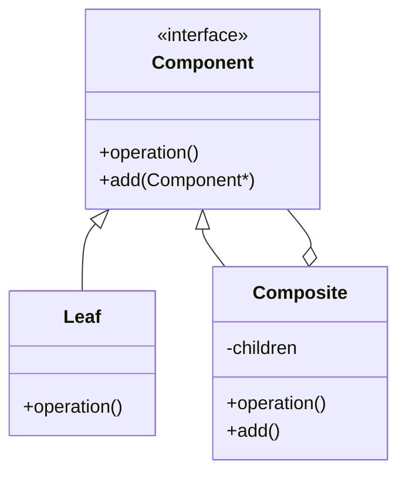

# 20 组合模式

> 系列：[李建忠设计模式](README.md) · 第 20/26 讲 · GoF 结构型

---

## 引子

文件夹里有子文件夹和文件，对用户都是「可打开/可删除」的条目。组合模式让**叶子与容器**实现同一接口，客户端可**一致地**处理单个对象与树形结构。

---

## 要解决什么问题

```cpp
void draw(File* f) { f->render(); }
void draw(Folder* folder) {
  for (auto* c : folder->children)
    if (c->isFile()) draw((File*)c);
    else draw((Folder*)c);  // 类型分支
}
```

痛点：容器与叶子处理不一致、递归逻辑散落、难以加新节点类型。

---

## 模式结构

| 角色 | 职责 |
|------|------|
| Component | 叶子与复合体的统一接口 |
| Leaf | 无子节点 |
| Composite | 存子 Component，转发操作 |



---

## C++ 示例

```cpp
#include <iostream>
#include <memory>
#include <vector>
#include <string>

class Graphic {
public:
  virtual void draw() const = 0;
  virtual void add(std::shared_ptr<Graphic>) {}
  virtual ~Graphic() = default;
};

class Dot : public Graphic {
  std::string name_;
public:
  explicit Dot(std::string n) : name_(std::move(n)) {}
  void draw() const override { std::cout << "Dot " << name_ << "\n"; }
};

class CompoundGraphic : public Graphic {
  std::vector<std::shared_ptr<Graphic>> children_;
public:
  void add(std::shared_ptr<Graphic> g) override { children_.push_back(g); }
  void draw() const override {
    std::cout << "Compound begin\n";
    for (const auto& c : children_) c->draw();
    std::cout << "Compound end\n";
  }
};

int main() {
  auto root = std::make_shared<CompoundGraphic>();
  root->add(std::make_shared<Dot>("A"));
  root->add(std::make_shared<Dot>("B"));
  root->draw();
  return 0;
}
```

---

## 适用 / 不适用

| 适用 | 不适用 |
|------|--------|
| 树形结构，需统一对待部分与整体 | 只有一层父子，无递归 |
| 客户端不关心是叶子还是容器 | 叶子与容器操作差异极大（接口不应强行统一） |

---

## 与其他模式对比

| 对比 | 区别 |
|------|------|
| **组合 vs 装饰** | 组合：树形结构；装饰：链式包装同一对象 |
| **组合 vs 迭代器** | 组合定义结构；迭代器遍历结构 |
| **组合 vs 责任链** | 责任链：线性传递请求；组合：递归树 |

---

## 重点与注意

> **重点**：组合让客户端对 **Individual 与 Composite 透明**。  
> **重点**：`add/remove` 在 Leaf 上可空实现或抛异常（安全组合 vs 透明组合）。  
> **注意**：透明组合把管理子节点也放进 Component，Leaf 的 `add` 语义要文档说明。  
> **注意**：与 UI 控件树、文件系统、场景图高度同构。

---

## 小结

组合模式是处理树形结构的经典统一接口。下一讲遍历聚合：**迭代器模式**。

**延伸阅读**

- 上一篇：[19 备忘录](19-memento.md) · 下一篇：[21 迭代器模式](21-iterator.md)
