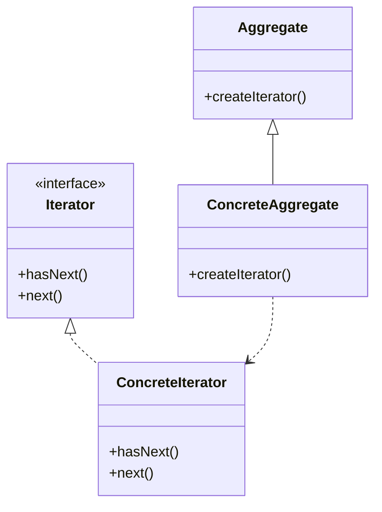

# 21 迭代器模式

> 系列：[李建忠设计模式](README.md) · 第 21/26 讲 · GoF 行为型

---

## 引子

遍历数组、链表、二叉树——遍历代码不应依赖内部结构。迭代器提供 `hasNext()` / `next()` 统一接口，聚合对象负责创建迭代器。

---

## 要解决什么问题

```cpp
for (int i = 0; i < arr.size(); ++i) { }
for (Node* p = head; p; p = p->next) { }
// 每种容器一种写法
```

痛点：遍历算法与容器结构耦合、难以替换底层数据结构。

---

## 模式结构

| 角色 | 职责 |
|------|------|
| Iterator | `first` / `next` / `isDone` / `currentItem` |
| ConcreteIterator | 针对具体聚合 |
| Aggregate | `createIterator()` |
| ConcreteAggregate | 返回具体迭代器 |



---

## C++ 示例

```cpp
#include <iostream>
#include <vector>
#include <memory>

template<typename T>
class Iterator {
public:
  virtual bool hasNext() const = 0;
  virtual T next() = 0;
  virtual ~Iterator() = default;
};

template<typename T>
class VectorIterator : public Iterator<T> {
  const std::vector<T>& vec_;
  size_t i_ = 0;
public:
  explicit VectorIterator(const std::vector<T>& v) : vec_(v) {}
  bool hasNext() const override { return i_ < vec_.size(); }
  T next() override { return vec_[i_++]; }
};

template<typename T>
class VectorAggregate {
  std::vector<T> data_;
public:
  void add(T v) { data_.push_back(std::move(v)); }
  std::unique_ptr<Iterator<T>> createIterator() const {
    return std::make_unique<VectorIterator<T>>(data_);
  }
};

int main() {
  VectorAggregate<int> agg;
  agg.add(1); agg.add(2);
  auto it = agg.createIterator();
  while (it->hasNext())
    std::cout << it->next() << " ";
  std::cout << "\n";
  return 0;
}
```

---

## 适用 / 不适用

| 适用 | 不适用 |
|------|--------|
| 多种聚合需统一遍历 | 只用 STL，范围 for 足够 |
| 隐藏聚合内部表示 | 简单数组一次遍历 |

---

## 与其他模式对比

| 对比 | 区别 |
|------|------|
| **迭代器 vs 访问器** | 迭代器：遍历元素；访问器：对元素执行操作 |
| **迭代器 vs 组合** | 组合：树形结构；迭代器可递归遍历组合 |
| **C++ STL** | `begin()`/`end()` 即迭代器模式的标准化 |

---

## 重点与注意

> **重点**：C++ 程序员日常用的 **范围 for** 底层就是迭代器。  
> **重点**：外部迭代器（客户端调 `next`）vs 内部迭代器（聚合自己遍历，如 `forEach`）。  
> **注意**：迭代器失效规则（vector 扩容）是 C++ 特有坑，与模式无关但实践必知。  
> **注意**：C++20 `ranges` 进一步抽象遍历。

---

## 小结

迭代器统一遍历接口。下一讲请求沿链传递：**职责链模式**。

**延伸阅读**

- 上一篇：[20 组合](20-composite.md) · 下一篇：[22 职责链模式](22-chain-of-responsibility.md)
