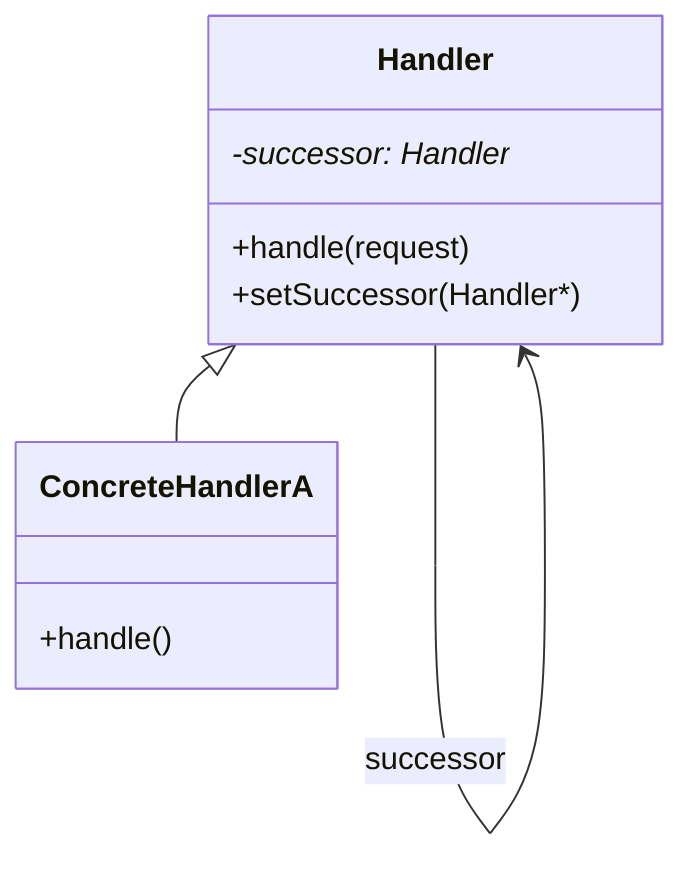

# 22 职责链模式

> 系列：[李建忠设计模式](README.md) · 第 22/26 讲 · GoF 行为型

---

## 引子

请假审批：组员 → 经理 → 总监，每一级要么处理要么转交上级。职责链把请求沿 **Handler 链** 传递，直到有人处理或链结束。

---

## 要解决什么问题

```cpp
void approve(int days) {
  if (days <= 1) leader.approve();
  else if (days <= 3) manager.approve();
  else director.approve();
}
```

痛点：审批层级变化要改集中逻辑、请求发送者与处理者紧耦合。

---

## 模式结构

| 角色 | 职责 |
|------|------|
| Handler | 持 successor，处理或 `forward` |
| ConcreteHandler | 具体处理条件 |
| Client | 把请求交给链头 |



---

## C++ 示例

```cpp
#include <iostream>
#include <memory>

struct Request { int leaveDays; };

class Handler {
  std::unique_ptr<Handler> next_;
public:
  void setNext(std::unique_ptr<Handler> n) { next_ = std::move(n); }
  virtual void handle(const Request& req) {
    if (next_) next_->handle(req);
    else std::cout << "no handler\n";
  }
  virtual ~Handler() = default;
};

class Manager : public Handler {
public:
  void handle(const Request& req) override {
    if (req.leaveDays <= 3) {
      std::cout << "Manager approved " << req.leaveDays << " days\n";
    } else {
      Handler::handle(req);
    }
  }
};

class Director : public Handler {
public:
  void handle(const Request& req) override {
    std::cout << "Director approved " << req.leaveDays << " days\n";
  }
};

int main() {
  auto dir = std::make_unique<Director>();
  auto mgr = std::make_unique<Manager>();
  mgr->setNext(std::move(dir));
  mgr->handle({2});
  mgr->handle({10});
  return 0;
}
```

---

## 适用 / 不适用

| 适用 | 不适用 |
|------|--------|
| 多个对象可处理请求，顺序或优先级明确 | 必须只有一个处理者且固定 |
| 想动态组织链 | 处理逻辑简单，单个 if 即可 |

---

## 与其他模式对比

| 对比 | 区别 |
|------|------|
| **职责链 vs 装饰** | 职责链：传递直到处理；装饰：每层都增强 |
| **职责链 vs 观察者** | 职责链：通常一个处理；观察者：广播全部 |
| **职责链 vs 中介者** | 中介者：星型中心；职责链：线性传递 |

---

## 重点与注意

> **重点**：请求发送者**不知**谁会最终处理。  
> **重点**：可结合 **纯责任链**（必传递）与 **不纯**（可处理可传递）。  
> **注意**：链未处理完的默认行为要定义（日志 / 错误）。  
> **注意**：Web 中间件、过滤器管道是职责链的现代形态。

---

## 小结

职责链解耦请求发送者与处理者集合。下一讲封装操作为对象：**命令模式**。

**延伸阅读**

- 上一篇：[21 迭代器](21-iterator.md) · 下一篇：[23 命令模式](23-command.md)
- 代码：[code/22-chain.cpp](code/22-chain.cpp)
