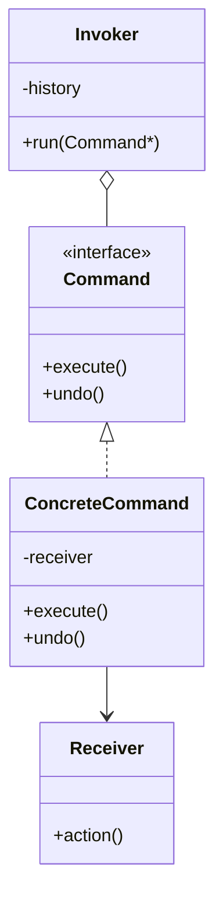

# 23 命令模式

> 系列：[李建忠设计模式](README.md) · 第 23/26 讲 · GoF 行为型

---

## 引子

遥控器按钮：每个键封装一个「开灯」「调音量」请求，可记录、撤销、宏命令（一键场景）。命令模式把**请求变成对象**，从而参数化、排队、记录日志、支持 undo。

---

## 要解决什么问题

```cpp
void onButton(int id) {
  if (id == 1) light.on();
  else if (id == 2) light.off();
  // 无法 undo、无法队列
}
```

痛点：调用方与接收方紧耦合、难以实现撤销/重做、难以组合宏操作。

---

## 模式结构

| 角色 | 职责 |
|------|------|
| Command | `execute()`，可选 `undo()` |
| ConcreteCommand | 绑定 Receiver + 参数 |
| Receiver | 真正干活的类 |
| Invoker | 触发命令，可持历史栈 |
| Client | 创建命令并交给 Invoker |



---

## C++ 示例

```cpp
#include <iostream>
#include <memory>
#include <stack>

class Light {
  bool on_ = false;
public:
  void on()  { on_ = true;  std::cout << "light on\n"; }
  void off() { on_ = false; std::cout << "light off\n"; }
  bool isOn() const { return on_; }
};

class Command {
public:
  virtual void execute() = 0;
  virtual void undo() = 0;
  virtual ~Command() = default;
};

class LightOnCommand : public Command {
  Light& light_;
public:
  explicit LightOnCommand(Light& l) : light_(l) {}
  void execute() override { light_.on(); }
  void undo() override { light_.off(); }
};

class Invoker {
  std::stack<std::unique_ptr<Command>> history_;
public:
  void submit(std::unique_ptr<Command> cmd) {
    cmd->execute();
    history_.push(std::move(cmd));
  }
  void undo() {
    if (history_.empty()) return;
    history_.top()->undo();
    history_.pop();
  }
};

int main() {
  Light light;
  Invoker inv;
  inv.submit(std::make_unique<LightOnCommand>(light));
  inv.undo();
  return 0;
}
```

现代 C++ 可用 `std::function` 作轻量命令，但完整 undo 仍需保存状态。

---

## 适用 / 不适用

| 适用 | 不适用 |
|------|--------|
| 撤销/重做、事务、任务队列 | 简单回调，无排队撤销需求 |
| 宏命令、日志、延迟执行 | 与策略混淆时：命令封装**请求**，策略封装**算法** |

---

## 与其他模式对比

| 对比 | 区别 |
|------|------|
| **命令 vs 策略** | 命令：请求对象、可 undo；策略：算法替换 |
| **命令 vs 备忘录** | 命令 undo 可调用 Receiver 逆操作或配合备忘录存状态 |
| **命令 vs 职责链** | 命令：封装单次操作；职责链：传递请求找处理者 |

---

## 重点与注意

> **重点**：命令模式是 **QUndoCommand**、文本编辑器 undo 栈的理论基础。  
> **重点**：`execute` 与 `undo` 要成对设计，避免 undo 后状态不一致。  
> **注意**：宏命令 = 组合多个 Command，本身也是 Command。  
> **注意**：`vtkCommand` 名字像命令，但是事件回调，不是 GoF Command（见 VTK 专题，本系列不展开）。

---

## 小结

命令把「做什么」变成可存储、可撤销的对象。下一讲对结构稳定的对象族做操作：**访问器模式**。

**延伸阅读**

- 上一篇：[22 职责链](22-chain-of-responsibility.md) · 下一篇：[24 访问器模式](24-visitor.md)
- 代码：[code/23-command.cpp](code/23-command.cpp)
