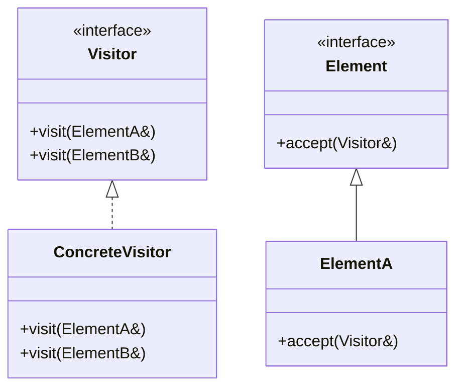

# 24 访问器模式

> 系列：[李建忠设计模式](README.md) · 第 24/26 讲 · GoF 行为型

---

## 引子

文档导出 HTML、PDF、Markdown——对标题、段落、图片的操作因格式而异。若在每种元素类里加 `exportHtml()` / `exportPdf()`，元素类爆炸。访问器把**操作**抽到 Visitor，元素只接受 `accept(visitor)`。

---

## 要解决什么问题

```cpp
class Paragraph {
  void exportHtml();
  void exportPdf();  // 每加一种格式改所有元素类
};
```

痛点：违反开闭原则、操作与对象结构耦合、双重分发需求。

---

## 模式结构

| 角色 | 职责 |
|------|------|
| Visitor | 为每种 ConcreteElement 声明 `visit()` |
| ConcreteVisitor | 实现各 visit 的具体操作 |
| Element | `accept(Visitor&)` |
| ConcreteElement | `accept` 里回调 `visitor.visit(*this)` |

**双重分发**：`accept` + `visit` 共同决定调用哪个重载。



---

## C++ 示例

```cpp
#include <iostream>

class Circle;
class Square;

class ShapeVisitor {
public:
  virtual void visit(Circle& c) = 0;
  virtual void visit(Square& s) = 0;
  virtual ~ShapeVisitor() = default;
};

class Shape {
public:
  virtual void accept(ShapeVisitor& v) = 0;
  virtual ~Shape() = default;
};

class Circle : public Shape {
public:
  double r = 1.0;
  void accept(ShapeVisitor& v) override { v.visit(*this); }
};

class Square : public Shape {
public:
  double side = 1.0;
  void accept(ShapeVisitor& v) override { v.visit(*this); }
};

class AreaVisitor : public ShapeVisitor {
public:
  double total = 0;
  void visit(Circle& c) override {
    total += 3.14 * c.r * c.r;
  }
  void visit(Square& s) override {
    total += s.side * s.side;
  }
};

int main() {
  Circle c;
  Square s;
  AreaVisitor av;
  c.accept(av);
  s.accept(av);
  std::cout << "total area ~ " << av.total << "\n";
  return 0;
}
```

---

## 适用 / 不适用

| 适用 | 不适用 |
|------|--------|
| 对象结构稳定，常增**新操作** | 常增新元素类型（每增元素要改所有 Visitor） |
| 需要对异构对象统一操作 | 结构频繁变化 |

---

## 与其他模式对比

| 对比 | 区别 |
|------|------|
| **访问器 vs 迭代器** | 迭代器：遍历；访问器：遍历时执行操作 |
| **访问器 vs 策略** | 策略：一种算法替换；访问器：多种操作跨类型 |
| **现代 C++** | `std::variant` + `std::visit` 可实现类似双重分发 |

---

## 重点与注意

> **重点**：访问器适合 **操作多变、结构稳定**（编译器 AST、文档对象模型）。  
> **重点**：`accept` 是 **双重分发** 的关键一环。  
> **注意**：新增 Element 类型要改 Visitor 所有子类——这是模式的主要代价。  
> **注意**：C++ 可用 `std::visit` 减少对虚函数的依赖。

---

## 小结

访问器集中定义跨类型的操作。下一讲语法解释：**解析器模式**。

**延伸阅读**

- 上一篇：[23 命令](23-command.md) · 下一篇：[25 解析器模式](25-interpreter.md)
