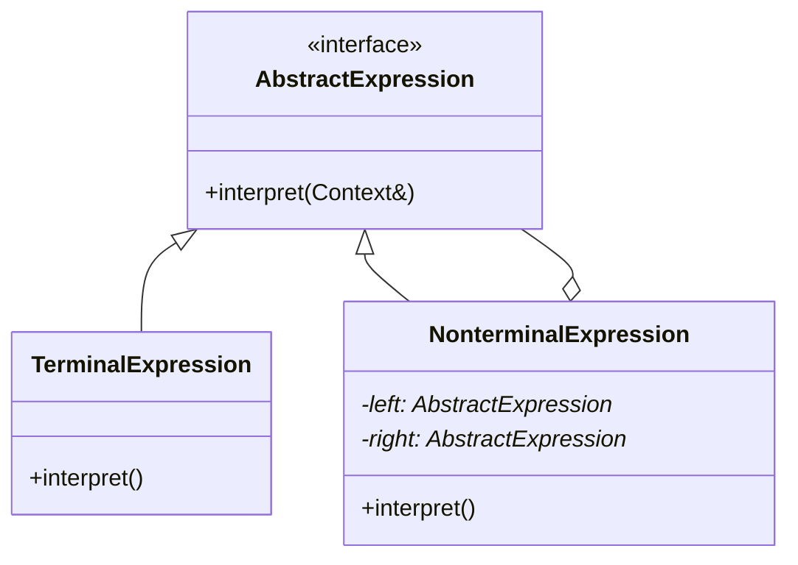

# 25 解析器模式

> 系列：[李建忠设计模式](README.md) · 第 25/26 讲 · GoF 行为型

---

## 引子

简单算术表达式 `1 + 2`、正则子集、查询 DSL——可为语法中每种规则定义一个类，用**组合语法树**解释执行。解析器（Interpreter）模式为语言构建解释器。

---

## 要解决什么问题

```cpp
int eval(const std::string& expr) {
  // 巨型 parse + switch
}
```

痛点：语法扩展困难、规则与求值缠在一起、难维护文法。

---

## 模式结构

| 角色 | 职责 |
|------|------|
| AbstractExpression | `interpret(context)` |
| TerminalExpression | 终结符（数字、变量） |
| NonterminalExpression | 非终结符（加、减），组合子表达式 |
| Context | 全局/解释所需信息 |



---

## C++ 示例（整数加法）

```cpp
#include <iostream>
#include <memory>

class Context {
public:
  int variables[26] = {};
};

class Expression {
public:
  virtual int interpret(Context& ctx) = 0;
  virtual ~Expression() = default;
};

class Number : public Expression {
  int val_;
public:
  explicit Number(int v) : val_(v) {}
  int interpret(Context&) override { return val_; }
};

class Add : public Expression {
  std::unique_ptr<Expression> left_, right_;
public:
  Add(std::unique_ptr<Expression> l, std::unique_ptr<Expression> r)
    : left_(std::move(l)), right_(std::move(r)) {}
  int interpret(Context& ctx) override {
    return left_->interpret(ctx) + right_->interpret(ctx);
  }
};

int main() {
  Context ctx;
  auto expr = std::make_unique<Add>(
    std::make_unique<Number>(1),
    std::make_unique<Number>(2));
  std::cout << expr->interpret(ctx) << "\n";
  return 0;
}
```

---

## 适用 / 不适用

| 适用 | 不适用 |
|------|--------|
| 简单、重复出现的文法 | 复杂语言（用解析器生成器 yacc/ANTLR） |
| 效率不是首要 | 执行频率极高、需编译优化 |
| 希望文法类层次清晰 | 文法频繁变化 |

---

## 与其他模式对比

| 对比 | 区别 |
|------|------|
| **解析器 vs 组合** | 解析器：组合模式常用于构建语法树 |
| **解析器 vs 访问器** | 可对语法树 accept Visitor 做求值/打印 |
| **解析器 vs 状态** | 词法/语法分析器内部常用状态机，不同层次 |

---

## 重点与注意

> **重点**：每个语法规则一个类，**组合**成树，`interpret` 递归求值。  
> **重点**：仅适合**简单语言**；复杂语言用工具生成解析器。  
> **注意**：与 [20 组合模式](20-composite.md) 常一起出现（表达式树）。  
> **注意**：实际项目优先成熟解析库，模式用于理解结构。

---

## 小结

解析器为简单语言提供面向对象的解释结构。下一讲全课收束：**设计模式总结**。

**延伸阅读**

- 上一篇：[24 访问器](24-visitor.md) · 下一篇：[26 设计模式总结](26-summary.md)
