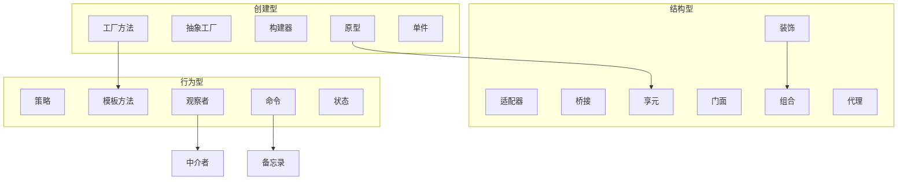
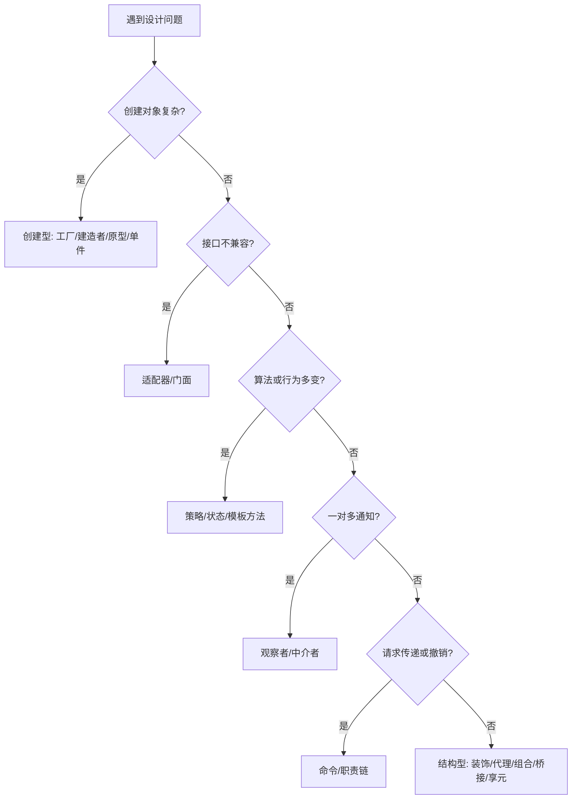

# 26 设计模式总结

> 系列：[李建忠设计模式](README.md) · 第 26/26 讲

---

## 引子

23 种模式不是 23 个孤立技巧，而是围绕**变化点隔离、依赖抽象、组合复用**的一组解法。本讲按 GoF 分类回顾、梳理易混关系、给出选型思路，并提醒模式的边界。

---

## GoF 23 种模式总表

| 创建型（5） | 结构型（7） | 行为型（11） |
|-------------|-------------|--------------|
| [工厂方法](08-factory-method.md) | [适配器](16-adapter.md) | [职责链](22-chain-of-responsibility.md) |
| [抽象工厂](09-abstract-factory.md) | [桥接](07-bridge.md) | [命令](23-command.md) |
| [构建器](11-builder.md) | [组合](20-composite.md) | [解析器](25-interpreter.md) |
| [原型](10-prototype.md) | [装饰](06-decorator.md) | [迭代器](21-iterator.md) |
| [单件](12-singleton.md) | [门面](14-facade.md) | [中介者](17-mediator.md) |
| | [享元](13-flyweight.md) | [备忘录](19-memento.md) |
| | [代理](15-proxy.md) | [观察者](05-observer.md) |
| | | [状态](18-state.md) |
| | | [策略](04-strategy.md) |
| | | [模板方法](03-template-method.md) |
| | | [访问器](24-visitor.md) |

前置：[01 简介](01-intro.md)、[02 设计原则](02-oop-principles.md)。

---

## 课程顺序 vs GoF 分类

李建忠课程顺序（03→25）先 **模板方法、策略、观察者**，再结构与创建，最后集中行为模式——主线是：

1. 先会认 **坏味道** 与 **原则**  
2. 再用 **行为模式** 消除分支与耦合  
3. 用 **结构模式** 组织类与对象  
4. 用 **创建模式** 隔离 `new` 与复杂构造  

复习时可按上表三类横向对照。

---

## 模式关系图（简化）

---

## 高频易混对照（总复习）

| 组别 | 判断口诀 |
|------|----------|
| 策略 / 状态 / 模板方法 | **谁切换**？客户端切换=策略；内部状态=状态；继承定骨架=模板方法 |
| 装饰 / 代理 / 适配器 | **目的**？增强=装饰；控制访问=代理；改接口=适配器 |
| 桥接 / 适配器 | **时机**？设计期拆维度=桥接；事后兼容=适配器 |
| 工厂方法 / 抽象工厂 / 构建器 | **几个产品**？一个=工厂方法；一族=抽象工厂；一个复杂分步=构建器 |
| 观察者 / 中介者 | **拓扑**？广播=观察者；星型协调=中介者 |
| 命令 / 备忘录 | **存什么**？操作=命令；状态快照=备忘录 |
| 组合 / 装饰 | **结构**？树=组合；链式包装=装饰 |
| 访问器 / 迭代器 | **做什么**？遍历时操作=访问器；只遍历=迭代器 |

---

## 选型决策树（何时考虑模式）

决策树是启发式，非机械规则。

---

## 设计原则再回顾

| 原则 | 典型模式 |
|------|----------|
| 开闭 OCP | 策略、装饰、工厂方法 |
| 依赖倒置 DIP | 抽象工厂、桥接、策略 |
| 合成复用 CRP | 策略、装饰、桥接 |
| 单一职责 SRP | 门面（协调但不包揽业务） |
| 里氏替换 LSP | 所有基于多态的模式 |

详见 [02 设计原则](02-oop-principles.md)。

---

## 模式不是银弹

1. **不要过度设计**：模式有成本（类增多、间接层）  
2. **语言与库已内置部分模式**：STL 迭代器、智能指针、信号槽  
3. **先重构后命名**：代码能工作 → 识别坏味道 → 重构到模式结构  
4. **单件滥用**、**访问器乱用**是常见反模式  
5. **模式组合**是常态：工厂 + 单件、命令 + 备忘录、组合 + 迭代器  

---

## 后续学习建议

| 方向 | 建议 |
|------|------|
| 巩固 | 每模式手写最小 C++ 示例（见 [code/](code/README.md)） |
| 阅读源码 | 标准库、小型开源项目的模式痕迹 |
| 框架落点 | 若做 Qt/VTK，可读兄弟系列 `pattern/`（本系列独立） |
| 进阶 | 《Refactoring》Martin Fowler、《Pattern-Oriented Software Architecture》 |

---

## 重点与注意（全课速记）

> **重点**：23 种模式 = 23 种**重复出现问题的命名解法**，不是 23 个类模板。  
> **重点**：李建忠主线：**变化点 + 抽象 + 组合**。  
> **重点**：易混组的判断依据是 **意图与谁触发变化**，不是 UML 长得像。  
> **注意**：学完应能 **识别坏味道**，而不是见代码就套模式。  
> **注意**：C++11 以后很多模式可用 `function`、`unique_ptr`、`variant` 简化实现。

---

## 小结

26 讲走完 GoF 全景与设计原则。模式是团队沟通的词汇与重构的目标形状；熟练来自在真实代码中识别问题、小步重构、再命名。

**延伸阅读**

- 上一篇：[25 解析器模式](25-interpreter.md)
- 系列索引：[README](README.md)
- 代码示例：[code/README](code/README.md)

---

*全系列完 · 2026-07-07*
