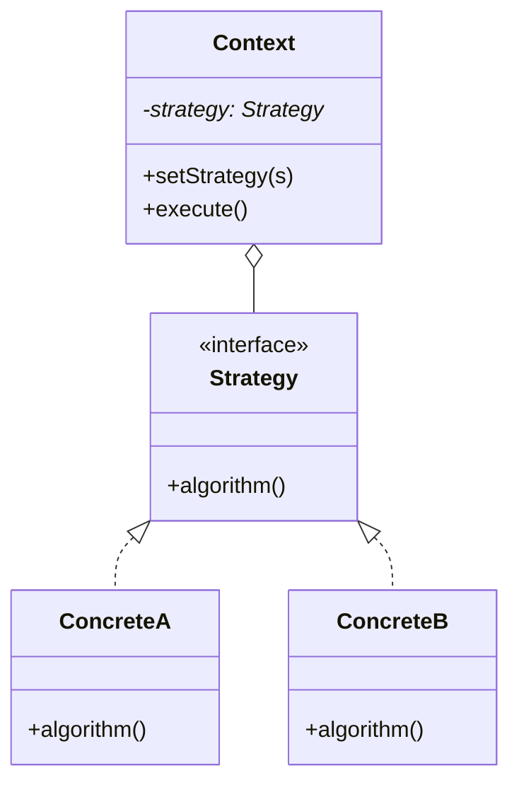

# 04 策略模式

> 系列：[李建忠设计模式](README.md) · 第 04/26 讲 · GoF 行为型

---

## 引子

购物车结账：国内用支付宝、海外用 PayPal——结账流程相同，**支付算法**不同。若用 `if (region == CN)` 堆在 `Checkout` 里，每加一种支付就改核心类。策略模式把算法**抽成可替换对象**。

---

## 要解决什么问题

```cpp
class Checkout {
  void pay(int method) {
    if (method == 0) { /* 支付宝 */ }
    else if (method == 1) { /* 微信 */ }
  }
};
```

痛点：违反开闭原则、无法运行时切换、单元测试难 mock 支付。

---

## 模式结构

| 角色 | 职责 |
|------|------|
| Strategy | 算法接口，如 `pay(amount)` |
| ConcreteStrategy | 各具体算法 |
| Context | 持有 Strategy，委托执行 |



---

## C++ 示例

```cpp
#include <iostream>
#include <memory>

class PaymentStrategy {
public:
  virtual void pay(double amount) = 0;
  virtual ~PaymentStrategy() = default;
};

class Alipay : public PaymentStrategy {
public:
  void pay(double amount) override {
    std::cout << "Alipay: " << amount << "\n";
  }
};

class PayPal : public PaymentStrategy {
public:
  void pay(double amount) override {
    std::cout << "PayPal: " << amount << "\n";
  }
};

class Checkout {
  std::unique_ptr<PaymentStrategy> strategy_;
public:
  void setStrategy(std::unique_ptr<PaymentStrategy> s) {
    strategy_ = std::move(s);
  }
  void checkout(double amount) {
    if (strategy_) strategy_->pay(amount);
  }
};

int main() {
  Checkout c;
  c.setStrategy(std::make_unique<Alipay>());
  c.checkout(99.0);
  c.setStrategy(std::make_unique<PayPal>());
  c.checkout(199.0);
  return 0;
}
```

现代 C++ 也可用 `std::function`<void(double)>`` 作轻量策略，无需继承。

---

## 适用 / 不适用

| 适用 | 不适用 |
|------|--------|
| 多种算法可互换，客户端选哪种 | 算法只有一份且不会变 |
| 想隐藏复杂算法实现 | 子类间主要是**流程不同**（用模板方法） |
| 消除 Context 内大型分支 | 行为随**内部状态**自动变（用状态模式） |

---

## 与其他模式对比

| 对比 | 区别 |
|------|------|
| **策略 vs 状态** | 策略：**客户端** `setStrategy`；状态：对象**自己**根据状态切换 |
| **策略 vs 模板方法** | 策略：组合、换对象；模板方法：继承、换步骤 |
| **策略 vs 命令** | 命令：封装**请求**、可撤销排队；策略：封装**算法** |

---

## 重点与注意

> **重点**：策略模式直接体现 **开闭原则** 与 **合成复用**：Context Has-A Strategy。  
> **重点**：运行时切换是策略的标志性能力。  
> **注意**：策略对象可复用、可共享（无状态策略）；有状态时每个 Context 持有独立实例。  
> **注意**：与状态模式结构像（都有接口 + 多实现），**谁触发切换**是判断关键。

---

## 小结

策略模式是课程中第一个「用组合消除 if-else」的利器。下一讲处理一对多通知：**观察者模式**。

**延伸阅读**

- 上一篇：[03 模板方法](03-template-method.md) · 下一篇：[05 观察者模式](05-observer.md)
- 代码：[code/04-strategy.cpp](code/04-strategy.cpp)
