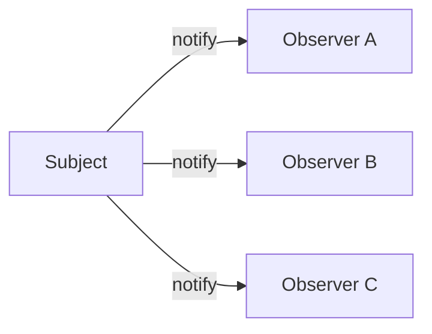
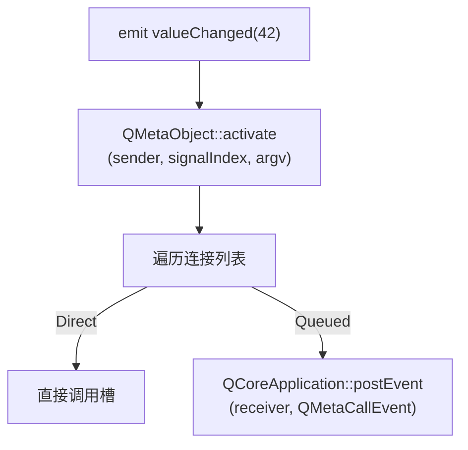

# Qt 设计模式：观察者模式与信号槽

> 系列：[Qt / VTK 设计模式](../README.md) · Qt 01/11  
> 参考：Qt 6 文档 [Signals & Slots](https://doc.qt.io/qt-6/signalsandslots.html)、`QObject::connect` 源码

---

## 引子

你点一下按钮，窗口标题变了、计数器加一、日志也打了一行——按钮并不需要知道谁在听。这就是观察者模式在 Qt 里最常见的样子：**信号（signal）广播，槽（slot）响应**。

---

## 要解决什么问题

没有观察者时，常见写法是：

```cpp
button->onClick([&]{ label->setText("..."); logger->write("..."); });
```

问题：

- 按钮与 label、logger **紧耦合**
- 监听器增减要改按钮代码
- 多线程回调容易踩坑

Qt 用 **信号槽** 把「谁通知」和「谁处理」拆开。

---

## GoF 观察者结构



| 角色 | Qt 对应 |
|------|---------|
| Subject | 发射信号的对象（`QObject` 子类） |
| Observer | 接收信号的槽函数或 lambda |
| 注册 | `connect(sender, signal, receiver, slot)` |
| 通知 | `emit valueChanged(x)` |

---

## Qt 中的落点

- 所有带元对象的类继承 `QObject`
- 信号/槽由 **moc**（Meta-Object Compiler）在编译期生成元信息
- `QObject::connect` 在运行期建立连接

官方文档明确：信号槽是 Qt 对观察者模式的类型安全扩展，支持跨线程队列投递。

---

## 底层逻辑

### 1. moc 做了什么（概念层）

你在头文件写：

```cpp
class Counter : public QObject {
  Q_OBJECT
signals:
  void valueChanged(int v);
public slots:
  void reset();
};
```

moc 会生成：

- `staticMetaObject`：信号/槽的名字、参数类型、索引
- `qt_static_metacall`：根据索引调用真正的 C++ 函数

**本质**：把「字符串级别的回调」变成「编译期可检查的元信息」。

### 2. connect 的五种连接类型

| 类型 | 行为 |
|------|------|
| `AutoConnection` | 同线程直调，异线程排队（默认） |
| `DirectConnection` | 始终在发射者线程同步调用 |
| `QueuedConnection` | 事件入队，在接收者线程执行 |
| `BlockingQueuedConnection` | 排队并阻塞等待执行完 |
| `UniqueConnection` | 避免重复连接 |

跨线程时 `QueuedConnection` 把槽调用封装成 `QMetaCallEvent` 放进接收者线程事件队列——这是 Qt 观察者模式比经典 C++ 回调更强的地方。

### 3. emit 之后发生了什么

简化调用链：



---

## 代码示例

### 最小示例

```cpp
#include <QApplication>
#include <QPushButton>
#include <QLabel>

int main(int argc, char* argv[]) {
  QApplication app(argc, argv);

  QPushButton button("Click me");
  QLabel label("Count: 0");
  int count = 0;

  QObject::connect(&button, &QPushButton::clicked, [&]() {
    ++count;
    label.setText(QString("Count: %1").arg(count));
  });

  button.show();
  label.show();
  return app.exec();
}
```

### 跨线程观察者

```cpp
class Worker : public QObject {
  Q_OBJECT
signals:
  void progress(int percent);
public slots:
  void doWork() {
    for (int i = 0; i <= 100; i += 10) {
      emit progress(i);
      QThread::msleep(50);
    }
  }
};

// 主线程
QThread thread;
Worker worker;
worker.moveToThread(&thread);
connect(&thread, &QThread::started, &worker, &Worker::doWork);
connect(&worker, &Worker::progress, label, &QLabel::setNum,
        Qt::QueuedConnection);  // 跨线程安全更新 UI
thread.start();
```

---

## 易混淆点

| 对比 | 区别 |
|------|------|
| 信号槽 vs 回调函数 | 信号槽有类型检查、可多连、可跨线程 |
| 信号槽 vs VTK `AddObserver` | Qt 偏 UI/业务；VTK 偏 C++ 对象生命周期事件 |
| `QEvent` vs 信号 | `QEvent` 是输入/绘制等系统事件；信号是应用层自定义通知 |

---

## 最佳实践与陷阱

1. **新语法 connect**：`connect(btn, &QPushButton::clicked, ...)` 编译期检查参数类型
2. **注意 lambda 捕获生命周期**：捕获裸指针时确保对象比 lambda 活得久
3. **跨线程默认 Auto 通常够用**，但 UI 更新务必在 GUI 线程
4. **断开连接**：`disconnect` 或 sender/receiver 销毁时自动断（同线程 QObject 树）
5. **避免在槽里递归 emit 同一信号** 导致栈溢出或逻辑混乱

---

## 重点与注意

> **重点**：信号槽本质是观察者模式；`moc` 生成元对象信息，`emit` 最终走 `QMetaObject::activate` 遍历连接表。  
> **重点**：五种 `Qt::ConnectionType` 中，`QueuedConnection` 把槽调用封装成事件投递到接收者线程，是 Qt 跨线程 UI 更新的标准做法。  
> **注意**：`DirectConnection` 在接收者所在线程**同步**执行，跨线程使用可能导致竞态或直接操作非 GUI 线程的 Widget。  
> **注意**：lambda 做槽时，捕获 `this` 或裸指针要关心对象是否已销毁；可改用 `QPointer` 或 context 版本的 `connect`（sender 销毁自动断开）。  
> **注意**：信号槽是**多对多**；一个信号可连多个槽，一个槽也可被多个信号连接。

---

## 小结

Qt 观察者模式的本质是：**moc 元对象 + 连接表 + 可选队列投递**。它解决了经典 Observer 的类型不安全与线程难题。

**延伸阅读**

- [Qt Signals & Slots](https://doc.qt.io/qt-6/signalsandslots.html)
- 下一篇：[02 组合模式：QObject 树](02-composite-qobject-tree.md)
- 系列索引：[README](../README.md)
