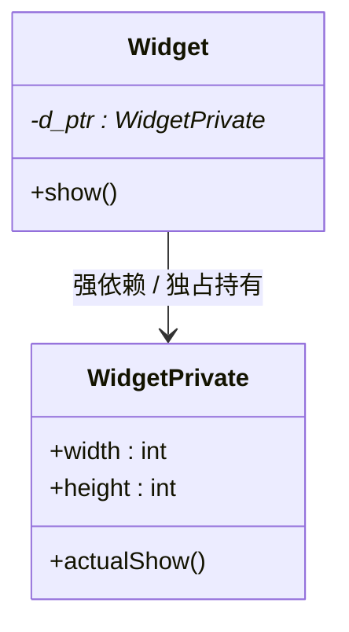
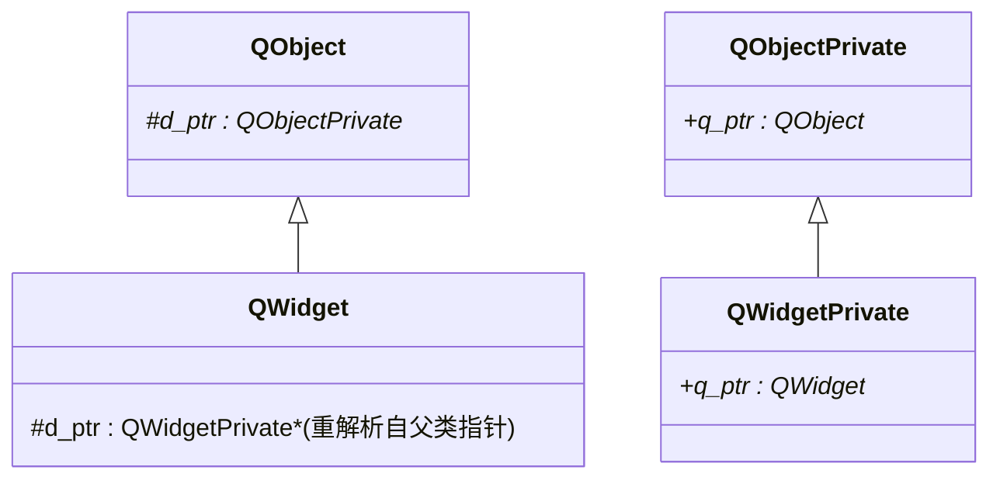

# Qt 设计模式：Pimpl 与 d-指针/q-指针模式

> 系列：[Qt / VTK 设计模式](../README.md) · Qt 12/12  
> 参考：Qt Wiki [D-Pointer](https://wiki.qt.io/D-Pointer)、[API Design for C++](https://www.apidesignbook.com/)

---

## 引子

在发布 C++ 动态链接库（SDK）时，最令人头疼的问题莫过于**二进制兼容性（ABI 稳定性）**——仅仅给类增加了一个私有成员变量，使用旧库编译的客户端程序运行期就会直接崩溃。
为了解决这一工程灾难，Qt 全局使用了 **Pimpl (Pointer to Implementation) 模式**，并将其规范化为独特的 **d-指针 / q-指针** 设计方法。

---

## 要解决什么问题

### C++ 脆弱的 ABI 机制
在 C++ 中，如果客户端代码实例化了类 `Widget`，编译器在编译期必须知道 `Widget` 对象的内存布局大小（以在栈或堆上分配内存）。
假设原始的 `Widget` 声明如下：

```cpp
// v1.0.0
class Widget {
public:
    Widget();
    void show();
private:
    int width;
}; // 编译器计算大小：4 字节
```

如果我们在 `v1.1.0` 中为 `Widget` 增加了一个新的私有变量 `int height;`：

```cpp
// v1.1.0
class Widget {
public:
    Widget();
    void show();
private:
    int width;
    int height; // 新增成员
}; // 编译器计算大小：8 字节
```

如果客户端程序**不重新编译**，直接用新版 DLL 替换旧版 DLL 运行，程序在读取 `height` 或进行内存寻址时，会因为内存越界直接发生 **Segment Fault** 崩溃。

### 带来的痛点
1. **无法热更新**：任何小改动必须强制下游所有客户端重新编译。
2. **编译开销极大**：私有成员的头文件一旦变动，包含该头文件的所有源文件都需要重新编译（编译传播）。
3. **暴露商业机密**：头文件中必须声明私有成员，容易暴露底层的设计细节。

---

## Pimpl 的设计本质

Pimpl（Pointer to Implementation，指向实现的指针）在设计模式分类中属于 **桥接模式 (Bridge)** 的变体。其核心思想是：**将公共类（外观）与实现类（具体实现）彻底分离**。



在公有头文件中，只声明一个前置声明的指针：

```cpp
class WidgetPrivate; // 前置声明
class Widget {
public:
    Widget();
    ~Widget();
    void show();
private:
    WidgetPrivate* d_ptr; // 唯一的成员指针（大小恒为 4/8 字节）
};
```

而所有的具体私有变量与内部逻辑，全部隐藏在具体的实现文件（`.cpp`）中：

```cpp
// widget.cpp
class WidgetPrivate {
public:
    int width;
    int height; // 在这里任意增加/修改成员，公有类的体积永远是一个指针的大小！
};
```

---

## Qt 的落点：d-指针与 q-指针

为了实现优雅的继承、防止大量冗余的手动指针转换，并实现实现类对公有类的反向调用，Qt 精妙设计了以下两个指针：

1. **`d-指针` (d_ptr)**：在公有类（`QObject` 等）中，指向私有实现类（如 `QObjectPrivate`）的指针。
2. **`q-指针` (q_ptr)**：在私有实现类中，指向其对应的公有类的反向指针（用于在私有类中调用公有类的信号、虚函数或方法）。

### 核心关联宏
Qt 提供了几个经典的内部宏来简化这一模式的操作（在应用层我们也可以借鉴）：
* `Q_DECLARE_PRIVATE(Class)`：在公有类中声明私有类为友元，并生成内联函数 `d_func()` 以实现安全的指针转换。
* `Q_DECLARE_PUBLIC(Class)`：在私有类中反向关联公有类。
* `Q_D(Class)`：在公有类的方法中，快捷获取私有类的 `d` 指针。
* `Q_Q(Class)`：在私有类的方法中，快捷获取公有类的 `q` 指针。

---

## 底层逻辑

### 继承链上的 d-指针复用
如果每个继承子类都定义一个全新的 `d_ptr`，子类对象中就会存在多个指针，造成内存浪费。Qt 的精妙设计是：**整个继承树上只保留一个基类定义的 `d_ptr`，子类通过指针转换复用这一个指针**。



当创建 `QWidget` 时，内部调用：
```cpp
QWidget::QWidget(QWidgetPrivate &dd) : QObject(dd) {}
```
它把子类的 `QWidgetPrivate` 向上转型传给基类 `QObject`。这样，所有的属性读写都在同一个子类私有对象上，不需要多重继承指针！

---

## 代码示例：实现一个符合 Qt 规范的 Pimpl 模块

下面给出一个可以在你的 C++ 工业项目中直接使用的 d-指针/q-指针标准模板：

### 1. 头文件 (`mywidget.h`)

```cpp
#pragma once
#include <QScopedPointer>

class MyWidgetPrivate; // 前置声明

class MyWidget {
public:
    MyWidget();
    virtual ~MyWidget();
    
    void setDimension(int w, int h);
    void render();

protected:
    // 整个继承链共享这一个 QScopedPointer 智能指针，负责自动销毁
    QScopedPointer<MyWidgetPrivate> d_ptr;

private:
    // 声明 d_func() 辅助函数
    MyWidgetPrivate* d_func() const { return d_ptr.data(); }
    friend class MyWidgetPrivate;
};
```

### 2. 实现文件 (`mywidget.cpp`)

```cpp
#include "mywidget.h"
#include <QDebug>

// 1. 定义私有实现类
class MyWidgetPrivate {
public:
    MyWidgetPrivate(MyWidget* q) : q_ptr(q), width(0), height(0) {}

    MyWidget* q_ptr; // 反向指针（q-指针）
    int width;
    int height;      // 在这里添加新成员，完全不影响外部动态链接库的 ABI！

    void doInternalCalculation() {
        qDebug() << "私有类执行计算，当前尺寸为:" << width << "x" << height;
        // 如果需要，可以通过 q_ptr 反向调用公有类的虚函数或发射信号
    }
};

// 2. 公有类的构造与析构
MyWidget::MyWidget() 
    : d_ptr(new MyWidgetPrivate(this)) // 初始化 d_ptr 并反向传入 this 指针
{
}

MyWidget::~MyWidget() {
    // QScopedPointer 会在析构时自动释放 MyWidgetPrivate
}

// 3. 业务接口实现
void MyWidget::setDimension(int w, int h) {
    // 模拟 Q_D 宏：获取类型安全的 d 指针
    MyWidgetPrivate* const d = d_func();
    d->width = w;
    d->height = h;
    d->doInternalCalculation();
}

void MyWidget::render() {
    MyWidgetPrivate* const d = d_func();
    qDebug() << "公有类调用私有数据进行渲染，宽度为:" << d->width;
}
```

---

## 最佳实践与陷阱

1. **避免在私有类中频繁反向调用公有类**：这会增加耦合。`q_ptr` 应该只用于发射信号（`emit`） or 转发虚函数回调。
2. **虚析构函数是必须的**：公有类必须具有显式声明的虚析构函数，否则编译器在销毁 `d_ptr` 时可能无法正确调用 `WidgetPrivate` 的析构函数，导致内存泄漏。
3. **开销折中**：Pimpl 带来了一次指针间接寻址的开销，在对性能极其苛刻的微秒级循环体内部，应谨慎使用 Pimpl，但在绝大多数 GUI 和业务管理模块中，这一点性能损失相比起 ABI 稳定性和编译速度的提升可以忽略不计。

---

## 重点与注意

> **重点**：Pimpl 是**隔离变化、隐藏细节**的桥接模式；C++ 中用它能确保类增加成员变量时不破坏二进制兼容性（ABI）。  
> **重点**：**d-指针**是公有类持有的实现指针；**q-指针**是实现类持有的公有类反向引用。两者实现了双向通信。  
> **注意**：必须显式编写公有类的析构函数，防止前置声明类型（Incomplete Type）导致智能指针无法析构。  
> **注意**：多级继承时，子类应通过受保护构造函数将 `dd`（私有子类引用）向上层传递，复用唯一的 `d_ptr` 指针，避免子类重复定义 `d_ptr`。

---

## 小结

Pimpl 与 d-指针模式是 Qt 框架的立足根基，它彻底解决了 C++ 开发中“动态库更新必崩溃”的噩梦，是构建大规模工业软件所不可或缺的设计范式。

**延伸阅读**

- [Qt Internals: D-Pointer and Q-Pointer](https://wiki.qt.io/D-Pointer)
- 上一篇：[11 MVC/MV](11-mvc-model-view.md)
- 系列索引：[README](../README.md)
