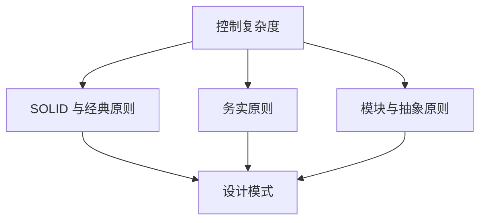
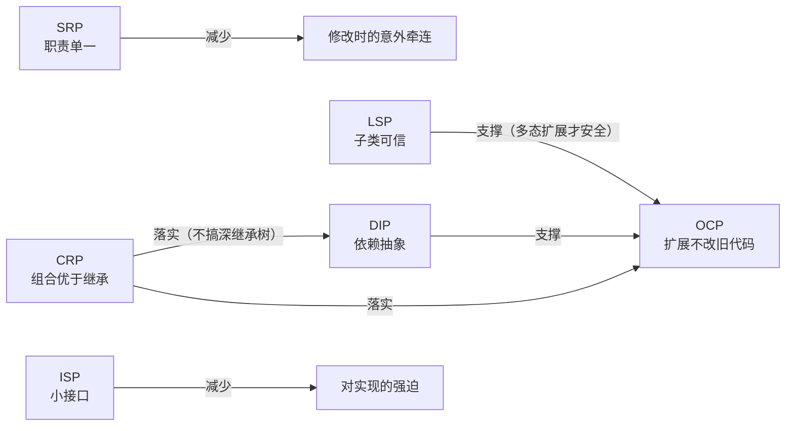
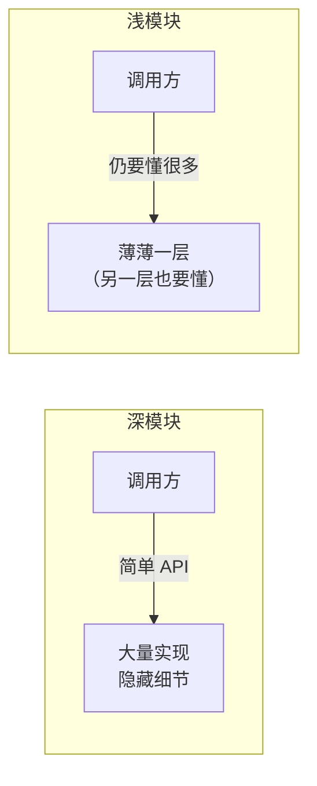
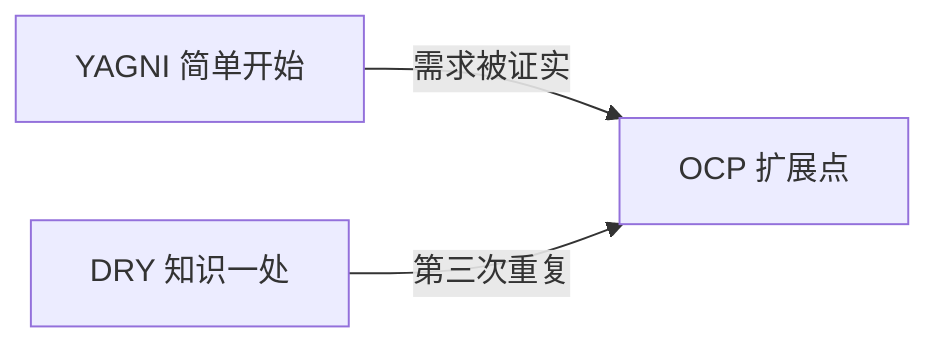
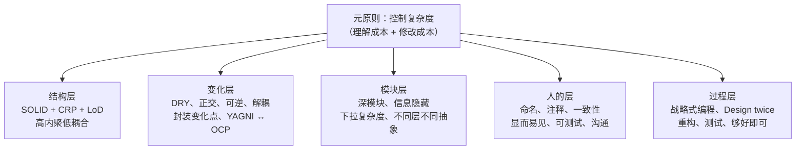

# 软件设计原则与模式本质总览

> 系列：[pattern/](README.md) · 原理与本质通识导读  
> 更新日期：2026-07-08

---

## 这篇是什么

软件设计有两个核心维度：
- **设计原则**：回答「**什么叫好设计**」，提供判断标准与重构方向。
- **设计模式**：回答「**怎么组织类与对象**」，提供经过时间检验的具体落地结构。

**设计模式的本质，是在「变化」与「稳定」之间划界，让系统对扩展开放、对修改关闭。** 模式几乎总是**设计原则的常见落地形状**。

### 建议的学习与实践顺序

高频模式建议优先：**观察者、策略、工厂、组合、命令、装饰**。它们覆盖了日常 80% 的「变化点」问题。其余模式在碰到具体问题时再查即可。

---

## 元原则：一切为了控制复杂度

几乎所有设计原则与模式最终都指向同一件事：**降低理解系统、修改系统时的认知负担**。

| 症状 | 含义 | 常见对策 |
|------|------|----------|
| **变更放大** | 小改动牵动大片代码 | DRY、信息隐藏、深模块 |
| **认知负荷** | 读代码要记太多上下文 | 单一职责、显而易见、命名 |
| **未知未知** | 改 A 不知道会坏 B | 正交、低耦合、测试 |

复杂度几乎总是**增量堆上去**的，没有「突然变烂」——见 [软件设计的哲学 · 复杂度](books/software-design-philosophy/02-chapter-complexity.md)。

---

## 一、软件设计原则全景

### 1. SOLID（面向对象五条）

面向对象模式背后最常引用的基石。详见 [李建忠 · 02 面向对象设计原则](../ljz-design-patterns/02-oop-principles.md)。

| 原则 | 英文 | 一句话 | 违反时常表现 |
|------|------|--------|--------------|
| **单一职责** | SRP | 一个模块只因**一种原因**而修改 | 上帝类；改导出牵连 UI |
| **开闭** | OCP | 对扩展开放，对修改关闭 | 满屏 `if (type == …)` |
| **里氏替换** | LSP | 子类可无损替换父类 | 子类抛「不支持」 |
| **依赖倒置** | DIP | 依赖抽象，不依赖具体 | 高层直接 `new` 具体类 |
| **接口隔离** | ISP | 接口小而专，不强迫无用方法 | 实现类大量空方法 |

**合成复用（CRP）** 虽不在 SOLID 字母里，但与 SOLID 同等重要：**优先组合（Has-A），慎用继承（Is-A）**。策略、装饰、桥接的共同地基。

#### SOLID 之间的关系与变化点封装

SOLID 之上的核心操作：**找到最可能变的那条轴，用抽象隔离开**（即变化点管理）。

### 2. 经典原则（跨范式）

不限于 OOP，函数式、过程式同样适用。

| 原则 | 英文 | 核心 | 注意 |
|------|------|------|------|
| **不要重复自己** | DRY | 每一条**知识**只在一处权威表达 | 形似代码 ≠ 重复知识 |
| **保持简单** | KISS | 能简单就不复杂 | 简单 ≠ 简陋 |
| **你不会需要它** | YAGNI | 无证据的变化别提前抽象 | 避免过度抽象 |
| **迪米特法则** | LoD | 只与直接朋友交谈 | 减少长链 `a.b().c().d()` |
| **最少知识** | — | 模块少假设邻居内部 | 与信息隐藏同族 |
| **组合优于继承** | — | 黑盒复用优于白盒复用 | 继承税高，易破坏封装 |
| **针对接口编程** | — | 调用方知契约，不知实现 | DIP 的日常说法 |
| **高内聚低耦合** | — | 模块内紧、模块间松 | 拆合的直觉目标 |

#### DRY 的精确定义
DRY 消灭的是**知识重复**，不是「两行长得像」。
- **违反**：连接失败提示、日志上传、防火墙预检各写一套分支与文案。
- **可保留**：两个循环结构相似，但表达不同的业务规则。
详见 [程序员修炼之道 · 第 2 章](books/pragmatic-programmer/02-chapter-approach.md)。

### 3. 务实原则（应对变化）

来自 [程序员修炼之道](books/pragmatic-programmer/README.md)，与 SOLID 互补：**SOLID 偏结构，务实原则偏过程与心态**。

| 原则 | 含义 | 实践 |
|------|------|------|
| **正交性** | 改 A 不应意外牵动 B | 模块边界清晰；少全局状态 |
| **可逆性** | 无最终决定；保留回退 | 延迟绑定；配置外置 |
| **解耦** | 少假设；通过消息/接口协作 | 事件、依赖注入 |
| **够好即可** | 在约束下**明确**质量目标 | 非降低专业标准 |
| **软件熵** | 不维护必然腐烂 | 每次改动让代码比来时干净一点 |
| **曳光弹** | 端到端可运行薄骨架 | 要演进，非一次性原型 |
| **早崩溃** | 非法状态立即失败 | 不传播脏数据 |
| **契约式设计** | 前置/后置条件写清假设 | 与断言分工 |
| **Rule of Three** | 第三次重复再抽象 | 平衡 YAGNI 与 DRY |

> **优秀设计的试金石**：优秀设计比烂设计更容易修改。若加功能总要改十处、怕碰旧代码，说明原则层面已欠债——见 [设计模式的思考 · 过度设计](design-patterns-reflections.md)。

### 4. 模块与抽象原则（战略式编程）

来自 [软件设计的哲学](books/software-design-philosophy/README.md)。与 SOLID 不冲突，但**视角不同**：SOLID 常从类出发；Ousterhout 从**模块接口与认知负担**出发。

| 原则 | 含义 | 反面 |
|------|------|------|
| **深模块** | 接口简单、实现强大 | 浅模块：接口仍复杂 |
| **信息隐藏** | 决策藏在实现内 | 信息泄漏：格式/协议/时序暴露给调用方 |
| **下拉复杂度** | 难留给实现，简留给接口 | API 把本该内部处理的事推给调用方 |
| **不同层不同抽象** | 相邻层语义可区分 | 透传层：只转发不增值 |
| **适度通用** | 略通用的模块往往更深 | 过窄或过宽都变浅 |
| **Define errors out** | 从 API 设计消灭非法状态 | 到处 `if (!valid)` |
| **Design it twice** | 至少两套方案再定稿 | 第一个想法直接写死 |
| **显而易见** | 读者第一次读就懂 | 聪明代码、嵌套回调链 |
| **战略式编程** | 默认多投 10–20% 设计时间 | 战术式：能跑就交差 |

#### 深模块 vs 浅模块

**classitis**（为小而拆、接口泛滥）是浅模块的常见病因。拆合的**唯一标准**是复杂度增减，非 SOLID 字母游戏——见 [第 9 章 · 拆还是合](books/software-design-philosophy/09-chapter-together-apart.md)。

### 5. 可读性与协作原则

设计不只关「模块形状」，也关**人能否读懂、改得动**。

- **命名揭示意图**：清晰、一致、可搜索。
- **注释写非显而易见之事**：解释 why、假设与约束，而非重复代码在做什么。
- **先写注释再写代码**：作为梳理设计思路的一部分。
- **一致性**：跟随局部惯例，降低认知负荷。
- **可测试性**：难测往往意味着耦合太重，促使我们进行解耦。
- **沟通**：API、文档、评审都是设计的一部分。

### 6. 原则之间的关系与张力

原则会**打架**，工程就是在约束下取舍。

| 张力 | 一侧 | 另一侧 | 怎么拿捏 |
|------|------|--------|----------|
| YAGNI ↔ OCP | 别为假想需求抽象 | 对扩展开放 | **变化有证据**再抽象；Rule of Three |
| DRY ↔ 显而易见 | 抽函数减重复 | 关键路径要一眼读懂 | 事故路径可牺牲一点 DRY |
| SRP ↔ 深模块 | 类要单一 | 模块要「深」 | 按**变更原因**拆，非按行数拆 |
| 性能 ↔ 清晰 | 先跑得快 | 先读得懂 | 先清晰，profile 后再优化热点 |
| 通用 ↔ 专用 | 深模块可适度通用 | YAGNI | 三个真实用例前别大抽象 |

---

## 二、设计模式的本质

设计模式既不是库，也不是框架，更不是特定语言的语法糖。它是**在反复出现的场景里，类与对象如何分工协作**的命名经验。

### 1. 模式是「变化点管理术」

几乎所有模式都在回答同一个问题：哪一部分将来最可能变？怎样让「变」不影响「不变」？
读模式时，先问「**这里的变化点是什么**」，比背 UML 更有用。

| 模式 | 隔离的变化点 |
|------|--------------|
| **策略** | 可互换的算法 |
| **观察者** | 谁会响应状态变化 |
| **工厂** | 具体类型如何被创建 |
| **桥接** | 抽象与实现两个维度 |
| **装饰** | 动态叠加的职责 |
| **命令** | 请求的发起与执行 |

### 2. 三条底层逻辑

GoF 23 种模式背后，反复出现三条主线：

#### 2.1 依赖抽象，不依赖具体 (DIP)
高层模块不应绑死在 `new FileLogger()` 上，而应依赖 `Logger` 接口。换实现时，调用方不动——这是策略、工厂、桥接的共同地基。

#### 2.2 组合优于继承 (CRP)
继承是白盒复用，子类与父类紧耦合。`Has-A`（持有一个策略、包一层装饰）是黑盒复用，往往更灵活。策略、装饰、桥接都在践行合成复用。

#### 2.3 分离「做什么」与「谁来做 / 何时做」 (SRP)
| 分离什么 | 典型模式 |
|----------|----------|
| 算法 vs 使用算法 the 上下文 | 策略 |
| 请求 vs 执行者 | 命令 |
| 通知 vs 响应 | 观察者 |
| 构造 vs 使用 | 工厂、建造者 |
| 树形结构 vs 遍历方式 | 组合 + 迭代器 |

### 3. 模式是「角色关系」，不是固定类名

GoF 描述的是角色（如 Context、Strategy、ConcreteStrategy）。
真实代码里可以根据业务任意命名（如 `Checkout`、`PaymentStrategy`、`Alipay`）——**角色关系不变，命名随意**。

同一系统里常多个模式叠加：
- 命令 + 备忘录 → 撤销栈  
- 组合 + 迭代器 → 遍历文档树  
- 工厂 + 单件 → 全局配置管理  
- 策略 + 模板方法 → 框架定流程、应用填步骤  

模式的本质是**可复用的微型架构片段**。

### 4. 三类模式：管三件不同的事

| 类型 | 本质问题 | 一句话 |
|------|----------|--------|
| **创建型** | 对象怎么来 | 把 `new` 从业务里挪走，隐藏构造复杂度 |
| **结构型** | 类怎么拼 | 用组合、包装、适配组织更大结构 |
| **行为型** | 职责怎么分、怎么通信 | 算法、状态、通知、请求如何流动 |

创建型管**诞生**，结构型管**形状**，行为型管**动作与协作**——这是对复杂度的三种切分。

### 5. 模式的代价：用复杂换灵活

每种模式都带来：更多的类与接口、更多的间接层、以及更高的理解成本。  
因此模式的另一面是：**有意识地接受一定复杂度，换取未来的可扩展性**。  
简单问题用简单解法；模式不是勋章，是**在确认真有变化压力时的投资**。

### 6. 模式 vs 框架 vs 语言

| | 设计模式 | 框架（Qt / VTK） | 现代 C++ |
|--|----------|------------------|----------|
| 是什么 | 设计经验的名字 | 已实现的大结构 | 语言级抽象 |
| 例子 | 策略、观察者 | 信号槽、`vtkInteractorStyle` | `std::function`、RAII |
| 关系 | 思想层 | 模式已嵌入 API | 可简化实现，思想仍在 |

- STL 迭代器 = 迭代器模式的标准化  
- `std::function` = 轻量策略 / 命令  
- Qt 信号槽 = 观察者思想的框架化  
- `vtkCommand` = Observer 回调载体（名字像 Command，语义是 Observer）

**本质在思想；形态随语言与框架演进。**

---

## 三、从坏味道到原则与模式（重构入口）

模式几乎总是**重构的目标形状**，而不是项目启动时的第一张架构图。在 CR 或重构时，可以通过「坏味道」反推需要采用的原则与模式。

### 1. 坏味道 → 对应原则与首要思考

| 坏味道 | 可能违反的原则 | 先想什么 |
|--------|----------------|----------|
| 满屏 `if-else` 按类型分支 | OCP | 变化点是否真是「算法/类型」 |
| 改一处坏十处 | 正交、信息隐藏 | 知识是否泄漏到多处 |
| 类几千行 | SRP、深模块 | 有几种变更原因 |
| 继承树爆炸 | LSP、CRP | 能否改组合 |
| 调用方要懂内部格式 | 信息隐藏 | 能否下拉复杂度 |
| 接口巨大但实现空 | ISP、浅模块 | 是否 classitis |
| 复制粘贴同一段逻辑 | DRY | 是知识重复还是巧合 |
| 测试要起半个系统 | DIP、解耦 | 能否注入抽象 |
| 注释只重复代码在做什么 | 注释原则 | 应写 why / 约束 |
| 单例满天飞 | 可测试性、解耦 | 是否真需要全局唯一 |

### 2. 坏味道 → 模式映射

| 坏味道 | 建议模式 |
|--------|----------|
| 满屏 if-else | 策略 / 状态 |
| 类越来越大 | 单一职责 / 门面 |
| 继承树爆炸 | 桥接 / 组合 / 装饰 |
| 对象互相引用成网 | 中介者 / 观察者 |
| 创建逻辑散落各处 | 工厂 / 原型 |
| 撤销重做难做 | 命令 + 备忘录 |

### 3. 原则 → 常见落地模式速查

| 原则 / 坏味道 | 常落到的模式 |
|---------------|--------------|
| OCP + 封装算法变化 | [策略](qt/04-strategy.md) |
| OCP + 动态叠加职责 | [装饰](vtk/06-decorator.md) |
| DIP + 隐藏创建 | [工厂](qt/06-factory.md) |
| 通知与响应分离 | [观察者](qt/01-observer-signals-slots.md) |
| 请求与执行分离 | [命令](qt/03-command-undo-action.md)（Qt 撤销语义） |
| 树形结构统一对待 | [组合](qt/02-composite-qobject-tree.md) |
| 子系统对外简单入口 | 门面（[ljz 14](../ljz-design-patterns/14-facade.md)） |
| 抽象与实现两维变化 | 桥接（[ljz 07](../ljz-design-patterns/07-bridge.md)） |

### 4. Code Review 红旗 (避免落入陷阱)

- 浅模块、接口膨胀、classitis
- 信息泄漏（格式、协议、时序暴露）
- 重复知识散落多处（真 DRY 问题）
- 长依赖链、`a.b().c().d()`
- 为未证实需求建抽象层（过度设计）
- 继承过深或子类破坏父类契约（LSP）
- 注释只复述代码、命名不可搜索
- 难测、难 mock、单例绑死
- 战术式补丁：只让当前用例过，系统整体复杂度更高

---

## 四、分层记忆：原则与模式地图

按「你在解决什么问题」选用，而非背清单。

### 若只记十句

1. **复杂度是敌人**，症状是变更放大、认知负荷、未知未知。  
2. **深模块**：接口简单，实现强大。  
3. **DRY** 的是知识，不是形似代码。  
4. **正交**：改一处不应意外牵动另一处。  
5. **依赖抽象**（DIP），组合优于继承（CRP）。  
6. **封装变化点**，有证据再为扩展投资（YAGNI ↔ OCP）。  
7. **信息隐藏**：别把内部决策泄漏进 API。  
8. **显而易见** 比聪明更重要。  
9. **优秀设计更容易修改**——这是优秀设计的终极试金石。  
10. **原则与模式不是 KPI**；可读、可测、可改才是。

---

## 重点与注意

> **重点**：**先原则，再模式**。模式名是手段，控制复杂度是目的。从坏味道出发重构，比一上来「模式驱动设计」更务实。  
> **重点**：**DRY + 正交 + 信息隐藏 + 深模块** 四条线覆盖多数日常重构。  
> **重点**：模式 = **变化点隔离 + 依赖抽象 + 组合复用** 的角色关系命名结构，可叠加使用。  
> **注意**：原则会冲突；用「变化是否有证据」「认知负担是否下降」作仲裁。  
> **注意**：违反原则不等于必须立刻上模式——有时一个朴素的、单一职责的函数就够了。  
> **注意**：框架里已内置大量原则与模式的落地；读 API 也是在读模式与原则的实践。

---

## 延伸阅读

- 姊妹篇：[设计模式的思考](design-patterns-reflections.md)  
- 姊妹系列：[GoF 设计原则（李建忠）](../ljz-design-patterns/02-oop-principles.md)
- 系列索引：[pattern/README.md](README.md)
