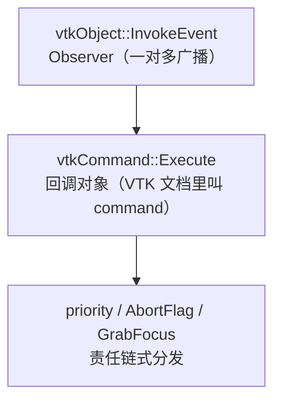
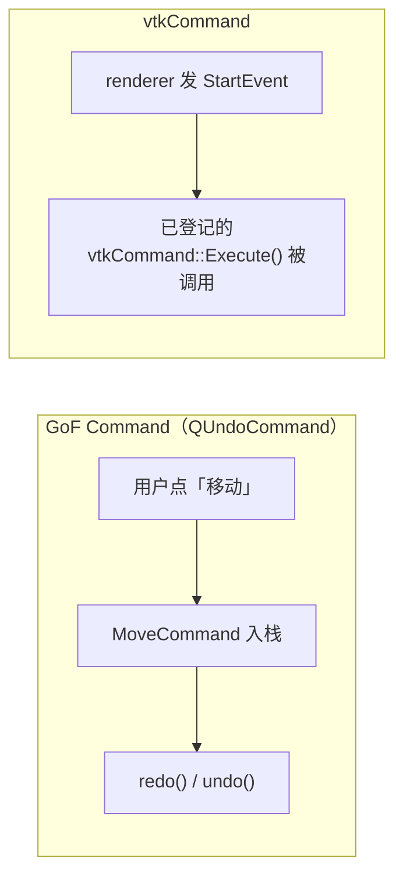

# VTK 设计模式：vtkCommand 与事件回调

> 系列：[Qt / VTK 设计模式](../README.md) · VTK 02/10  
> 参考：[vtkCommand.h](https://github.com/Kitware/VTK/blob/master/Common/Core/vtkCommand.h)、[vtkCallbackCommand](https://vtk.org/doc/nightly/html/classvtkCallbackCommand.html)  
> 进阶：[VTK 观察者+命令深度专题](../vtk-observer-and-command-pattern.md)

---

## 引子

VTK 没有让你传裸函数指针给 `AddObserver`，而是要求传入 **`vtkCommand`** 对象。官方注释写：*vtkCommand is an implementation of the observer/command design pattern.*

**先澄清一件事**：从 GoF 教科书的标准来看，`vtkCommand` **并不是完整的「命令模式」实现**——它更像是 **观察者模式里的回调载体**，再叠上优先级、`AbortFlag`、`GrabFocus` 等**事件链控制**。VTK 文档里的 *command* 主要指「把回调封装成带 `Execute()` 的对象」，而不是「可撤销、可入栈的用户操作」。

上一篇 [01 观察者](01-observer.md) 解决「谁通知」；本篇解决「通知到了执行什么、能否截断后续处理」。

---

## vtkCommand 到底算不算命令模式？

| 能力 | GoF Command（如 `QUndoCommand`） | `vtkCommand` |
|------|----------------------------------|--------------|
| 把行为封装成对象 | 有 | 有 |
| 统一 `Execute` 入口 | 有 | 有 |
| 由 Subject **广播事件**触发 | 否 | **是** |
| `undo()` / `redo()` | 有 | **无** |
| 命令队列、宏命令 | 常见 | **无** |
| 截断后续处理（`AbortFlag`） | 非典型 | **有** |

更准确的三层理解：



> 责任链式分发详见 [10 责任链](10-chain-of-responsibility.md)。

**结论**：学 VTK 时把 `vtkCommand` 当成 **Observer 的 listener 对象** 最不容易混；叫它「命令模式」只能算**借用了 Command 的外形**（`Execute` 接口），别和 `QUndoCommand`、应用层撤销栈画等号。

---

## 要解决什么问题

若用全局函数回调：

```cpp
void cb(vtkObject*, unsigned long, void*) { /* 无法携带成员状态 */ }
```

痛点：难以绑定 C++ 成员、难以复用、难以在运行时替换行为、难以表达「我处理完了，别往下传」。

---

## 结构对照（别硬套 GoF）

| 角色 | VTK 对应 | 说明 |
|------|----------|------|
| Observer 回调体 | `vtkCommand` 子类 | 主身份：事件监听者 |
| 统一入口 | `Execute(caller, eventId, callData)` | 形似 Command，语义是「事件到了跑这段逻辑」 |
| 分发扩展 | `AbortFlag`、`PassiveObserver`、priority | 更像责任链，不是经典 Command |

---

## VTK 中的落点

### 核心接口

```cpp
class vtkCommand : public vtkObjectBase {
public:
  virtual void Execute(vtkObject* caller, unsigned long eventId, void* callData) = 0;
  void SetAbortFlag(vtkTypeBool);
  void SetPassiveObserver(vtkTypeBool);
};
```

### 常见实现

| 类 | 用途 |
|----|------|
| `vtkCallbackCommand` | C 风格 `SetCallback` + `clientData` |
| `vtkObject::AddObserver(..., &Class::Method)` | C++ 成员函数模板绑定 |
| 自定义子类 | 复杂状态、复用命令对象 |

---

## 底层逻辑

### Execute 三参数

- **caller**：发射事件的对象（Subject）
- **eventId**：如 `vtkCommand::ProgressEvent`
- **callData**：可选载荷（如 `double*` 进度），**类型因 caller 而异**

### AbortFlag：责任链熔断

3D Widget 处理鼠标事件后 `AbortFlagOn()`，后续 `vtkInteractorStyle` 不再收到同一事件——这是 **Observer 分发链上的截断**，应归到责任链语义，而不是 GoF Command。

### 与引用计数

`InvokeEvent` 内对 command 临时 `Register/UnRegister`，与 `vtkObjectBase` 引用计数体系一致。

---

## 代码示例

### vtkCallbackCommand

```cpp
void onModified(vtkObject* caller, unsigned long, void*, void* clientData) {
  auto* view = static_cast<MyView*>(clientData);
  view->requestRender();
}

vtkNew<vtkCallbackCommand> cmd;
cmd->SetCallback(onModified);
cmd->SetClientData(myView);
actor->AddObserver(vtkCommand::ModifiedEvent, cmd);
```

### 自定义命令类

```cpp
class LogCommand : public vtkCommand {
public:
  static LogCommand* New() { return new LogCommand; }
  void Execute(vtkObject* caller, unsigned long eventId, void*) override {
    std::cout << caller->GetClassName() << " event " << eventId << "\n";
  }
};
```

### 成员函数绑定（VTK 内置模板）

```cpp
class MyView : public vtkObject {
public:
  void OnClippingRange(vtkObject* caller, unsigned long, void*) {
    // 同步 overlay、HUD 等
  }
};

auto* view = MyView::New();
renderer->AddObserver(vtkCommand::ResetCameraClippingRangeEvent,
                      view, &MyView::OnClippingRange);
```

---

## 易混淆点

| 对比 | 区别 |
|------|------|
| `vtkCommand` vs `QUndoCommand` | 前者是 **VTK 事件回调**；后者才是 **GoF 命令 + 撤销栈** |
| `vtkCommand` vs 应用层 `TranslateCommand` | 同名不同层：应用层自己实现的 undo 命令，与 `vtkCommand` 无关 |
| `vtkCommand` vs `vtkAlgorithm` | 后者是数据管道节点，不是回调对象 |
| Observer vs「命令模式」 | VTK 主框架是 Observer；`vtkCommand` 只是 listener 的对象化封装 |

### 触发方式对比（帮助记忆）



---


## 最佳实践与陷阱

1. **优先用 `vtkNew` / 智能指针** 管理命令生命周期
2. **`clientData` 指针生命周期** 必须长于 observer 注册期
3. **慎用 AbortFlag**，除非确实要消费事件
4. **Progress 回调里不要 UI 阻塞**
5. **阅读 callData 文档** 再转型

---

## 重点与注意

> **重点**：`vtkCommand` 的**主身份**是 Observer 的回调对象；`Execute(caller, eventId, callData)` 是统一入口，不是撤销栈里的「可逆操作」。  
> **重点**：`AbortFlagOn()` 会**截断**后续 observer，是 3D Widget 与 InteractorStyle 共存的关键——这是**责任链**，别当成 Command 模式的核心特征。  
> **注意**：VTK 头文件写 *observer/command*，但 GoF 意义上的 Command 要看 `QUndoCommand` 或你自己写的 Undo 层。  
> **注意**：`callData` 含义**因发射者而异**；同是 `ProgressEvent`，有的给 `double*`，不要想当然强转。

---

## 小结

`vtkCommand` 把观察者回调 **对象化**，并加入优先级、中断、被动监听等 VTK 特有语义。它**借用了 Command 的名字和 `Execute` 外形**，本质仍是事件系统里的 listener；完整的 GoF 命令模式要在应用层另建。

**延伸阅读**

- 上一篇：[01 观察者](01-observer.md) · 下一篇：[03 管道](03-pipeline-filter.md)
- 深度专题：[vtk-observer-and-command-pattern.md](../vtk-observer-and-command-pattern.md)
- 系列索引：[README](../README.md)
