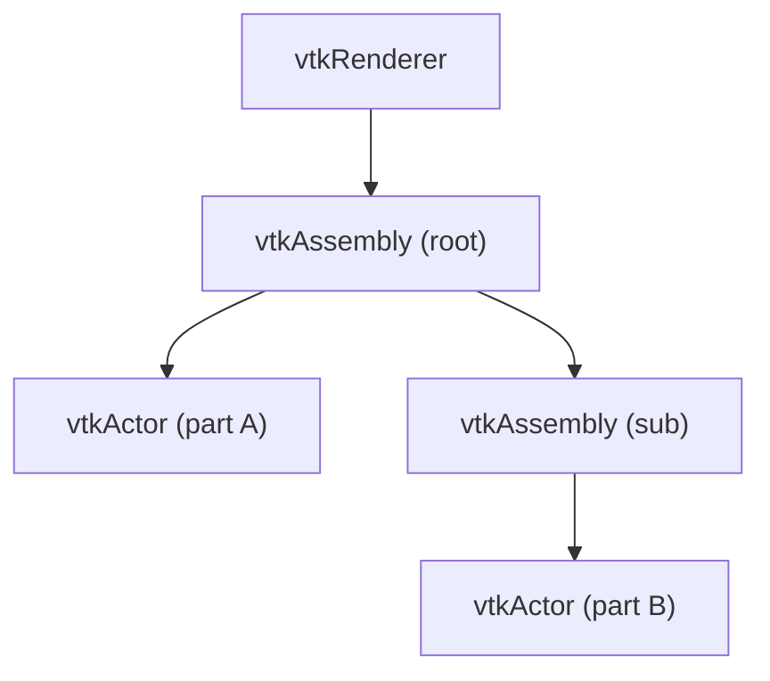

# VTK 设计模式：组合模式

> 系列：[Qt / VTK 设计模式](../README.md) · VTK 09/10  
> 参考：[vtkAssembly](https://vtk.org/doc/nightly/html/classvtkAssembly.html)、[vtkProp](https://vtk.org/doc/nightly/html/classvtkProp.html)

---

## 引子

一个机械装配体由轴、齿轮、外壳组成，整体移动时子零件跟随——VTK 用 `vtkAssembly` 把多个 `vtkProp` 组成树，统一应用变换与可见性。这是组合模式：**整体与部分同一接口**。

---

## 要解决什么问题

```cpp
actor1->SetUserMatrix(M);
actor2->SetUserMatrix(M);  // 手动同步每个零件
```

痛点：层次变换难维护、无法统一 pick/可见性、结构不清晰。

---

## GoF 组合结构

| 角色 | VTK 对应 |
|------|----------|
| Component | `vtkProp` |
| Composite | `vtkAssembly`、`vtkMultiBlockDataSet`（数据侧） |
| Leaf | `vtkActor`、`vtkVolume` |

---

## VTK 中的落点

### 场景图组合（渲染）



`vtkAssembly::AddPart(prop)` 建立父子关系；父级 `UserMatrix` 影响子级世界坐标。

### vtkProp 统一接口

`vtkActor`、`vtkVolume`、`vtkAssembly` 都可：

- `SetVisibility`
- 参与 `Pick`
- 加入 `vtkRenderer`

### 数据侧组合

`vtkMultiBlockDataSet` 把多块网格组织成树，与渲染组合互补。

---

## 底层逻辑

`vtkAssembly` 维护 `vtkPropCollection`：

- `Render()` 遍历子节点，累积变换矩阵
- `PokeMatrix` 将父变换传给子 Prop

**Pick** 时射线与整棵子树求交，返回最前端 `vtkProp`。

---

## 代码示例

```cpp
#include <vtkAssembly.h>
#include <vtkActor.h>
#include <vtkPolyDataMapper.h>
#include <vtkSphereSource.h>

vtkNew<vtkSphereSource> s1, s2;
vtkNew<vtkPolyDataMapper> m1, m2;
m1->SetInputConnection(s1->GetOutputPort());
m2->SetInputConnection(s2->GetOutputPort());

vtkNew<vtkActor> a1, a2;
a1->SetMapper(m1);
a2->SetMapper(m2);
a2->SetPosition(2, 0, 0);

vtkNew<vtkAssembly> asm;
asm->AddPart(a1);
asm->AddPart(a2);

renderer->AddActor(asm);
asm->RotateY(30);  // 整体旋转
```

---

## 易混淆点

| 对比 | 区别 |
|------|------|
| Assembly vs Actor 列表 | Assembly 有层次变换；平铺列表无父子矩阵 |
| 组合 vs 管道 | 组合管场景结构；管道管数据流 |
| `vtkMultiActor` | 多帧融合等特殊复合，非通用 Assembly |

---

## 最佳实践与陷阱

1. **深层次注意浮点累积误差**
2. **RemovePart 后检查引用计数**
3. **Pick 结果可能是 Assembly 或叶子 Actor**，逻辑要区分
4. **大数据勿滥用深层 Assembly**，影响遍历
5. **与 `vtkTransform` 配合** 记录初始姿态便于 reset

---

## 重点与注意

> **重点**：`vtkAssembly` 让多个 `vtkProp` 形成树，**父级变换作用于子级**，整体移动/旋转子零件跟随。  
> **重点**：`vtkProp` 是组合中的统一接口——`vtkActor`、`vtkVolume`、`vtkAssembly` 都可加入 `vtkRenderer`。  
> **注意**：组合（整体-部分同一接口）与简单「Actor 列表」不同；Assembly 有层次矩阵累积。  
> **注意**：组合管**场景结构**；Pipeline 管**数据流**——二者常被并列讨论，要能分清各自职责。

---

## 小结

VTK 组合模式在 **`vtkAssembly` + `vtkProp` 场景图** 中实现统一变换与渲染遍历。

**延伸阅读**

- 上一篇：[08 原型](08-prototype.md) · 下一篇：[10 责任链](10-chain-of-responsibility.md)
- 系列索引：[README](../README.md)
