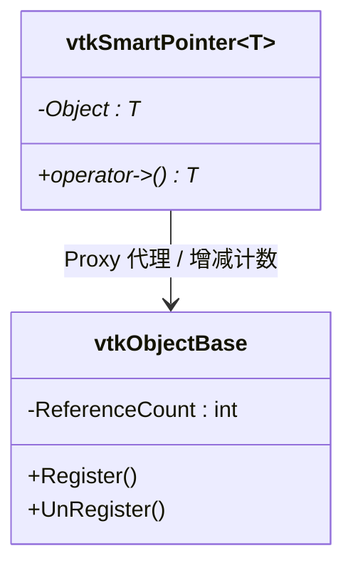

# VTK 设计模式：引用计数与 C++ RAII 模式

> 系列：[Qt / VTK 设计模式](../README.md) · VTK 11/11  
> 参考：[vtkObjectBase](https://vtk.org/doc/nightly/html/classvtkObjectBase.html)、[VTK Smart Pointers Guide](https://docs.vtk.org/en/latest/guides/smart_pointers.html)

---

## 引子

在 C++ 开发中，内存泄漏与野指针是两大永恒的心腹大患。VTK 作为一个庞大的三维图形渲染引擎，每天需要处理数以千万计的点云与三角网格，如果使用传统的 `new/delete` 手动管理内存，系统几乎注定会发生内存泄露。
为了实现安全的垃圾回收，VTK 自诞生起便内置了独特的**侵入式引用计数（Intrusive Reference Counting）系统**，并结合现代 C++ 的 **RAII（资源获取即初始化）** 机制，构建了 `vtkSmartPointer` 与 `vtkNew` 内存管理模式。

---

## 要解决什么问题

### C++ 原生指针的内存陷阱
1. **多方共享同一个几何对象**：如果一个包含 500 万点云的 `vtkPolyData` 同时被 `vtkMapper`、`vtkClipFilter` 和业务数据层引用，任何一方如果擅自 `delete` 掉该数据，其他地方访问该指针就会导致程序发生非法野指针崩溃（Segment Fault）。
2. **内存泄露**：如果所有人都以为别人会释放，最终谁也没释放，服务器运行几天后内存就会爆满。

### 为什么不用标准库的 `std::shared_ptr`？
很多现代 C++ 开发者会问：为什么不用 `std::shared_ptr` 呢？
1. **非侵入式开销**：`std::shared_ptr` 属于非侵入式智能指针，它的引用计数存储在一个**外部的控制块（Control Block）**中。对于 VTK 来说，频繁跨模块传递和创建这个控制块会带来可观的额外内存与性能开销。
2. **侵入式优势**：VTK 采用**侵入式引用计数**，引用计数直接作为整型变量 `ReferenceCount` 存储在每个 `vtkObjectBase` 类的体内。这意味着任何时候，你拿到一个普通的 VTK 裸指针，都可以通过 `obj->GetReferenceCount()` 瞬间知道当前有几个人在引用它，而不需要像 `std::shared_ptr` 一样必须持有智能指针本身。

---

## 模式本质

VTK 的智能指针在设计模式中属于 **代理模式 (Proxy)** 的典型应用。它通过重载 `operator->()`、`operator*()` 等操作符，在逻辑上完全代理了真实的 VTK 裸对象，并在生命周期结束时自动处理垃圾回收。



---

## VTK 引用计数底层机制

在 VTK 中，对象的创建和销毁遵循严格的生命周期法则：

### 1. 对象的创建
所有继承自 `vtkObjectBase` 的类**都严禁使用 `new` 关键字在栈或堆上直接创建**。必须使用静态工厂方法 `::New()` 在堆上分配：
```cpp
vtkPolyData* poly = vtkPolyData::New(); // 引用计数初始化为 1
```

### 2. 引用计数的增减
* **`Register(vtkObjectBase*)`**：将引用计数加 1。
* **`UnRegister(vtkObjectBase*)` 或 `Delete()`**：将引用计数减 1。
* **内存释放**：当 `UnRegister()` 使得引用计数降为 **0** 时，对象会自动调用析构函数销毁自己，归还内存。

```cpp
poly->Register(nullptr);   // 计数变为 2
poly->Delete();             // 计数变为 1
poly->Delete();             // 计数变为 0，对象在内部执行 delete this!
```

---

## 现代 C++ RAII 卫士：`vtkSmartPointer` 与 `vtkNew`

为了防止开发者漏写 `Delete()`，或者在函数抛出异常时导致代码提前退出造成泄漏，VTK 提供了两个基于 RAII 封装的智能指针。

### 1. `vtkSmartPointer<T>`：通用智能指针
`vtkSmartPointer` 内部代理了裸指针。当它被复制、赋值时，会自动调用底层的 `Register()` 增加计数；当它离开作用域被析构时，会自动调用 `UnRegister()` 减少计数。

```cpp
{
    vtkSmartPointer<vtkPolyData> poly = vtkSmartPointer<vtkPolyData>::New(); // 计数 = 1
    {
        vtkSmartPointer<vtkPolyData> poly2 = poly; // 自动调用 Register()，计数 = 2
    } // poly2 析构，自动调用 UnRegister()，计数 = 1
} // poly 析构，自动调用 UnRegister()，计数 = 0，内存自动释放！
```

### 2. `vtkNew<T>`：局部快速指针
如果你只需要在当前函数内部临时创建一个对象，不需要将其作为返回值传递，也不需要与外部共享，应优先使用极其轻量的 `vtkNew<T>`。
* **原理**：`vtkNew` 在栈上实例化，**不允许拷贝构造和赋值**。它保证了对象在当前大括号作用域结束时，百分之百会被自动 `Delete()` 释放。

```cpp
{
    vtkNew<vtkSTLReader> reader; // 自动创建并包裹对象，计数 = 1
    reader->SetFileName("data.stl"); // 像普通指针一样使用 ->
} // 离开作用域，reader 自动调用 Delete()，内存销毁！
```

---

## 典型代码示例

### 1. 函数返回值传递中的引用计数变化

```cpp
#include <vtkSmartPointer.h>
#include <vtkPolyData.h>
#include <vtkPoints.h>

// 工厂函数：创建并返回一个智能指针
vtkSmartPointer<vtkPolyData> createPointData() {
    vtkSmartPointer<vtkPolyData> poly = vtkSmartPointer<vtkPolyData>::New(); // 计数 = 1
    
    vtkNew<vtkPoints> points; // 临时创建点集
    points->InsertNextPoint(0, 0, 0);
    
    poly->SetPoints(points); // poly 内部引用了 points，points 计数加 1 (变成 2)
    
    return poly; // 返回智能指针，引用计数保持为 1
} // points 离开作用域，points 计数减 1 (回到 1，由 poly 独自持有)

int main() {
    vtkSmartPointer<vtkPolyData> data = createPointData(); // 承接返回值，data 计数 = 1
    std::cout << "当前 PolyData 引用计数: " << data->GetReferenceCount() << std::endl; // 输出 1
    return 0;
} // data 离开作用域，计数降为 0，PolyData 及其内部的 points 内存全部自动释放！
```

### 2. 避免循环引用（Memory Loop）
引用计数最大的软肋是**循环引用**（A 引用 B，B 也反向引用 A），这会导致双方计数永远无法降为 0，造成永久内存泄漏。
在 VTK 中，如果遇到双向图、树形父子节点等设计，必须引入**弱引用**机制，使用 **`vtkWeakPointer<T>`** 来打破循环。`vtkWeakPointer` 观察对象但不增加其计数，一旦对象被销毁，弱指针会自动安全地指向 `nullptr`。

```cpp
vtkSmartPointer<vtkPolyData> poly = vtkSmartPointer<vtkPolyData>::New();
vtkWeakPointer<vtkPolyData> weakPoly = poly; // 不增加计数

poly = nullptr; // 计数归零，对象销毁
if (weakPoly.GetPointer() == nullptr) {
    // 💡 弱指针自动感知到对象销毁，避免了野指针崩溃！
}
```

---

## 最佳实践与陷阱

1. **绝对不要对继承自 `vtkObjectBase` 的类直接使用 `delete`**：这会破坏内部计数体系，直接导致其他持有该对象的模块运行期崩溃。
2. **优先使用 `vtkNew` 替代 `vtkSmartPointer`**：如果在函数内部不需要传递或共享该对象，`vtkNew` 的代码更简洁，开销更低。
3. **不要混用 `std::shared_ptr` 与 `vtkSmartPointer`**：这会导致两套计数系统冲突，最终引发二次释放崩溃。

---

## 重点与注意

> **重点**：VTK 使用 **侵入式引用计数**，计数器直接存储在 `vtkObjectBase` 内部，而不是像 `std::shared_ptr` 存在于外部控制块。  
> **重点**：所有的 VTK 对象都严禁使用 `new` 实例化，必须使用工厂方法 `::New()`；销毁必须使用智能指针或显式调用 `->Delete()`。  
> **注意**：在函数局部作用域内，优先使用轻量级的 `vtkNew<T>`，它比 `vtkSmartPointer` 更加高效且不可拷贝。  
> **注意**：警惕循环引用引发的泄漏，在父子双向关联或图结构中，必须使用 `vtkWeakPointer<T>` 阻断循环链路。

---

## 小结

VTK 的引用计数与 RAII 指针模式是整个渲染管线稳定运行的基石，理解其底层机制与循环引用陷阱是编写高性能、无泄露三维可视化应用程序的基本功。

**延伸阅读**

- [VTK Smart Pointers Documentation](https://docs.vtk.org/en/latest/guides/smart_pointers.html)
- 上一篇：[10 责任链](10-chain-of-responsibility.md)
- 系列索引：[README](../README.md)
