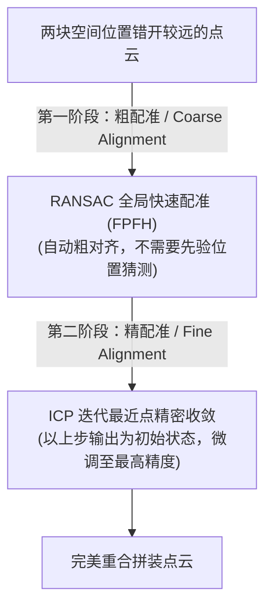

# 三维点云处理（六）：点云配准与粗/精对齐管线实战

在三维扫描、三维建模以及 SLAM（同步定位与建图）中，我们通常需要将不同视角、不同时刻扫描得到的局部点云，拼合对齐成一张完整的完整三维场景。这个拼接对齐的过程称为 **点云配准（Registration）**。

配准的数学本质是寻找一个最优的**旋转矩阵 $R$** 和**平移向量 $T$**（合称变换矩阵 $[R \mid T]$），使得源点云与目标点云重合。

本篇抛开繁琐的代数推导，为你解析**粗配准 + 精配准**的双阶管线工作流，并提供基于 **FPFH 粗配准 + ICP 精配准** 的完整 Open3D 实战代码。

---

## 1. 为什么配准需要分两阶段？（粗配准与精配准）

如果你直接在两块错开较远的点云上运行著名的 **ICP（迭代最近点）** 算法，配准大概率会完全失败。

因为局部精配准（ICP 或 NDT）是一个**高度局部优化**算法。它们就像梯度下降一样，**极度依赖一个良好的初始相对位置**。如果两块点云的初始位置差得很远，ICP 就会陷在局部极小值（局部死胡同）里，拼合出完全错位的几何体。

因此，工业界的标准工作流分为两趟：


---

## 2. 核心配准算法原理解析

### 2.1 粗配准：基于 RANSAC + FPFH 的全局对齐
* **思路**：先对源和目标点云提取 FPFH 局部特征描述子。利用 RANSAC 算法，随机在源点云选 3 个点，在目标点云中寻找 FPFH 特征最相似的 3 个对应点，算出一个变换矩阵，验证其余点的重合率。迭代多次，保留重合率最高的变换。
* **特点**：速度较快，不需要两块点云有重叠的初始猜测。

### 2.2 精配准：迭代最近点 (ICP, Iterative Closest Point)
* **思路**：给定初始相对位置，对源点云中的每个点，在目标点云中检索其最近的邻近点建立对应关系。求解最小化点对距离的变换矩阵，应用该变换，然后重复“找最近点-算变换-变换点云”的循环，直到位姿收敛或达到最大迭代步数。
* **变体对比**：

<svg viewBox="0 0 540 180" width="100%" style="background-color: transparent; font-family: sans-serif; margin: 20px 0; overflow: visible;">
  <!-- Left Side: Point-to-Point -->
  <g transform="translate(10, 10)">
  <text x="120" y="10" text-anchor="middle" font-size="12" fill="currentColor">① Point-to-Point ICP (点对点)</text>
  <!-- Source Point pi -->
  <circle cx="60" cy="110" r="5" fill="#1677ff" />
  <text x="60" y="125" text-anchor="middle" font-size="11" fill="#1677ff">p_i (源点)</text>
  <!-- Target Point qi -->
  <circle cx="180" cy="60" r="5" fill="#fa8c16" />
  <text x="180" y="50" text-anchor="middle" font-size="11" fill="#fa8c16">q_i (目标对应点)</text>
  <!-- Distance arrow -->
  <line x1="60" y1="110" x2="180" y2="60" stroke="#f5222d" stroke-width="2" stroke-dasharray="3 3" marker-end="url(#icp-arrow-red)" />
  <text x="120" y="95" text-anchor="middle" font-size="11" fill="#f5222d">直接拉近</text>
  <text x="120" y="155" text-anchor="middle" font-size="11" fill="var(--vp-c-text-2)">使两点间的空间三维距离最小</text>
  </g>
  <!-- Right Side: Point-to-Plane -->
  <g transform="translate(290, 10)">
  <text x="120" y="10" text-anchor="middle" font-size="12" fill="currentColor">② Point-to-Plane ICP (点对面)</text>
  <!-- Tangent Plane representation (Surface at qi) -->
  <line x1="60" y1="90" x2="220" y2="50" stroke="currentColor" stroke-width="3" opacity="0.3" />
  <text x="210" y="45" font-size="10" fill="var(--vp-c-text-2)">目标表面切线</text>
  <!-- Target Point qi -->
  <circle cx="140" cy="70" r="5" fill="#fa8c16" />
  <text x="140" y="55" text-anchor="middle" font-size="11" fill="#fa8c16">q_i</text>
  <!-- Normal vector ni at qi -->
  <line x1="140" y1="70" x2="165" y2="10" stroke="#fa8c16" stroke-width="2" marker-end="url(#icp-arrow-orange)" />
  <text x="170" y="15" font-size="11" fill="#fa8c16">n_i (法向量)</text>
  <!-- Source Point pi -->
  <circle cx="60" cy="120" r="5" fill="#1677ff" />
  <text x="60" y="135" text-anchor="middle" font-size="11" fill="#1677ff">p_i</text>
  <!-- Projection line onto normal -->
  <line x1="60" y1="120" x2="80" y2="85" stroke="#52c41a" stroke-width="2" marker-end="url(#icp-arrow-green)" />
  <text x="50" y="98" font-size="11" fill="#52c41a">垂直投影距离</text>
  <!-- Show sliding along the tangent plane -->
  <line x1="60" y1="120" x2="140" y2="70" stroke="currentColor" stroke-dasharray="3 3" opacity="0.3" />
  <text x="140" y="155" text-anchor="middle" font-size="11" fill="var(--vp-c-text-2)">仅约束法向距离，允许源点沿表面滑动</text>
  </g>
  <!-- Markers -->
  <defs>
  <marker id="icp-arrow-red" viewBox="0 0 10 10" refX="6" refY="5" markerWidth="5" markerHeight="5" orient="auto">
  <path d="M 0 1.5 L 8 5 L 0 8.5 z" fill="#f5222d" />
  </marker>
  <marker id="icp-arrow-orange" viewBox="0 0 10 10" refX="6" refY="5" markerWidth="5" markerHeight="5" orient="auto">
  <path d="M 0 1.5 L 8 5 L 0 8.5 z" fill="#fa8c16" />
  </marker>
  <marker id="icp-arrow-green" viewBox="0 0 10 10" refX="6" refY="5" markerWidth="5" markerHeight="5" orient="auto">
  <path d="M 0 1.5 L 8 5 L 0 8.5 z" fill="#52c41a" />
  </marker>
  </defs>
</svg>

  * **Point-to-Point ICP (点到点)**：使对应点之间的空间欧氏距离平方和最小。
  * **Point-to-Plane ICP (点到面)**：使源点云中的点到目标点云对应点**局部切平面**的垂直投影距离最小。
  * **💡 为什么 Point-to-Plane 更好？** 因为它结合了表面法向量信息，允许源点云沿着目标表面进行“滑动”贴合。在处理平整表面（如公路、墙壁）时，点到面 ICP 收敛速度远快于点到点，且极难陷入局部错位死锁。

#### 核心代数：点到点 ICP 的 SVD（奇异值分解）闭式求解 (Kabsch 算法)
给定已匹配的对应点对集 $\{p_i\}$（源点）和 $\{q_i\}$（目标点），我们希望求解最佳旋转矩阵 $\mathbf{R}$ 与平移向量 $\vec{t}$，使下式最小：
$$E(\mathbf{R}, \vec{t}) = \sum_{i=1}^n \|\mathbf{R} p_i + \vec{t} - q_i\|^2$$

1. **去中心化（Centroid Alignment）**：
   计算两组点云的几何中心：
   $$\bar{p} = \frac{1}{n} \sum_{i=1}^n p_i, \quad \bar{q} = \frac{1}{n} \sum_{i=1}^n q_i$$
   将每个点减去质心，得到去质心坐标：
   $$x_i = p_i - \bar{p}, \quad y_i = q_i - \bar{q}$$
2. **构建交叉协方差矩阵 $\mathbf{H}$**：
   $$\mathbf{H} = \sum_{i=1}^n x_i y_i^T \quad \left( \mathbf{H} \in \mathbb{R}^{3 \times 3} \right)$$
3. **奇异值分解 (SVD)**：
   对 $\mathbf{H}$ 进行奇异值分解：
   $$\mathbf{H} = \mathbf{U} \mathbf{\Sigma} \mathbf{V}^T$$
4. **计算最优旋转矩阵 $\mathbf{R}$**：
   $$\mathbf{R} = \mathbf{V} \mathbf{U}^T$$
   *(注：如果出现反射混淆，即 $\det(\mathbf{R}) = -1$，则需要对矩阵最后一列符号进行修正，保证旋转矩阵的行列式为 +1)*。
5. **计算最优平移向量 $\vec{t}$**：
   $$\vec{t} = \bar{q} - \mathbf{R} \bar{p}$$

#### 核心代数：点到面 ICP 的线性化近似求解
点到面 ICP 的优化目标函数为：
$$\min_{\mathbf{R}, \vec{t}} \sum_{i=1}^n \left( (\mathbf{R} p_i + \vec{t} - q_i) \cdot \vec{n}_i \right)^2$$
由于该式中旋转矩阵 $\mathbf{R}$ 存在非线性约束，直接求解困难。在初始对齐较好时，利用小角度旋转近似（$\theta \to 0$）：
$$\mathbf{R} \approx \mathbf{I} + [\vec{\theta}]_{\times} = \begin{bmatrix} 1 & -\theta_z & \theta_y \\ \theta_z & 1 & -\theta_x \\ -\theta_y & \theta_x & 1 \end{bmatrix}$$
上式可展开为：$\mathbf{R} p_i + \vec{t} \approx p_i + \vec{\theta} \times p_i + \vec{t}$。
利用向量恒等式 $(\vec{\theta} \times p_i) \cdot \vec{n}_i = (p_i \times \vec{n}_i) \cdot \vec{\theta}$，原目标函数可转化为关于未知变量 $\vec{x} = [\theta_x, \theta_y, \theta_z, t_x, t_y, t_z]^T \in \mathbb{R}^6$ 的标准线性最小二乘问题：
$$\mathbf{A}_i \vec{x} \approx \mathbf{b}_i$$
其中：
$$\mathbf{A}_i = \left[ (p_i \times \vec{n}_i)^T, \ \vec{n}_i^T \right], \quad \mathbf{b}_i = (q_i - p_i) \cdot \vec{n}_i$$
这可通过超定方程组的最小二乘解直接求出（$\vec{x} = (\mathbf{A}^T \mathbf{A})^{-1} \mathbf{A}^T \mathbf{b}$），计算效率极高。

---

### 2.3 精配准：正态分布变换 (NDT, Normal Distributions Transform)
* **思路**：不依赖于繁琐的点对建立。它先将目标点云空间划分为三维体素网格。在每个被点云占用的网格 Cell 内，计算所有落入点的均值 $\vec{\mu}_k$ 与协方差矩阵 $\mathbf{\Sigma}_k$，从而将该体素网格抽象为一个三维高斯概率密度分布 (PDF)：
  $$p(\vec{x}) \propto \exp \left( -\frac{1}{2} (\vec{x} - \vec{\mu}_k)^T \mathbf{\Sigma}_k^{-1} (\vec{x} - \vec{\mu}_k) \right)$$
* **优化目标**：调整源点云的变换矩阵 $\mathbf{T}$，使得源点云中所有点经过变换后落入目标体素网格内对应高斯分布的联合概率密度（似然分数）最大：
  $$\max_{\mathbf{T}} \sum_{i} p(\mathbf{T}(y_i))$$
  通过牛顿迭代法（计算一阶梯度和二阶海森 Hessian 矩阵）对参数进行快速优化迭代。
* **优点**：不需要在每次迭代中重新用 KD-Tree 搜索最近邻点对，配准速度极大提高，特别适用于大场景的激光雷达 SLAM 制图。

---

## 3. Open3D 实战：粗-精配准完整管线

下面展示如何利用 Open3D 的最新 `pipelines.registration` 模块搭建一条从无先验位置出发，到精细对齐的完整拼接代码：

```python
import copy
import numpy as np
import open3d as o3d


# 辅助函数：绘制配准前的源点云（青色）与目标点云（黄色）
def draw_registration_result(source, target, transformation):
    source_temp = copy.deepcopy(source)
    target_temp = copy.deepcopy(target)
    # 给点云染色
    source_temp.paint_uniform_color([0.0, 0.8, 0.8])  # 青色
    target_temp.paint_uniform_color([1.0, 0.7, 0.0])  # 黄色
    # 应用变换矩阵
    source_temp.transform(transformation)
    o3d.visualization.draw_geometries(
        [source_temp, target_temp], window_name="Registration Alignment"
    )


# 1. 读入源和目标点云，并进行下采样和法向量计算
dataset = o3d.data.DemoICPPointClouds()
source = o3d.io.read_point_cloud(dataset.paths[0])
target = o3d.io.read_point_cloud(dataset.paths[1])

voxel_size = 0.05  # 体素大小，单位为米

# 预处理：降采样与法向量计算
source_down = source.voxel_down_sample(voxel_size)
target_down = target.voxel_down_sample(voxel_size)

source_down.estimate_normals(
    o3d.geometry.KDTreeSearchParamHybrid(radius=voxel_size * 2, max_nn=30)
)
target_down.estimate_normals(
    o3d.geometry.KDTreeSearchParamHybrid(radius=voxel_size * 2, max_nn=30)
)

# 绘制初始未对齐状态（可以看到有严重的错位）
draw_registration_result(source_down, target_down, np.identity(4))

# ==================== 第一阶段：RANSAC + FPFH 粗配准 ====================
# 计算 FPFH 特征
source_fpfh = o3d.pipelines.registration.compute_fpfh_feature(
    source_down, o3d.geometry.KDTreeSearchParamRadius(radius=voxel_size * 5)
)
target_fpfh = o3d.pipelines.registration.compute_fpfh_feature(
    target_down, o3d.geometry.KDTreeSearchParamRadius(radius=voxel_size * 5)
)

distance_threshold = voxel_size * 1.5  # 判定重合的距离上限

print("正在执行 RANSAC 全局粗配准...")
# 运行粗配准
result_ransac = (
    o3d.pipelines.registration.registration_ransac_based_on_feature_matching(
        source_down,
        target_down,
        source_fpfh,
        target_fpfh,
        mutual_filter=True,  # 开启双向互滤减少误匹配
        max_correspondence_distance=distance_threshold,
        estimation_method=o3d.pipelines.registration.TransformationEstimationPointToPoint(
            False
        ),
        ransac_n=3,
        checkers=[
            o3d.pipelines.registration.CorrespondenceCheckerBasedOnEdgeLength(
                0.9
            ),
            o3d.pipelines.registration.CorrespondenceCheckerBasedOnDistance(
                distance_threshold
            ),
        ],
        criteria=o3d.pipelines.registration.RANSACConvergenceCriteria(
            100000, 0.999
        ),
    )
)

coarse_transform = result_ransac.transformation
print("第一阶段粗配准变换矩阵 (Initial Guess):\n", coarse_transform)
# 绘制粗配准结果 (物体已大致靠拢)
draw_registration_result(source_down, target_down, coarse_transform)

# ==================== 第二阶段：Point-to-Plane ICP 精配准 ====================
print("\n正在执行 Point-to-Plane ICP 精配准...")
# ICP 参数设置：
# max_correspondence_distance=0.02: 寻找最近点对的半径上限为 2cm
# init=coarse_transform: 以上一步粗配准得到的矩阵作为初始猜测位置
icp_threshold = 0.02
result_icp = o3d.pipelines.registration.registration_icp(
    source_down,
    target_down,
    icp_threshold,
    init=coarse_transform,
    estimation_method=o3d.pipelines.registration.TransformationEstimationPointToPlane(),
)

fine_transform = result_icp.transformation
print("第二阶段精配准最终变换矩阵:\n", fine_transform)

# 绘制精对齐最终结果 (两只兔子已经完美交融对齐)
draw_registration_result(source_down, target_down, fine_transform)
```
