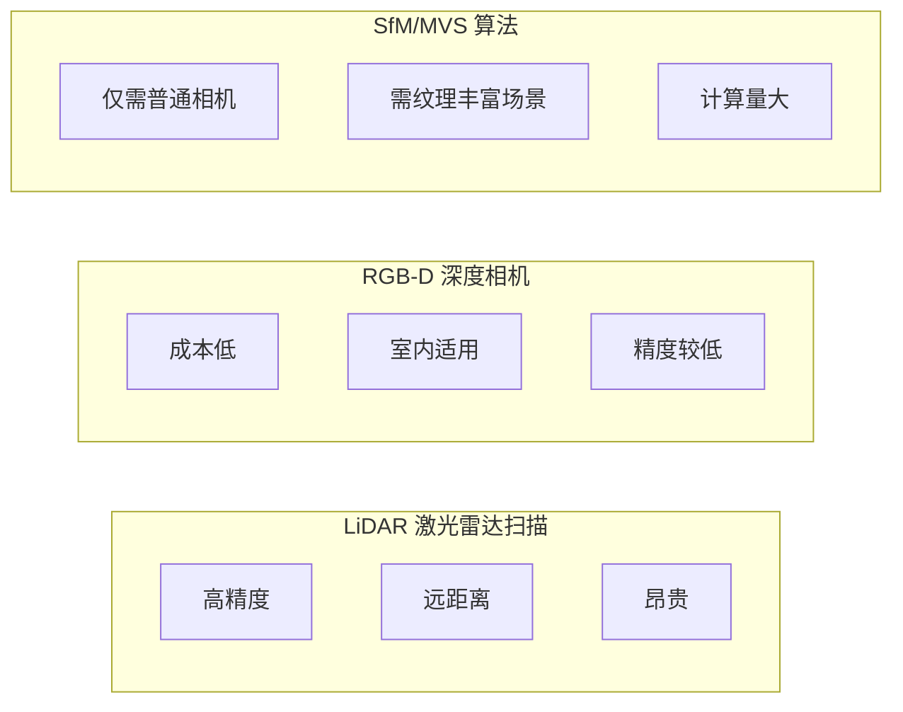

# 三维点云处理（一）：引言与基础概念

## 一、什么是三维点云？

**三维点云（Point Cloud）** 是三维空间中一组离散点的集合。每个点至少包含 $(x, y, z)$ 三个坐标分量，因此一个含有 $N$ 个点的点云可以表示为一个 $N \times 3$ 的矩阵：

$$
P = \begin{bmatrix} x_1 & y_1 & z_1 \\ x_2 & y_2 & z_2 \\ \vdots & \vdots & \vdots \\ x_N & y_N & z_N \end{bmatrix} \in \mathbb{R}^{N \times 3}
$$

除了坐标外，每个点还可以携带额外属性：

| 属性 | 说明 | 数据来源 |
|------|------|----------|
| **颜色 (R, G, B)** | 与相机图像对齐后获取 | RGB-D 相机、彩色激光 |
| **法向量 (nx, ny, nz)** | 局部表面朝向 | PCA 拟合估计 |
| **反射强度 (Intensity)** | 激光反射信号强弱 | LiDAR 传感器 |
| **语义标签 (Label)** | 所属类别（地面/车辆/行人等） | 人工标注或深度学习推理 |

---

## 二、点云的获取方式



- **LiDAR（激光雷达）**：发射激光脉冲并测量飞行时间（Time-of-Flight），精度可达厘米级，广泛用于自动驾驶与测绘。
- **RGB-D 深度相机**：如 Microsoft Kinect、Intel RealSense，通过红外结构光或飞行时间获取深度图像。
- **SfM（Structure from Motion）/ MVS（Multi-View Stereo）**：从多张普通照片中恢复三维结构，依赖特征匹配与三角化。

---

## 三、三维信息的表达形式

三维世界的数字化表达有多种形式，各有优劣：

<svg viewBox="0 0 640 180" width="100%" style="background-color: transparent; font-family: sans-serif; margin: 20px 0; overflow: visible;">
  <!-- Mesh (Left) -->
  <g transform="translate(10, 10)">
  <rect x="0" y="0" width="130" height="130" fill="none" stroke="currentColor" stroke-width="1" rx="4" opacity="0.3" />
  <path d="M 20,40 L 60,20 L 50,70 Z" fill="rgba(22, 119, 255, 0.15)" stroke="#1677ff" stroke-width="1.5" />
  <path d="M 60,20 L 110,40 L 95,80 Z" fill="rgba(22, 119, 255, 0.15)" stroke="#1677ff" stroke-width="1.5" />
  <path d="M 50,70 L 60,20 L 95,80 Z" fill="rgba(22, 119, 255, 0.25)" stroke="#1677ff" stroke-width="1.5" />
  <path d="M 20,40 L 50,70 L 30,110 Z" fill="rgba(22, 119, 255, 0.1)" stroke="#1677ff" stroke-width="1.5" />
  <path d="M 50,70 L 95,80 L 80,115 Z" fill="rgba(22, 119, 255, 0.15)" stroke="#1677ff" stroke-width="1.5" />
  <path d="M 30,110 L 50,70 L 80,115 Z" fill="rgba(22, 119, 255, 0.2)" stroke="#1677ff" stroke-width="1.5" />
  <text x="65" y="146" text-anchor="middle" font-size="12" fill="currentColor">Mesh (网格)</text>
  <text x="65" y="160" text-anchor="middle" font-size="10" fill="var(--vp-c-text-2)">三角面片连接 / 渲染游戏</text>
  </g>
  <!-- Voxel Grid (Middle-Left) -->
  <g transform="translate(170, 10)">
  <rect x="0" y="0" width="130" height="130" fill="none" stroke="currentColor" stroke-width="1" rx="4" opacity="0.3" />
  <!-- Grid -->
  <g stroke="currentColor" stroke-width="0.8" opacity="0.25">
  <line x1="0" y1="32.5" x2="130" y2="32.5" />
  <line x1="0" y1="65" x2="130" y2="65" />
  <line x1="0" y1="97.5" x2="130" y2="97.5" />
  <line x1="32.5" y1="0" x2="32.5" y2="130" />
  <line x1="65" y1="0" x2="65" y2="130" />
  <line x1="97.5" y1="0" x2="97.5" y2="130" />
  </g>
  <!-- Shaded Voxels -->
  <rect x="32.5" y="32.5" width="32.5" height="32.5" fill="#52c41a" opacity="0.6" stroke="#52c41a" stroke-width="1" />
  <rect x="65" y="65" width="32.5" height="32.5" fill="#52c41a" opacity="0.6" stroke="#52c41a" stroke-width="1" />
  <rect x="97.5" y="32.5" width="32.5" height="32.5" fill="#52c41a" opacity="0.6" stroke="#52c41a" stroke-width="1" />
  <text x="65" y="146" text-anchor="middle" font-size="12" fill="currentColor">Voxel (体素)</text>
  <text x="65" y="160" text-anchor="middle" font-size="10" fill="var(--vp-c-text-2)">均匀立方体 / 占用检测</text>
  </g>
  <!-- Octree (Middle-Right) -->
  <g transform="translate(330, 10)">
  <rect x="0" y="0" width="130" height="130" fill="none" stroke="currentColor" stroke-width="1" rx="4" opacity="0.3" />
  <!-- Level 1 split -->
  <line x1="0" y1="65" x2="130" y2="65" stroke="currentColor" stroke-width="1.2" opacity="0.6" />
  <line x1="65" y1="0" x2="65" y2="130" stroke="currentColor" stroke-width="1.2" opacity="0.6" />
  <!-- Level 2 split in top-left -->
  <line x1="0" y1="32.5" x2="65" y2="32.5" stroke="currentColor" stroke-width="0.8" opacity="0.5" />
  <line x1="32.5" y1="0" x2="32.5" y2="65" stroke="currentColor" stroke-width="0.8" opacity="0.5" />
  <!-- Level 3 split in top-left-bottom-right -->
  <line x1="32.5" y1="48.75" x2="65" y2="48.75" stroke="currentColor" stroke-width="0.5" opacity="0.4" />
  <line x1="48.75" y1="32.5" x2="48.75" y2="65" stroke="currentColor" stroke-width="0.5" opacity="0.4" />
  <!-- Fill some nodes -->
  <rect x="48.75" y="32.5" width="16.25" height="16.25" fill="#722ed1" opacity="0.5" />
  <rect x="0" y="32.5" width="32.5" height="32.5" fill="#722ed1" opacity="0.3" />
  <rect x="65" y="65" width="65" height="65" fill="#722ed1" opacity="0.15" />
  <text x="65" y="146" text-anchor="middle" font-size="12" fill="currentColor">Octree (八叉树)</text>
  <text x="65" y="160" text-anchor="middle" font-size="10" fill="var(--vp-c-text-2)">自适应稀疏细分 / 压缩</text>
  </g>
  <!-- Point Cloud (Right) -->
  <g transform="translate(490, 10)">
  <rect x="0" y="0" width="130" height="130" fill="none" stroke="currentColor" stroke-width="1" rx="4" opacity="0.3" />
  <!-- Points cloud cluster -->
  <g fill="#fa8c16">
  <circle cx="30" cy="40" r="2" /><circle cx="45" cy="35" r="2" /><circle cx="40" cy="50" r="2" />
  <circle cx="70" cy="60" r="2.5" /><circle cx="85" cy="55" r="2" /><circle cx="65" cy="75" r="2" />
  <circle cx="90" cy="80" r="2" /><circle cx="100" cy="95" r="2" /><circle cx="80" cy="90" r="2.5" />
  <circle cx="50" cy="100" r="2" /><circle cx="35" cy="90" r="2" /><circle cx="60" cy="110" r="2" />
  </g>
  <text x="65" y="146" text-anchor="middle" font-size="12" fill="currentColor">Point Cloud (点云)</text>
  <text x="65" y="160" text-anchor="middle" font-size="10" fill="var(--vp-c-text-2)">离散三维坐标 / 原始数据</text>
  </g>
</svg>

| 表达形式 | 核心特点 | 内存效率 | 适用领域 |
|----------|----------|----------|----------|
| **Mesh** | 由三角面片构成，具有拓扑连接信息 | 中 | 游戏引擎、图形学渲染 |
| **Voxel Grid** | 规则立方体均匀切分空间 | 低（$O(n^3)$） | 简单场景占用检测 |
| **Octree** | 递归八分空间，仅在有数据处细分 | 高 | 大规模场景、LOD 渲染 |
| **Point Cloud** | 纯坐标矩阵，无拓扑信息 | 高 | 传感器数据处理、算法开发 |

---

## 四、点云的应用场景

### 1. 自动驾驶
自动驾驶系统（如 Waymo、Uber ATG）使用车顶 LiDAR 获取 360° 环境点云，核心任务包括：
- **地面分割**：将地面点与非地面点分离。
- **物体检测**：通过聚类算法定位车辆、行人、路障等前景物体。
- **语义分割**：对每个点赋予语义标签（植被/建筑/电线杆等）。
- **模型拟合**：用定向包围盒（OBB）标记车辆轮廓。

### 2. 机器人导航与 SLAM
移动机器人利用点云进行同步定位与建图（SLAM），通过 ICP/NDT 等配准算法实时构建环境三维地图。

### 3. 人脸识别 (Face ID)
iPhone 的 Face ID 通过结构光投射 30,000+ 个红外点形成面部深度点云，相比 2D 照片更难以欺骗（三维深度信息提供了额外的安全维度）。

### 4. 工业检测与逆向工程
利用高精度扫描仪获取零件表面点云，与 CAD 模型进行对比检测，或从物理实体逆向生成 CAD 模型。

---

## 五、点云处理的核心挑战

| 挑战 | 描述 |
| :--- | :--- |
| **1. 密度不均** | 近处密集、远处稀疏 (100m 外的车辆可能仅反射 < 10 个激光点) |
| **2. 无序性** | 点云无固定排列顺序 (矩阵行交换不应改变语义) |
| **3. 无纹理信息** | 仅有几何坐标、无颜色纹理 (三人并排可能被误判为车辆轮廓) |
| **4. 邻域搜索困难** | 缺乏图像中规整的网格结构 (需 KD-Tree/Octree 等空间索引结构加速) |

---

## 六、传统方法 vs 深度学习

| 维度 | 传统方法 | 深度学习 |
|------|----------|----------|
| **流程** | 问题定制化（不同任务需要不同算法流水线） | 统一流程（数据采集 → 标注 → 训练 → 推理） |
| **可控性** | 每个步骤数学可证、可调参 | 黑盒特性，结果难以解释 |
| **门槛** | 需要扎实的数学与几何学基础 | 相对较低，框架封装完善 |
| **泛化性** | 在已知约束下稳定 | 对训练数据分布敏感 |
| **计算需求** | CPU 即可运行 | 通常需要 GPU |

> **核心观点**：深度学习的易用性是一把双刃剑——它降低了入行门槛的同时也加剧了同质化竞争。精通传统方法是建立技术壁垒和深层理解的关键。

---

## 七、课程总览

本系列教程涵盖以下核心模块：

```
  ┌──────────────────────────────────────────────────────────────┐
  │  三维点云处理完整知识图谱                                      │
  ├──────────────────────────────────────────────────────────────┤
  │                                                              │
  │  Ch.1  基础数学                                               │
  │        ├── PCA 主成分分析与数学推导                             │
  │        ├── Kernel PCA 核主成分分析                              │
  │        ├── PCA 应用: 法向量估计                                │
  │        └── PCA 应用: 点云降噪滤波                              │
  │                                                              │
  │  Ch.2  空间索引结构                                            │
  │        ├── BST 二叉搜索树                                     │
  │        ├── KD-Tree K维空间划分树                                │
  │        └── Octree 八叉树                                      │
  │                                                              │
  │  Ch.3  聚类算法                                               │
  │        ├── K-Means 均值聚类                                    │
  │        ├── GMM 高斯混合模型                                    │
  │        ├── EM 期望最大化                                       │
  │        ├── 谱聚类 (Spectral Clustering)                       │
  │        └── Mean Shift / DBSCAN 密度聚类                       │
  │                                                              │
  │  Ch.4  拟合与检测                                              │
  │        ├── 最小二乘法拟合                                      │
  │        ├── 霍夫变换                                            │
  │        └── RANSAC 鲁棒拟合                                     │
  │                                                              │
  │  Ch.5  特征点检测与描述                                        │
  │        ├── Harris 2D/3D 角点检测                               │
  │        ├── ISS 内禀形状特征                                    │
  │        ├── PFH / FPFH 点特征直方图                              │
  │        └── SHOT 局部特征描述                                    │
  │                                                              │
  │  Ch.6  点云配准                                               │
  │        ├── ICP 迭代最近点                                      │
  │        ├── NDT 正态分布变换                                     │
  │        └── RANSAC 粗配准                                       │
  │                                                              │
  └──────────────────────────────────────────────────────────────┘
```

---

## 八、实践工具与环境

| 工具 | 用途 | 推荐 |
|------|------|------|
| **Python 3.10+** | 算法实现主力语言 | ★★★★★ |
| **Open3D** | 点云数据加载、可视化与算法库 | ★★★★★ |
| **NumPy / SciPy** | 矩阵运算与科学计算 | ★★★★★ |
| **Matplotlib** | 二维/三维绘图 | ★★★★ |
| **C++ / PCL** | 工业级高性能点云处理 | ★★★★ |

环境搭建方面，请参考下一篇《环境配置：Python + Open3D 安装指南》。

---

## 参考资料

- Radu B. Rusu, Steve Cousins. "3D is here: Point Cloud Library (PCL)", ICRA 2011.
- Charles R. Qi et al. "PointNet: Deep Learning on Point Sets for 3D Classification and Segmentation", CVPR 2017.
- KITTI 3D Object Detection Benchmark: http://www.cvlibs.net/datasets/kitti/
