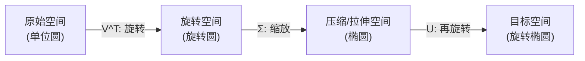

# 三维点云处理（三）：PCA 主成分分析的数学原理与几何直觉

主成分分析（Principal Component Analysis, PCA）是三维点云处理中最基础也最核心的数学工具。它贯穿了法向量估计、点云降噪、特征提取、数据压缩等几乎所有点云算法。本文将从向量投影的物理直觉出发，严格推导 PCA 的数学原理。

---

## 一、物理直觉：投影与方差

### 1.1 向量内积与投影

两个向量 $a$ 和 $b$ 的内积（点积）定义为：
$$a \cdot b = \|a\| \|b\| \cos\theta$$

当 $b$ 为单位向量（$\|b\| = 1$）时，内积 $a \cdot b = \|a\| \cos\theta$ 恰好等于 $a$ 在 $b$ 方向上的**标量投影**。

```
          a
         ╱│
        ╱ │
       ╱  │  a·b = ‖a‖cosθ
      ╱ θ │
     ╱────┘──────────────► b (单位向量)
     ◄──────►
     投影长度
```

### 1.2 最大投影方差 = 最多信息

PCA 的核心思想是：**找到一个方向，使得数据点在该方向上的投影方差最大**。投影方差越大，意味着数据在该方向上的"展开程度"越高，保留的信息越多。

```
  原始二维数据                投影到方向1 (高方差)        投影到方向2 (低方差)

      *    *                 ──*──*──────*──*──         │
   *    *                         (保留双峰分布)        *│*
     *   *   *                                          │
  *   *                                                *│*
                                                        │
```

在上面的示意中，投影到方向1后仍然能看出数据的双峰结构（信息丰富），而投影到方向2后所有点都挤在一起（信息丢失严重）。

---

## 二、数学推导：从优化问题到特征值分解

### 2.1 数据中心化

给定 $N$ 个 $d$ 维数据点 $\{p_1, p_2, \ldots, p_N\} \in \mathbb{R}^d$，首先计算均值并中心化：
$$\bar{p} = \frac{1}{N} \sum_{i=1}^N p_i, \quad x_i = p_i - \bar{p}$$

中心化后的数据矩阵记为：
$$X = \begin{bmatrix} x_1^T \\ x_2^T \\ \vdots \\ x_N^T \end{bmatrix} \in \mathbb{R}^{N \times d}$$

### 2.2 协方差矩阵

中心化数据的协方差矩阵定义为：
$$\Sigma = \frac{1}{N} X^T X \in \mathbb{R}^{d \times d}$$

协方差矩阵是一个**实对称半正定矩阵**，其对角元素是各维度的方差，非对角元素是两两维度间的协方差。

对于三维点云数据（$d = 3$），协方差矩阵为一个 $3 \times 3$ 的对称矩阵：
$$\Sigma = \begin{bmatrix} \sigma_{xx} & \sigma_{xy} & \sigma_{xz} \\ \sigma_{xy} & \sigma_{yy} & \sigma_{yz} \\ \sigma_{xz} & \sigma_{yz} & \sigma_{zz} \end{bmatrix}$$

### 2.3 最大方差优化问题

数据点 $x_i$ 在单位方向 $u$ 上的投影为 $x_i^T u$，投影方差为：
$$\text{Var}(u) = \frac{1}{N} \sum_{i=1}^N (x_i^T u)^2 = u^T \left(\frac{1}{N} X^T X\right) u = u^T \Sigma u$$

**第一主成分**的优化问题是：
$$\max_{u} u^T \Sigma u \quad \text{s.t.} \quad u^T u = 1$$

### 2.4 拉格朗日乘子法求解

构建拉格朗日函数：
$$\mathcal{L}(u, \lambda) = u^T \Sigma u - \lambda(u^T u - 1)$$

对 $u$ 求导并令其为零：
$$\frac{\partial \mathcal{L}}{\partial u} = 2\Sigma u - 2\lambda u = 0 \implies \Sigma u = \lambda u$$

这正是**特征值方程**！将其代回目标函数：
$$u^T \Sigma u = u^T (\lambda u) = \lambda$$

因此，投影方差等于对应的特征值。要使方差最大，应取**最大特征值对应的特征向量**。

### 2.5 主成分的完整结论

对协方差矩阵 $\Sigma$ 进行特征值分解：
$$\Sigma = V \Lambda V^T$$

其中 $\Lambda = \text{diag}(\lambda_1, \lambda_2, \ldots, \lambda_d)$（按降序排列），$V = [v_1, v_2, \ldots, v_d]$ 为正交矩阵。

```
  特征值与主成分的对应关系
  ─────────────────────────────────────────────────
  λ₁ ≥ λ₂ ≥ ... ≥ λ_d ≥ 0

  第 1 主成分 v₁  →  方差最大方向（数据最展开的方向）
  第 2 主成分 v₂  →  与 v₁ 正交的方差次大方向
  ...
  第 d 主成分 v_d →  方差最小方向
  ─────────────────────────────────────────────────
```

---

## 三、SVD 与 PCA 的等价性

### 3.1 奇异值分解（SVD）

任意矩阵 $X \in \mathbb{R}^{N \times d}$ 都可以进行奇异值分解：
$$X = U \Sigma_s V^T$$

其中：
- $U \in \mathbb{R}^{N \times N}$：左奇异向量矩阵（正交）
- $\Sigma_s \in \mathbb{R}^{N \times d}$：奇异值对角矩阵
- $V \in \mathbb{R}^{d \times d}$：右奇异向量矩阵（正交）

### 3.2 SVD 的几何意义

矩阵乘法 $X \cdot v$ 可以理解为三步变换：**旋转 → 缩放 → 再旋转**。



### 3.3 SVD 与 PCA 的联系

协方差矩阵可以写成：
$$\Sigma = \frac{1}{N} X^T X = \frac{1}{N} (U \Sigma_s V^T)^T (U \Sigma_s V^T) = V \frac{\Sigma_s^2}{N} V^T$$

因此：
- SVD 的**右奇异向量** $V$ 就是 PCA 的**主成分方向**（特征向量）
- SVD 的**奇异值的平方除以 $N$** 就是 PCA 的**特征值**（方差）

$$\lambda_i = \frac{\sigma_i^2}{N}$$

在实际计算中，NumPy 的 `np.linalg.svd` 比 `np.linalg.eigh` 在数值稳定性上通常更好。

---

## 四、PCA 降维与数据压缩

### 4.1 降维公式

选取前 $l$ 个主成分（$l < d$），将数据从 $d$ 维降到 $l$ 维：
$$\alpha_i = V_l^T x_i \in \mathbb{R}^l$$

其中 $V_l = [v_1, v_2, \ldots, v_l] \in \mathbb{R}^{d \times l}$。

重构（近似还原）公式为：
$$\hat{x}_i = V_l \alpha_i = V_l V_l^T x_i$$

### 4.2 信息保留率

前 $l$ 个主成分保留了多少信息，可以用**累积方差贡献率**衡量：
$$\text{贡献率} = \frac{\sum_{j=1}^l \lambda_j}{\sum_{j=1}^d \lambda_j} \times 100\%$$

通常选择使贡献率达到 **95%** 或 **99%** 的 $l$ 值。

### 4.3 图像压缩示例

以 $30 \times 30$ 像素的手写数字图片为例：

| 步骤 | 操作 | 维度 |
|------|------|------|
| 向量化 | 展开为行向量 | $900$ 维 |
| PCA 降维 | 选取前 $l$ 个主成分 | $l$ 维 |
| 重构还原 | $\hat{x} = V_l \alpha + \bar{p}$ | $900$ 维 |

```
  主成分数量与重构质量的关系
  ──────────────────────────────────
  l = 1    →  极度模糊，仅有轮廓
  l = 6    →  数字可辨认
  l = 10   →  清晰度接近原图
  l = 20   →  肉眼几乎无区别
  l = 900  →  完美还原（无压缩）
  ──────────────────────────────────
```

---

## 五、Python 实现

```python
import numpy as np

def pca(data, n_components=None):
    """
    对数据矩阵执行 PCA。
    
    :param data: N x d 的数据矩阵，每行是一个数据点
    :param n_components: 保留的主成分数量，None 表示保留全部
    :return: eigenvalues, eigenvectors, projected_data, mean
    """
    # 1. 计算均值并中心化
    mean = np.mean(data, axis=0)
    centered = data - mean
    
    # 2. 计算协方差矩阵
    cov_matrix = np.cov(centered, rowvar=False)
    
    # 3. 特征值分解 (eigh 保证实对称矩阵返回实数特征值)
    eigenvalues, eigenvectors = np.linalg.eigh(cov_matrix)
    
    # 4. 按特征值降序排列
    idx = np.argsort(eigenvalues)[::-1]
    eigenvalues = eigenvalues[idx]
    eigenvectors = eigenvectors[:, idx]
    
    # 5. 选取前 n_components 个主成分
    if n_components is not None:
        eigenvectors = eigenvectors[:, :n_components]
    
    # 6. 投影到主成分空间
    projected = centered @ eigenvectors
    
    return eigenvalues, eigenvectors, projected, mean


def reconstruct(projected, eigenvectors, mean):
    """从低维投影重构原始数据"""
    return projected @ eigenvectors.T + mean


# ────── 使用示例 ──────
if __name__ == "__main__":
    # 生成带有相关性的二维数据
    np.random.seed(42)
    theta = np.pi / 6  # 旋转 30 度
    R = np.array([[np.cos(theta), -np.sin(theta)],
                  [np.sin(theta),  np.cos(theta)]])
    raw = np.random.randn(200, 2) @ np.diag([3, 0.5])  # 长轴:短轴 = 6:1
    data = raw @ R.T  # 旋转
    
    eigenvalues, eigenvectors, proj, mean = pca(data)
    
    print("特征值 (方差):", eigenvalues)
    print("第一主成分方向:", eigenvectors[:, 0])
    print("第二主成分方向:", eigenvectors[:, 1])
    print(f"第一主成分贡献率: {eigenvalues[0]/sum(eigenvalues)*100:.1f}%")
```

---

## 六、PCA 在三维点云中的双重应用

在三维点云处理中，PCA 有两种截然不同的用法：

| 应用场景 | 选取的特征向量 | 物理含义 |
|----------|----------------|----------|
| **全局主方向提取** | 最大特征值 $\lambda_{\max}$ 的特征向量 | 点云整体延展最开的方向（主轴） |
| **局部法向量估计** | 最小特征值 $\lambda_{\min}$ 的特征向量 | 局部表面的法线方向（详见第五章） |

> **关键区分**：不要混淆这两者！最大特征值方向是点云最"展开"的方向（切平面主轴），而最小特征值方向是点云最"薄"的方向（法线方向）。这个混淆是许多开源代码中最常见的 bug。

---

## 总结

| 概念 | 数学表达 | 物理意义 |
|------|----------|----------|
| 第一主成分 | $\Sigma$ 最大特征值的特征向量 | 数据方差最大的方向 |
| 第 $k$ 主成分 | $\Sigma$ 第 $k$ 大特征值的特征向量 | 与前 $k-1$ 个正交的方差最大方向 |
| 特征值 $\lambda_k$ | $u_k^T \Sigma u_k$ | 第 $k$ 主成分方向上的方差 |
| 降维投影 | $\alpha = V_l^T (x - \bar{p})$ | 保留前 $l$ 个主成分的低维表示 |
| 重构 | $\hat{x} = V_l \alpha + \bar{p}$ | 从低维表示近似还原原始数据 |

下一章我们将学习 Kernel PCA（核主成分分析），解决 PCA 在非线性数据分布下的局限性。
